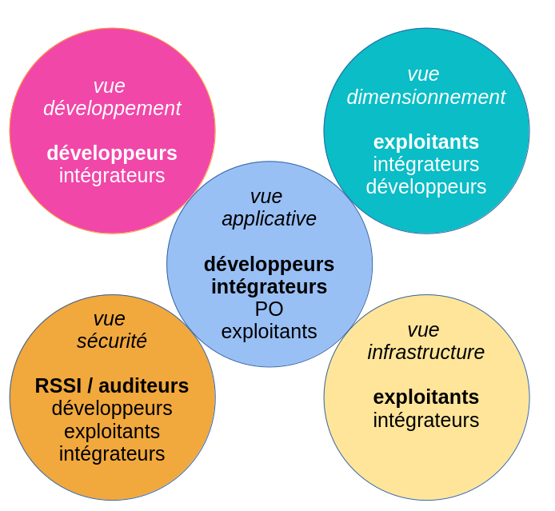

# Modèle de dossier d'architecture

Ce modèle de Dossier d'Architecture (DA) est applicable à la plupart des projets d'informatique de gestion, indépendamment de l'architecture générale retenue (monolithe, SOA, microservices, n-tiers, etc.). Il a déjà été utilisé sur plusieurs projets importants y compris au sein de grandes organisations. Il s'enrichit régulièrement.

Autres langues : https://github.com/bflorat/architecture-document-template[Anglais].

## Principes du modèle
Nous avons découpé l'architecture du projet en cinq vues (applicative, sécurité, dimensionnement, infrastructure et développement), *chaque vue étant auto-porteuse*. 

Le principe de base est de proposer un *ensemble de vues d'architecture alignées sur les rôles que l'on trouve le plus fréquemment dans les organisations et sur leurs préoccupations respectives*. Par exemple, un architecte d'infrastructure ou un ingénieur DevOps a rarement besoin de connaître le détail de l'architecture logicielle (le détail des frameworks utilisés ou la façon de gérer les erreurs). De même, un PO ou un architecte d'entreprise va s'intéresser à la vision macroscopique des modules applicatifs et de leurs interactions principales ("le batch B appelle le service S")  mais rarement du détail de l'infrastructure sous-jacente (choix de la base de données du service, dimensionnement des machines, …).

Un dossier suivant ce modèle sera ainsi constitué :

* d’une link:vue-applicative.adoc[vue applicative] présentant le contexte général et le découpage en modules applicatifs ;
* d’une link:vue-developpement.adoc[vue développement] présentant l’architecture logicielle, c'est-à-dire l'architecture du code ;
* d’une link:vue-dimensionnement.adoc[vue dimensionnement] présentant les aspects liés aux performances et au dimensionnement de l'infrastructure ;
* d’une link:vue-infrastructure.adoc[vue infrastructure] présentant les serveurs, les middlewares, l'exploitation, etc. ;
* d’une link:vue-securite.adoc[vue sécurité] ;

Dans chaque vue, on retrouvera le triptyque :

* *Contraintes* : les contraintes juridiques, budgétaires, technologiques et normatives applicables au projet ;
* *Exigences* non fonctionnelles (ENF) : les exigences non fonctionnelles exprimées par les porteurs du projet, dans la limite des contraintes mentionnées précédemment;

* *Solution* : la description de l’architecture retenue, répondant aux exigences non fonctionnelles.

Le dossier comprend également un exemple de glossaire pouvant servir de support à l'https://martinfowler.com/bliki/UbiquitousLanguage.html[Ubiquitous Language], élément fondamental d'une architecture.

TIP: https://www.emerald.com/insight/content/doi/10.1108/ACI-12-2020-0159/full/html?utm_source=rss&utm_medium=feed&utm_campaign=rss_journalLatest[Cet article] publié dans _Applied Computing and Informatics_ donne plus de détail sur les principes de ce modèle.

## Utilisation de ce modèle
### Présentation générale
* Ce modèle est au format https://www.methods.co.nz/asciidoc/index.html[Asciidoc]. Vous pouvez le convertir dans le format de votre choix pour vos DA même si nous préconisons un *format textuel et lisible* (type Markdown) facile à suivre et à modifier par merge requests dans un outil de gestion de version et ainsi transformer votre DA en une documentation vivante ;
* Nous précisons et fournissons des exemples d'utilisation de diagrammes _As Code_ (type Plantuml).
* Ce modèle est perfectible, c'est pourquoi tous les retours, critiques (constructives), contributions et suggestions sont appréciés (faire une https://github.com/bflorat/modele-da/pulls[pull request] ou utiliser https://github.com/bflorat/modele-da/issues[les issues]) ;
* De plus, il est volontairement riche en *explications et exemples* car il a également une (modeste) prétention éducative à destination des étudiants et jeunes architectes.
* Le texte en italique contient des exemples ;
* Chaque chapitre dispose de notes aidant à le remplir ;
* Si besoin, vous pouvez réduire la taille de ce modèle en utilisant l'outil https://document-template-customizer.florat.net/?base_template_url=https%3A%2F%2Fraw.githubusercontent.com%2Fbflorat%2Fmodele-da%2Frefs%2Fheads%2Fmaster%2F[Document-Template-Customizer];
* Un link:modele-vierge[modèle vierge] (sans exemples) est fourni pour votre confort. *Il est fortement préconisé de partir du modèle vierge tout en ayant sous les yeux, dans une autre fenêtre, le modèle avec exemples et explications* ;
* Le script `export` joint permet de produire une archive de votre dossier complet au format HTML, PDF ou ODT.
* Comme précisé dans le modèle vierge, nous recommandons de préciser la version de ce modèle (hash Git) en haut du fichier `README.adoc` afin de déterminer plus facilement les écarts avec de nouvelles versions du modèle. Exemple: `Version du modèle utilisé : b523b6a`.

TIP : L'utilisation de textes et de diagrammes textuels peut également servir d’entraînement à un LLM en vue du déploiement d'un Chatbot d'architecture à destination des parties prenantes du projet. En intégrant des techniques de RAG (Retrieval-Augmented Generation), le chatbot peut accéder à des informations précises et à jour, améliorant ainsi la pertinence et l'exactitude de ses réponses.

### Conseils sur la rédaction de votre dossier d'architecture 
* *Rester bref*, chaque mot doit avoir son utilité. Pas d’explication bateau type ‘ceci est l’introduction’, pas de redites d’autres documents, d’historique de l’entreprise ou de concepts vagues ;
* Un lecteur doit comprendre le fonctionnement et les contraintes de l’application sans être noyé de détails. Le document doit *rester maintenable et à jour* ;
* Si l’application suit une architecture standardisée par l’organisation, *ne pas la répéter* (principe https://en.wikipedia.org/wiki/Don%27t_repeat_yourself[DRY]) et se référer à un document commun ;
* Si un chapitre n’est pas applicable, ne pas le laisser vide mais simplement mentionner `N/A` pour que le lecteur sache que le sujet a été traité ou `TODO` s'il reste à compléter ;
* Ce modèle se veut *suffisamment complet pour couvrir la plupart des applications*. Il est donc normal que de nombreux chapitres ne soient pas applicables dans votre contexte ; 
* Lister les *hypothèses d’architecture* et études en cours dans le chapitre "Points non statués" de chaque vue (leur nombre doit être limité, sinon c'est le signe que le DA est rédigé trop tôt) ;
* *Isoler dans des annexes* en fin de document les informations d'architecture importantes mais concernant des points précis n’intéressant que peu de lecteurs ;

### Que ne trouve-t-on *PAS* dans ce document ?
** la *conception détaillée* du projet (diagrammes UML de classes, de séquences…) sauf pour présenter un pattern général spécifique à l’application ;
** des éléments d’*études* (SWOT, scénarios…) : les choix doivent déjà avoir été faits (en revanche, nous préconisons à cette fin l'écriture d'https://florat.net/comment-faire-de-bons-adr/[ADRs] en annexe du DA);
** l’*urbanisation du SI* (nous nous positionnons ici au niveau d’une application ou d’un ensemble de modules applicatifs cohérents) ;
** les *règles d'architecture de référence* (communes à toutes les applications) ;
** des détails techniques (IP, logins, ...) pouvant compromettre la sécurité ;
** l'*architecture physique* (détails des serveurs et datacenters, architecture réseau, architecture de stockage, provisioning…). Il s'agit de sujets très spécifiques et en général traités par les architectes d'infrastructure à un niveau SI ;
** le détail des *environnements* autres que la production (recette, développement…). Ces derniers sont en général trop fluctuants pour figurer dans ce dossier et gagneront à être documentés par l'intégrateur dans d'autres dossiers, fiches, wikis ou outils de CMDB.

## FAQ
* **A partir de quelle taille de projet ce modèle est-il éligible ?** Ce modèle a été utilisé avec succès sur un projet de huit mois doté d'une seule personne comme par plusieurs grands projets faisant intervenir des équipes importantes sur plusieurs années. Un grand projet détaillera probablement davantage les rubriques mais la plupart sont applicables quelque soit la taille du projet. Par exemple, les questions de disponibilité ou d’internationalisation ne sont pas liées à la taille d'un projet nous semble-il.
* **Ce modèle peut-il servir de base à un référentiel d'architecture ?** Même si de nombreuses idées peuvent être reprises, non, ce n'est pas l'objet de ce modèle.
* **Ce modèle convient-il à un programme complet ?** Nous préconisons pour un programme complet une approche type TOGAF avec les livrables associés. En revanche, les phases C et D pourront être documentées par un DA au sein de chaque projet de ce programme.
* **Comment documenter les trajectoires d'architecture ?** Nous préconisons de décrire la trajectoire générale (sans entrer dans trop de détails) dans la section "Architecture générale" de la vue applicative et d'en décrire l'architecture des futurs modules dans les sections habituelles des différents vues mais en spécifiant clairement de quelle étape il s'agit (par exemple, préfixer le titre d'un module ou d'un flux qui n’apparaît qu'en étape 2 avec `[Etape 2]`). Attention néanmoins à faire en sorte d'éviter trop de refactoring documentaire quand cette partie du projet sera implémentée (liens cassés par exemple).
   ** Traiter les étapes futures dans les mêmes sections que les éléments à implémenter immédiatement afin de les traiter suivant la même logique que le reste.
   ** Plus l'étape décrite est lointaine dans le temps, moins son architecture doit être détaillée. C'est un bon principe agile d'architecture 'Just In Time', qui évitera de réécrire plusieurs fois ces sections.
   ** Plus l'étape décrite est proche de l'architecture physique, moins elle doit être détaillée. Par exemple, il peut être pertinent de documenter dans la vue applicative l'architecture générale de modules qui devraient être implémentés dans un an mais attendre le plus possible pour documenter leur dimensionnement précis dans la vue dimensionnement. De même, vous pouvez documenter des flux applicatifs lointains mais attendez avant de décrire les flux techniques précis dans la vue infrastructure.  

## Terminologie  

TIP: Les documentations d'architecture utilisent souvent plusieurs termes synonymes pour le même concept, de façon interchangeable et possiblement ambiguë. Ce document d'architecture utilise (sauf erreur, sinon, nous prévenir) une terminologie constante et cohérente. Nous avons évité les termes ambigus (comme '_service_') et nous utilisons les termes les plus répandus dans la littérature et les contextes opérationnels.

TIP: Pourquoi 'DA' et pas 'DAT' (dossier d'architecture technique) ou termes similaires ? Chaque organisation possède sa terminologie propre mais le terme 'technique' (comme 'fonctionnel' d'ailleurs) est équivoque (qu'est-ce qui n'est pas "technique" dans l'IT ?).

- **Module** : Unité de code qui regroupe des fonctionnalités ou des services liés. Nous utilisons ce terme pour désigner les API (qui contiennent elles-mêmes des **endpoints**), les traitements par lots ou **batchs** (qui contiennent des **jobs**), et les IHM/GUI (interfaces graphiques) qui contiennent des pages.

- **Application** : En architecture monolithique, une application complète d'un seul tenant. En architecture microservices, un ensemble logique de modules.

- **Composant d'infrastructure** : Exécutable tiers ou équipement proposant des services d'infrastructure tels que la persistance pour une base de données, le messaging pour les queues, la répartition de charge pour un load-balancer, la détection de malwares pour une API antivirus, etc. Ne doit pas être confondu avec un 'composant', qui décrit une sous-partie logicielle d'un module ou d'une application monolithique (et qui est rarement documentée dans un DA car trop proche de l'implémentation).

- **Unité déployable** : Paquet/artefact autonome (zip, war, jar, gem, .deb, image OCI/Docker, binaire, etc.) en général construit et publié par un système de CI (Intégration Continue) et qui contient les exécutables d'un module (ex : 'jar' d'une application Spring Boot, archive d'une application PHP ou JS) ou d'un composant d'infrastructure (ex : 'deb' d'installation d'une base de données PostgreSQL).

## Licence
* Copyright (c) 2017-2026 Bertrand Florat et contributeurs
* Ce modèle est en licence https://creativecommons.org/licenses/by-sa/4.0/[CC BY-SA 4.0] : Creative Commons Attribution - Partage à l'identique V4.0
* Vous pouvez créer votre propre modèle à condition qu'il conserve la licence CC BY-SA 4.0 et qu'il contienne donc ces trois éléments: 
** Le nom du créateur (Bertrand Florat) ;
** Un lien vers https://creativecommons.org/licenses/by-sa/4.0/ ;
** Une notice de non-responsabilité et un lien vers https://github.com/bflorat/modele-da.
* Les dossiers d'architecture issus de ce modèle n'ont pas à appliquer cette licence. Il est néanmoins recommandé d'y inclure un lien vers https://github.com/bflorat/modele-da.

## Remerciements 
* https://github.com/bflorat/modele-da/graphs/contributors[Contributrices/eurs], siwon (RACI)
* Retours : Antoine Parra Del Pozo, Pascal Bousquet, Philippe Mayjonade, Nicolas Chahwekilian, Steven Morvan, Dr. Christophe Gaie
* Tous les diagrammes de ce modèle ont été générés avec l'outil http://plantuml.com/[PlantUML]
Les https://c4model.com/[diagrammes C4] utilisent la personnalisation https://github.com/plantuml-stdlib/C4-PlantUML[C4 de plantuml].

## Bibliographie partielle
* _Site Reliability Engineering_ - Google  
* _Living documentation_ - Cyril Martraire
* _Clean Code_ - Robert Martin
* _Performance des architectures IT - 2ᵉ éd._ - Pascal Grojean
* _Design Patterns: Elements of Reusable Object-Oriented Software de Erich Gamma, Richard Helm, Ralph Johnson et John Vlissides_ (GOF)
* _Le projet d’Urbanisation du SI_ - Christophe Longépé 
* _Sécurité de la dématérialisation_ - Dimitri Mouton
