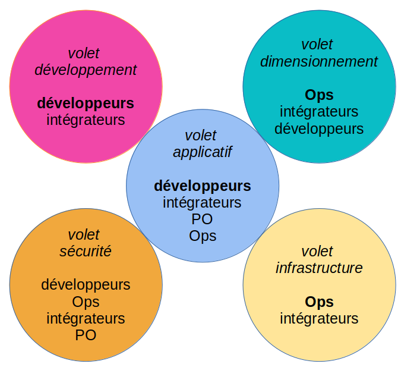

# Modèle de dossier d'architecture

Ce modèle de Dossier d'Architecture (DA) est applicable à la plupart des projets d'informatique de gestion, indépendamment de l'architecture générale retenue (monolithe, SOA, micro-service, n-tiers, ...).
Ce modèle a déjà été utilisé sur plusieurs projets importants y compris au sein de grandes organisations. Il s'enrichit régulierement.

NOTE: Nous utilisons le terme 'DA' et pas 'DAT' ou termes similaires car chaque organisation possède sa terminologie mais surtout le terme 'technique' (comme 'fonctionnel' d'ailleurs) est équivoque (qu'est ce qui n'est pas "technique" dans l'IT ?).

Autres langues : https://github.com/bflorat/architecture-document-template[Anglais].

## Principes du modèle
Nous avons découpé l'architecture en cinq volets (applicatif, sécurité, dimensionnement, infrastructure et développement), *chaque volet étant auto-porteur*. 

L'idée est de proposer un *ensemble de vues d'architecture alignées sur les rôles que l'on trouve le plus fréquemment dans les organisations* et sur leurs préoccupations respectives. Par exemple, un⸱e architecte d'infrastructure ou un⸱e ingénieur DevOps a rarement besoin de connaitre le détail de l'architecture logicielle (le détail des frameworks utilisés ou façon de traiter les erreurs). De même, un⸱e PO ou un⸱e architecte d'entreprise va s'intéresser à la vision macroscopique des modules applicatifs et de leurs interactions principales ("le batch B appelle le service S")  mais rarement du détail de l'infrastructure sous-jacente (choix de la base de donnée du service, dimensionnement des machines, ...).

Un dossier suivant ce modèle sera ainsi constitué :

* d’un link:volet-architecture-applicative.adoc[volet applicatif] présentant le contexte général et l’architecture applicative ;
* d’un link:volet-architecture-developpement.adoc[volet développement] présentant l’architecture logicielle et son environnement ;
* d’un link:volet-architecture-dimensionnement.adoc[volet dimensionnement] présentant les aspects liés aux performances et au dimensionnement de l'infrastructure ;
* d’un link:volet-architecture-infrastructure.adoc[volet infrastructure] présentant les serveurs, les middlewares, l'exploitation, etc. ;
* d’un link:volet-architecture-securite.adoc[volet sécurité] ;

Dans chaque volet, on retrouvera le triptyque :

* *Contraintes* (juridiques, budgétaires, technologiques, normatives,...) applicables au projet;
* *Exigences* non fonctionnelles (ENF) exprimées par les porteurs du projet dans la limite des contraintes ;
* *Solution* (description de l'architecture retenue et répondant aux ENF).

Le dossier comprend également un exemple de glossaire pouvant servir de support à l'https://martinfowler.com/bliki/UbiquitousLanguage.html[Ubiquitous Language], élément fondamental d'une architecture.

## Utilisation de ce modèle
### Présentation générale
* Ce modèle est au format https://www.methods.co.nz/asciidoc/index.html[asciidoc]. Vous pouvez le convertir dans le format de votre choix pour vos DA même si nous préconisons un *format textuel et lisible* (type Markdown) facile à suivre et à modifier par merge requests dans un outil de gestion de version et ainsi transformer votre DA en une documentation vivante ;
* Ce modèle est perfectible, c'est pourquoi tous les retours, critiques (constructives), contributions et suggestions sont appréciés (faire une https://github.com/bflorat/modele-da/pulls[pull request] 
ou utiliser https://github.com/bflorat/modele-da/issues)[les issues]) ;
* De plus, il est volontairement riche en *explications et exemples* car il a également une (modeste) prétention éducative à destination des étudiants et jeunes architectes.
* Le texte en italique contient des exemples ;
* Chaque chapitre dispose de notes aidant à le remplir ;
* Des link:modeles-vierges[modèles vierges] (sans exemples) sont fournis pour votre confort. *Il est fortement préconisé de partir des modèles vierges tout en ayant dans une autre fenêtre le modèle avec exemples et explications sous les yeux* ;

### Conseils sur la rédaction de votre dossier d'architecture 
* *Rester bref*, chaque mot doit avoir son utilité. Pas d’explication bateau type ‘ceci est l’introduction’, pas de redites d’autres documents, de l’historique de l’entreprise ou de concepts vagues ;
* Un lecteur doit comprendre le fonctionnement et les contraintes de l’application sans être noyé de détails. Le document doit *rester maintenable et à jour* ;
* Si l’application suit une architecture standardisée par l’organisation, *ne jamais la répéter* (principe https://en.wikipedia.org/wiki/Don%27t_repeat_yourself[DRY]) et se référer à un document commun ;
* Si un chapitre n’est pas applicable, ne pas le laisser vide mais simplement mentionner `N/A` pour que le lecteur sache que le sujet a été traité ou `TODO` s'il reste à compléter ;
* Ce modèle se veut *suffisamment complet pour couvrir la plupart des applications*. Il est donc normal que de nombreux chapitres ne soient pas applicables dans votre contexte ; 
* Lister les *hypothèses d’architecture* et études en cours dans le chapitre "Points non statués" de chaque volet (ils doivent être exceptionnels, sinon le DA est rédigé trop tôt) ;
* *Isoler dans des annexes* en fin de document les informations d'architecture importantes mais concernant des points précis n’intéressant que peu de lecteurs ;

### Que ne trouve-t-on *PAS* dans ce document ?
** la *conception détaillée* du projet (diagrammes UML de classes, de séquences ...) sauf pour présenter un pattern général spécifique à l’application ;
** des éléments d’*études* (SWOT, scénarios…) : les choix doivent déjà avoir été faits ;
** l’*urbanisation du SI* (nous nous positionnons ici au niveau d’une application ou d’un ensemble de composants cohérents) ;
** les *règles d'architecture de référence* (communes à toutes les applications) ;
** des détails techniques (IP, logins) pouvant compromettre la sécurité ;
** l'*architecture physique* (détails des serveurs et datacenters, architecture réseau, architecture de stockage, provisioning...). Il s'agit de sujets très pointus et en général traités par les architectes d'infrastructure à un niveau SI ;
** le détail des *environnements* autres que la production (recette, développement...). Ces derniers sont en général trop fluctuants pour figurer dans ce dossier et gagneront à plutôt être documentés par l'intégrateur dans d'autres dossiers, fiches, wikis ou outils de CMDB.

## Licence
* Copyright (c) 2017-2021 Bertrand Florat et contributeurs
* Ce modèle est en licence https://creativecommons.org/licenses/by-sa/4.0/[CC BY-SA 4.0] : Creative Commons Attribution - Partage à l'identique V4.0
* Vous pouvez créer votre propre modèle à condition qu'il conserve la licence CC BY-SA 4.0 et qu'il contienne donc ces trois éléments: 
** Le nom du créateur (Bertrand Florat) ;
** Un lien vers https://creativecommons.org/licenses/by-sa/4.0/ ;
** Une notice de non-responsabilité et un lien vers https://github.com/bflorat/modele-da.
* Les dossiers d'architecture issus de ce modèle n'ont pas à appliquer cette licence. Il est néanmoins recommandé d'y inclure un lien vers https://github.com/bflorat/modele-da.

## Remerciements 
* Relecture : Frédérique Lefranc
* Retours : Antoine Parra Del Pozo, Pascal Bousquet, Philippe Mayjonade, Nicolas Chahwekilian, Steven Morvan, Dr. Christophe Gaie
* Tous les diagrammes de ce modèle ont été générés avec l'excellent outil http://plantuml.com/[PlantUML]
Les https://c4model.com/[diagrammes C4] utilisent la personnalisation https://github.com/RicardoNiepel/C4-PlantUML[C4 de plantuml].

## Bibliographie partielle
* _Site Reliability Engineering_ - Google  
* _Living documentation_ - Cyril Martraire
* _Clean Code_ - Robert Martin
* _Performance des architectures IT - 2e ed._ - Pascal Grojean
* _Design Patterns: Elements of Reusable Object-Oriented Software de Erich Gamma, Richard Helm, Ralph Johnson et John Vlissides_ (GOF)
* _Le projet d’Urbanisation du SI_ - Christophe Longépé 
* _Sécurité de la dématérialisation_ - Dimitri Mouton
