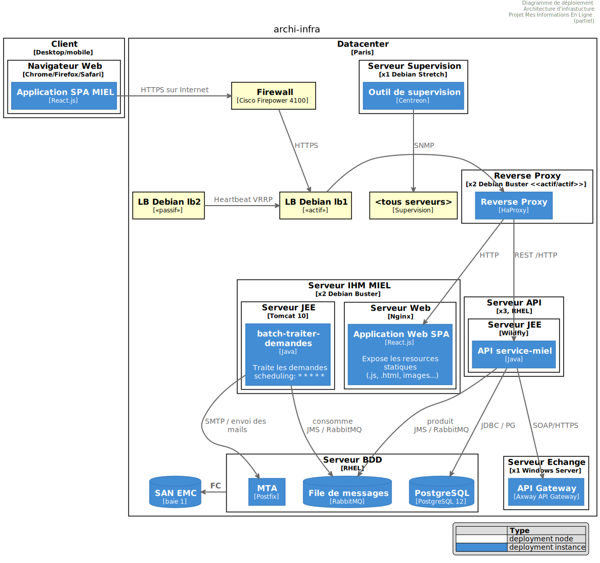

= Volet infrastructure
:sectnumlevels: 4
:toclevels: 4
:sectnums: 4
:toc: left
:icons: font
:toc-title: Sommaire

Dernière modification : {docdate}

== Introduction
Ceci est le point de vue infrastructure de l’application. Il décrit le déploiement des modules applicatifs dans leur environnement d’exécution cible et l'ensemble des dispositifs assurant leur bon fonctionnement.

Les autres volets du dossier sont accessibles link:./README.adoc[d'ici].

Le glossaire du projet est disponible link:glossaire.adoc[ici]. Nous ne redéfinirons pas ici les termes fonctionnels ou techniques utilisés.

[TIP]
====
Ce point de vue est aussi souvent appelé « point de vue technique » et concerne l'infrastructure : serveurs, réseaux, systèmes d'exploitation, bases de données, intergiciels (middleware), ... 

Bref, elle porte sur tout ce qui est externe à l'application et nécessaire à son exécution
====

=== Documentation de Référence
[TIP]
Mentionner ici les documents d'architecture de référence (mutualisés). Ce document ne doit en aucun cas reprendre leur contenu sous peine de devenir rapidement obsolète et non maintenable.

.Références documentaires
[cols="1e,2e,5e,4e"]
|====
|N°|Version|Titre/URL du document|Détail

|1||Regles_sauvegardes.pdf
|Règles concernant les sauvegardes

|====

== Non statué
=== Points soumis à étude complémentaire
.Points soumis à étude complémentaire
[cols="1e,5e,2e,2e,2e"]
|====
|ID|Détail|Statut|Porteur du sujet | Échéance

|EI1
|Le choix technique de la solution d’API Management reste soumise à étude complémentaires
|EN_COURS
|Équipe Archi Technique
|AVANT 2040

|====

=== Hypothèses

.Hypothèses
[cols="1e,5e"]
|====
|ID|Détail

|HI1
|Nous prenons l'hypothèse que d'ici à la MEP du projet, PostgreSQL 11 sera validé en interne.
|====

== Contraintes

[TIP]
====
Les contraintes sont les limites applicables aux exigences sur le projet. 

Il est intéressant de les expliciter pour obtenir des exigences réalistes. Par exemple, il ne serait pas valide d'exiger une disponibilité incompatible avec le niveau de sécurité Tier du datacenter qui l'hébergera.

====

=== Contraintes sur la disponibilité

[TIP]
====
Les éléments ici fournis pourront servir de base au SLO (Service Level Objective). Idéalement, ce dossier devrait simplement pointer sur un tel SLO sans plus de précision.

Ce chapitre a une vocation pédagogique car il rappelle la disponibilité plafond envisageable : la disponibilité finale de l’application ne pourra être qu’inférieure.
====

==== MTTD

[TIP]
====
Donner les éléments permettant d'estimer le temps moyen de détection d'incident.
====
====
Exemple 1 : l'hypervision se fait 24/7/365

Exemple 2 : le service support production est disponible durant les heures de bureau mais une astreinte est mise en place avec alerting par e-mail et SMS en 24/7 du lundi au vendredi.
====

==== MTTR

[TIP]
====
Donner les éléments permettant d'estimer le temps moyen de réparation (Mean Time To Repair en anglais). A noter qu'il est important de distinguer le MTTD du MTTR. En effet, ce n'est pas parce qu'une panne est détectée que les compétences ou ressources nécessaires à sa correction sont disponibles.

Préciser les plages de présence des exploitants en journée et les possibilités d'astreintes.

Lister ici les durées d’intervention des prestataires matériels, logiciels, électricité, telecom...
====
====
Exemple 1 : Cinq serveurs physiques de spare sont disponibles à tout moment.

Exemple 2 : Le contrat de support Hitashi prévoit une intervention sur les baies SAN en moins de 24h.

Exemple 3 : Au moins un expert de chaque domaine principal (système et virtualisation, stockage, réseau) est présent durant les heures de bureau.

Exemple 4 : Comme toute application hébergée au datacenter X, l’application disposera de la présence d’exploitants de 7h à 20h jours ouvrés. Aucune astreinte n’est possible.

Exemple 5 : le remplacement de support matériel IBM sur les lames BladeCenter est assuré en 4h de 8h à 17h, jours ouvrés uniquement.
====

==== Outils et normes de supervision

[TIP]
====
Donner ici les outils et normes de supervisions imposés au niveau du SI et les éventuelles contraintes liées.
====
====
Exemple 1 : L'application sera supervisée avec Zabbix

Exemple 2 : Les batchs doivent pouvoir se lancer sur un endpoint REST

Exemple 3 : un batch en erreur ne doit pas pouvoir se relancer sans un acquittement humain
====

==== Interruptions programmées

[TIP]
====
Donner ici la liste et la durée des interruptions programmées standards dans le SI.
====

====
Exemple 1 : On estime l'interruption de chaque serveur à 5 mins par mois. Le taux de disponibilité effectif des serveurs en prenant en compte les interruptions programmées système est donc de 99.99 %.

Exemple 2 : suite aux mises à jour de sécurité de certains packages RPM (kernel, libc…), les serveurs RHEL sont redémarrés automatiquement la nuit du mercredi suivant la mise à jour. Ceci entraînera une indisponibilité de 5 mins en moyenne 4 fois par an.

====

==== Niveau de service du datacenter

[TIP]
====
Donner ici le niveau de sécurité du datacenter selon l’échelle Uptime Institute (Tier de 1 à 4). 

.Niveaux Tier des datacenters (source : Wikipedia)
[cols="1,5,2,2,2"]
|====
|Niveau Tier|Caractéristiques|Taux de disponibilité|Indisponibilité statistique annuelle| Maintenance à chaud possible ?| Tolérance aux pannes ?

|Tier 1
|Non redondant
|99,671 %
|28,8 h
|Non
|Non

|Tier 2
|Redondance partielle
|99,749 %
|22 h
|Non
|Non

|Tier 3
|Maintenabilité
|99,982 %
|1,6 h
|Oui
|Non

|Tier 4
|Tolérance aux pannes
|99,995 %
|0,4 h
|Oui
|Oui

|====
====

====
Exemple : le datacenter de Paris est de niveau Tier III et celui de Toulouse Tier II.
====

==== Synthèse de la disponibilité plancher

[TIP]
====
En prenant en compte les éléments précédents, estimer la disponibilité planché (maximale) d'une application (hors catastrophe). Toute exigence devra être inférieure à celle-ci. Dans le cas d'un cloud, se baser sur le SLA du fournisseur. Dans le cas d'une application hébergée en interne, prendre en compte la disponibilité du datacenter et des indisponibilité programmées.
====

====
Exemple : <disponibilité datacenter> * <plage de fonctionnement effective> * <disponibilité système > * <disponibilité hardware> = 99.8 x 99.99 x 99.6 x 99.99 =~ *99.4%*.
====

==== Gestion des catastrophes

[TIP]
====

Les catastrophes peuvent être classées en trois catégories:

* Naturelle (tremblements de terre, inondations, ouragans, canicules...).
* Incident sur l'infrastructure du datacenter (accidentel comme les accidents industriels, incendies, pannes électriques majeures, pannes majeures du réseau / stockage / serveurs, les erreurs critiques d'administrateurs ou intentionnelles: militaire, terroriste, sabotage ...).
* Cyber (DDOS, virus, Ransomware ... )

PRA (Plan de Reprise d'Activité) comme PCA (Plan de Continuité d'Activité) répondent à un risque de catastrophe sur le SI (catastrophe naturelle, accident industriel, incendie...). Un PRA permet de reprendre l’activité suite à une catastrophe après une certaine durée de restauration. Il exige au minium un doublement du datacenter. 

Un PCA permet de poursuivre les activités critiques de l’organisation (en général dans un mode dégradé) sans interruption notable. Ce principe est réservé aux organisations assez matures car il exige des dispositifs techniques coûteux et complexes (filesystems distribués et concurrents par exemple).

Un architecte n'utilise pas les mêmes technologies suivant qu'on vise un PRA ou un PCA. Par exemple, si on vise un PCA, il faut prévoir des clusters actifs-actifs multi-zonaux (situés dans des datacenters distants géographiquement) alors que pour un PRA, l'important est la qualité et la vitesse de sauvegarde/restauration des données dans le datacenter de secours. 

Note: Dans la plupart des grands comptes, PRA comme PCA impliquent une réplication par lien optique des baies SAN pour limiter le RPO au minimum et s'assurer que l'ensemble des données du datacenter soient bien répliquées. Les systèmes de sauvegarde/restauration classiques sont rarement suffisants à couvrir ce besoin. La différence est que dans le cas d'un PRA, il faut prévoir une bascule et une préparation conséquente du datacenter de secours alors que dans le cas d'un PCA, des deux (ou plus) datacenters fonctionnent en parallèle en mode actif/actif de façon nominale.

Note: La gestion des catastrophes est un sujet complexe. C'est l'un des points forts des Clouds publics (OVH, GCP, Azure, AWS...) que de gérer une partie de cette complexité pour vous. Des solutions Cloud spécifiques existent (Disaster Recovery as a Service (DRaaS)).

Décrire entre autres :

* Les matériels redondés dans le second datacenter, nombre de serveurs de spare, capacité du datacenter de secours par rapport au datacenter nominal.
* Pour un PRA, les dispositifs de restauration (OS, données, applications) prévues.
* Pour un PRA, donner le *Recovery Time Objective* (durée maximale admissible de rétablissement en heures) et le *Recovery Point Objective*  (durée maximale admissible de données perdues en heures depuis la dernière sauvegarde).
* Pour un PCA les dispositifs de réplication de données (synchrone ? fil de l’eau ? Combien de transactions peuvent-être perdues ?).
* Présenter la politique de failback (réversibilité) : doit-on rebasculer vers le premier datacenter ? Comment ?
* Comment sont organisés les tests de bascule à blanc ? Avec quelle fréquence ?
====
====
Exemple de PRA : Pour rappel (voir [doc xyz]), les VM sont répliquées dans le datacenter de secours via la technologie vSphere Metro Storage Cluster utilisant SRDF en mode asynchrone pour la réplication inter-baies. En cas de catastrophe, la VM répliquée sur le site de secours est à jour et prête à démarrer. Le RPO est de ~0 secs et le RTO de 30 mins.

Autre exemple de PRA (PME avec son propre datacenter à Paris) : Stockage de deux serveurs de spare dans les locaux de Lille. Sauvegarde à chaud toutes les quatre heures des données principales de l'entreprise et envoi (avec chiffrement client) sur BackBlaze.com. Le RPO est de 4h, le RTO de 2H.

Exemple de PCA avec élasticité: Les applications s’exécutent sous forme de POD Kubernetes sur au moins trois clusters situées dans des zones géographiquement distantes. Les données MongoDB sont shardées et synchronisées entre zones via un système de ReplicatSet. Le système est auto-régulé par Kubernetes et tout plantage d'un DC sera compensé en quelques secondes par la création de nouveaux POD dans les deux clusters restants. Ainsi, non seulement les utilisateurs n'auront pas de perte de disponibilité mais ils ne verront pas non plus leurs performances dégradées. Le RTO est de 0, le RPO est ~0 (zéro strict est impossible, voir le théorème de CAP).
====

=== Hébergement

* Où sera hébergée cette application ? datacenter "on premises" ? Cloud interne ? Cloud IaaS ? PaaS ? autre ?
* Qui administrera cette application ? en interne ? Sous-traité ? Pas d’administration (PaaS) … ?
====
Exemple 1: Cette application sera hébergée en interne dans le datacenter de Nantes (seul à assurer la disponibilité de service exigée) et il sera administré par l’équipe X de Lyon. 
====

====
Exemple 2 : Étant donné le niveau de sécurité très élevé de l’application, la solution devra être exploitée uniquement en interne par des agents assermentés. Pour la même raison, les solutions de cloud sont exclues.
====

====
Exemple 3 : Étant donné le nombre d’appels très important de cette application vers le référentiel PERSONNE, elle sera colocalisée avec le composant PERSONNE dans le VLAN XYZ.
====

=== Contraintes réseau

[TIP]
====
Lister les contraintes liées au réseau, en particulier le débit maximum théorique et les découpages en zones de sécurité.
====
====
Exemple 1 : le LAN dispose d'un débit maximal de 10 Gbps
====
====
Exemple 2 : les composants applicatifs des applications intranet doivent se trouver dans une zone de confiance inaccessible d'Internet.
====

=== Contraintes de déploiement

[TIP]
====
Lister les contraintes liées au déploiement des applications et composants techniques.
====
====
Exemple 1 : Une VM ne doit héberger qu'une unique instance Postgresql

Exemple 2 : Les applications Java doivent être déployées sous forme de jar exécutable et non de war.

Exemple 3 : Toute application doit être packagées sous forme d'image OCI et déployable sur Kubernetes via un ensemble de manifests structurés au format Kustomize.

====

=== Contraintes de logs

[TIP]
====
Lister les contraintes liées aux logs
====
====
Exemple 1 : une application ne doit pas produire plus de 1Tio de logs / mois.

Exemple 2 : la durée de rétention maximale des logs est de 3 mois
====

=== Contraintes de sauvegardes et restaurations

[TIP]
====
Lister les contraintes liées aux sauvegardes. 
====
====
Exemple 1 : L'espace disque maximal pouvant être provisionné par un projet pour les backups est de 100 Tio sur HDD.

Exemple 2 : la durée de retentions maximale des sauvegardes est de deux ans

Exemple 3 : Compter 1 min / Gio pour une restauration NetBackup.
====

=== Coûts

[TIP]
====
Lister les limites budgétaires.
====
====
Exemple 1 : les frais de services Cloud AWS ne devront pas dépasser 5K€/ an pour ce projet.
====

== Exigences

[TIP]
====
Contrairement aux contraintes qui fixaient le cadre auquel toute application devait se conformer, les exigences non fonctionnelles sont données par les porteurs du projet (MOA en général).

Prévoir des interviews pour les recueillir.

Si certaines exigences ne sont pas réalistes, le mentionner dans le document des points non statués.

Les exigences liées à la disponibilité devraient être précisées via une étude de risque (type EBIOS Risk Manager)

====

=== Plages de fonctionnement

[TIP]
====
On liste ici les plages de fonctionnement principales (ne pas trop détailler, ce n’est pas un plan de production). 

Penser aux utilisateurs situés dans d'autres fuseaux horaires.

Les informations données ici serviront d'entrants au SLA de l’application.
====

====
.Exemple plages de fonctionnement
[cols="1e,5e,2e"]
|====
|No plage| Heures | Détail

|1
|De 8H00-19H30 heure de Paris , 5J/7 jours ouvrés
|Ouverture Intranet aux employés de métropole

|2
|De 21h00 à 5h00 heure de Paris
|Plage batch

|3
|24 / 7 / 365
|Ouverture Internet aux usagers

|4
|De 5h30-8h30 heure de Paris, 5J/7 jours ouvrés
|Ouverture Intranet aux employés de Nouvelle Calédonie
|====
====

=== Exigences de disponibilité

[TIP]
====
Nous listons ici les exigences de disponibilité. Les mesures techniques permettant de les atteindre seront données dans l’architecture technique de la solution. 

Les informations données ici serviront d'entrants au SLA de l’application.

Attention à bien cadrer ces exigences car un porteur de projet a souvent tendance à demander une disponibilité très élevée sans toujours se rendre compte des implications. Le coût et la complexité de la solution augmente exponentiellement avec le niveau de disponibilité exigé. 

L’architecture physique, technique voire logicielle change complètement en fonction du besoin de disponibilité (clusters d’intergiciels voire de bases de données, redondances matériels coûteuses, architecture asynchrone, caches de session, failover ...). 

Ne pas oublier également les coûts d’astreinte très importants si les exigences sont très élevées. De la pédagogie et un devis permettent en général de modérer les exigences.

On estime en général que la haute disponibilité (HA) commence à deux neufs (99%), c'est à dire environ 90h d'indisponibilité par an.

Donner la disponibilité demandé par plage.

La disponibilité exigée ici devra être en cohérence avec les <<Contraintes sur la disponibilité>> du SI.
====

.Durée d’indisponibilité maximale admissible par plage
[cols="1e,5e"]
|====
|No Plage| Indisponibilité maximale

|1 
|24h, maximum 7 fois par an

|2
|4h, 8 fois dans l'année

|3
|4h, 8 fois dans l'année
|====

=== Modes dégradés
[TIP]
====
Préciser les modes dégradés applicatifs envisagés.
====

====
Exemple 1 : Le site _monsite.com_ devra pouvoir continuer à accepter les commandes en l’absence du service de logistique.
====
====
Exemple 2 : Si le serveur SMTP ne fonctionne plus, les mails seront stockés en base de donnée puis soumis à nouveau suite à une opération manuelle des exploitants.
====

=== Exigences de robustesse

[TIP]
====
La robustesse du système indique sa capacité à ne pas produire d'erreurs lors d’événements exceptionnels comme une surcharge ou la panne de l'un de ses composants.

Cette robustesse s'exprime en valeur absolue par unité de temps : nombre d'erreurs (techniques) par mois, nombre de messages perdus par an...

Attention à ne pas être trop exigeant sur ce point car une grande robustesse peut impliquer la mise en place de systèmes à tolérance de panne complexes, coûteux et pouvant aller à l'encontre des capacités de montée en charge, voire même de la disponibilité.
====
====
Exemple 1 : pas plus de 0.001% de requêtes en erreur
====
====
Exemple 2 : l'utilisateur ne devra pas perdre son panier d'achat même en cas de panne
-> attention, ce type d'exigence impacte l'architecture en profondeur, voir la section <<Disponibilite>>.
====
====
Exemple 3 : le système devra pouvoir tenir une charge trois fois supérieure à la charge moyenne avec un temps de réponse de moins de 10 secondes au 95éme centile.
====

=== Exigences de RPO

[TIP]
====
La sauvegarde (ou backup) consiste à recopier les données d'une système sur un support dédié en vue d'une restauration en cas de perte. Ces données sont nécessaires au système pour fonctionner.

Donner ici le Recovery Point Objective (RPO) de l’application. Il peut être utile de restaurer suite à :

* Une perte de données matérielle (peu probable avec des systèmes de redondance).
* Une fausse manipulation d'un power-user ou d'un administrateur (assez courant).
* Un bug applicatif.
* Une destruction de donnée volontaire (attaque de type ransomware)...

====
====
Exemple : on ne doit pas pouvoir perdre plus d'une journée de données applicatives
====

=== Exigences d'archivage

[TIP]
====
L'archivage est la recopie de données importantes sur un support dédié offline en vue non pas d'une restauration comme la sauvegarde mais d'une _consultation_ occasionnelle. Les archives sont souvent exigées pour des raisons légales et conservées trente ans ou plus. 

Préciser si des données de l’application doivent être conservées à long terme. Préciser les raisons de cet archivage (https://www.service-public.fr/professionnels-entreprises/vosdroits/F10029[légales] le plus souvent).

Préciser si des dispositifs spécifiques de protection de l'intégrité (pour empêcher toute modification principalement) doivent être mis en place.
====

====
Exemple 1: comme exigé par l'article L.123-22 du code de commerce, les données comptables devront être conservées au moins dix ans. 
====
====
Exemple 2 : Les pièces comptables doivent être conservées en ligne (en base) au moins deux ans puis peuvent être archivées pour conservation au moins dix ans de plus. Une empreinte SHA256 sera calculée au moment de l'archivage et stockée séparément pour vérification de l'intégrité des documents en cas de besoin.
====

=== Exigences de purges

[TIP]
====

Il est crucial de prévoir des purges régulières pour éviter une dérive continue des performances et de l'utilisation disque (par exemple liée à un volume de base de données trop important). 

Les purges peuvent également être imposées par la loi. Le RGPD apporte depuis 2018 de nouvelles contraintes sur le droit à l’oubli pouvant affecter la durée de rétention des informations personnelles.

Il est souvent judicieux d'attendre la MEP voire plusieurs mois d'exploitation pour déterminer précisément les durées de rétention (âge ou volume maximal par exemple) mais il convient de prévoir le principe même de l’existence de purges dès la définition de l'architecture de l’application. En effet, l'existence de purges a souvent des conséquences importantes sur le fonctionnel (exemple : s'il n'y a pas de rétention _ad vitam aeternam_ de l'historique, certains patterns à base de listes chaînées ne sont pas envisageables).
====

====
Exemple 1 : les dossiers de plus de six mois seront purgées (après archivage)
====

=== Exigences de déploiements et de mise à jour

==== Coté serveur

[TIP]
====
Préciser ici comment l’application devra être déployée coté serveur. 

Par exemple :

* L'installation est-elle manuelle ? scriptées avec des outils d'IT Automation comme Ansible ou SaltStack ? via des images Docker ?
* Comment sont déployés les composants ? Sous forme de paquets ? Utilise-t-on un dépôt de paquets (type yum ou apt) ? Utilise-t-on des containeurs ?
* Comment sont appliquées les mises jour ?
====

==== Coté client

[TIP]
====
Préciser ici comment l’application devra être déployée coté client :

* Si l’application est volumineuse (beaucoup de JS ou d’images par exemple), risque-t-on un impact sur le réseau ?
* Une mise en cache de proxy locaux est-elle à prévoir ?
* Des règles de firewall ou QoS sont-elles à prévoir ?

Coté client, pour une application Java :

* Quel version du JRE est nécessaire sur les clients ?

Coté client, pour une application client lourd :

* Quel version de l’OS est supportée ?
* Si l’OS est Windows, l’installation passe-t-elle par un outil de déploiement (Novell ZENWorks par exemple) ? l’application vient-elle avec un installeur type Nullsoft ? Affecte-t-elle le système (variables d’environnements, base de registre…) ou est-elle en mode portable (simple zip) ?
* Si l’OS est Linux, l’application doit-elle fournie en tant que paquet? 
* Comment sont appliquées les mises jour ?
====

==== Stratégie de déploiement spécifiques

[TIP]
====
* Prévoit-on un déploiement de type blue/green ? 
* Prévoit-on un déploiement de type canary testing ? si oui, sur quel critère ?
* Utilise-t-on des feature flags ? si oui, sur quelles fonctionnalités ?
====

====
Exemple: L'application sera déployée sur un mode blue/green, c'est à dire complètement installée sur des machines initialement inaccessibles puis une bascule DNS permettra de pointer vers les machines disposant de la dernière version.
====

=== Exigences de gestion de la concurrence

[TIP]
====
Préciser ici les composants internes ou externes pouvant interférer avec l’application.
====
====
Exemple 1  : Tous les composants de cette application doivent pouvoir fonctionner en concurrence. En particulier, la concurrence batch/IHM doit toujours être possible car les batchs devront pouvoir tourner de jour en cas de besoin de rattrapage
====
====
Exemple 2 : le batch X ne devra être lancé que si le batch Y s’est terminé correctement sous peine de corruption de données.
====

=== Exigences d'écoconception

[TIP]
====
L'écoconception consiste à limiter l'impact environnemental des logiciels et matériels utilisés par l’application. Les exigences dans ce domaine s'expriment généralement en WH ou équivalent CO2.

Prendre également en compte les impressions et courriers.

Selon l'ADEME (estimation 2014), les émissions équivalent CO2 d'un KWH en France continentale pour le tertiaire est de 50g/KWH.
====
====
Exemple 1 : La consommation électrique moyenne causée par l’affichage d'une page Web ne devra pas dépasser 10mWH, soit pour 10K utilisateurs qui affichent en moyenne 100 pages 200 J par an : 50 g/KWH x 10mWH x 100 x 10K x 200 = 100 Kg équivalent CO2 / an.
====
====
Exemple 2 : Le Power usage effectiveness (PUE) du site devra être de 1.5 ou moins.
====
====
Exemple 3 : La consommation d'encre et de papier devra être réduite de 10% par rapport à 2020.
====

== Architecture cible

=== Principes

[TIP]
====
Quels sont les grands principes d'infrastructure de notre application ?
====
====
Exemples :

* Les composants applicatifs exposés à Internet dans une DMZ protégée derrière un pare-feu puis un reverse-proxy et sur un VLAN isolé. 
* Concernant les interactions entre la DMZ et l’intranet, un pare-feu ne permet les communications que depuis l’intranet vers la DMZ
* Les clusters actifs/actifs seront exposés derrière un LVS + Keepalived avec direct routing pour le retour.
====

=== Disponibilité 
 
[TIP] 
==== 

La disponibilité est le pourcentage de temps minimal sur une année pendant lequel un système doit être utilisable dans des conditions acceptables. Il est exprimé en % (exemple: 99.9%).

Donner ici les dispositifs permettant d'atteindre les <<Exigences de disponibilité>>. 

Les mesures permettant d’atteindre la disponibilité exigée sont très nombreuses et devront être choisies par l’architecte en fonction de leur apport et de leur coût (financier, en complexité, …).  

Nous regroupons les dispositifs de disponibilité en quatre grandes catégories : 

* Dispositifs de *supervision* (technique et applicative) permettant de détecter au plus tôt les pannes et donc de limiter le MTTD (temps moyen de détection). 

* *Dispositifs organisationnels* :  

** la présence humaine (astreintes, heures de support étendues...) qui permet d'améliorer le MTTR (temps moyen de résolution) et sans laquelle la supervision est inefficiente ; 

** La qualité de la gestion des incidents (voir les bonnes pratiques ITIL), par exemple un workflow de résolution d'incident est-il prévu ? si oui, quel est sa complexité ? sa durée de mise en œuvre ? si elle nécessite par exemple plusieurs validations hiérarchiques, la présence de nombreux exploitants affecte le MTTR. 

* Dispositifs de *haute disponibilité (HA)* (clusters, RAID...) qu'il ne faut pas surestimer si les dispositifs précédents sont insuffisants. 

* Dispositifs de *restauration de données* : la procédure de restauration est-t-elle bien définie ? testée ? d'une durée compatible avec les exigences de disponibilité ? C'est typiquement utile dans le cas de perte de données causée par une fausse manipulation ou bug dans le code : il faut alors arrêter l'application et dans cette situation, pouvoir restaurer rapidement la dernière sauvegarde améliore grandement le MTTR. 
 

==== 
[TIP] 
==== 

*Principes de disponibilité et de redondance*: 

* La *disponibilité d’un ensemble de composants en série* : `D = D1 * D2 * … * Dn`. Exemple : la disponibilité d’une application utilisant un serveur Tomcat à 98 % et une base Oracle à 99 % sera de 97.02 %. 

* La *disponibilité d’un ensemble de composants en parallèle* : `D = 1 – (1-D1) * (1- D2) * ..* (1-Dn)`. Exemple : la disponibilité de trois serveurs Nginx en cluster dont chacun possède une disponibilité de 98 % est de 99.999 %. 

* Il convient d'être cohérent sur la *disponibilité de chaque maillon de la chaîne de liaison* : rien ne sert d'avoir un cluster actif/actif de serveurs d'application JEE si tous ces serveurs attaquent une base de donnée localisée sur un unique serveur physique avec disques sans RAID. 

* On estime un système comme hautement disponible *(HA) à partir de 99%* de disponibilité. 

* On désigne par *«spare»* un dispositif (serveur, disque, carte électronique...) de rechange qui est dédié au besoin de disponibilité mais qui n'est pas activé en dehors des pannes. En fonction du niveau de disponibilité recherché, il peut être dédié à l’application ou mutualisé au niveau SI.  

* Les *niveaux de redondance* d'un système (modèle NMR = N-Modular Redundancy) les plus courants sont les suivants (avec N, le nombre de dispositifs assurant un fonctionnement correct en charge) :  

** *N* : aucune redondance (exemple : si l'alimentation unique d'un serveur tombe, le serveur s'arrête) 

** *N+1* : un composant de rechange est disponible, on peut supporter la panne d'un matériel (exemple : on a une alimentation de spare disponible). 

** *N+M*: Un seul spare n'est pas suffisant pour tenir la charge, on prévoit au moins M spares. 

** *2N* : le système est entièrement redondé et peut supporter la perte de la moitié des composants (exemple : on dispose de deux alimentations actives en même temps dont chacune suffit à alimenter le serveur). Ce système est tolèrant aux pannes (Fault-tolerant). 

** *2N+1*: En plus d'un système entièrement redondé, un système de secours est disponible (pour les opérations de maintenance par exemple). 

==== 
[TIP] 
====  

*Clustering*: 

* Un cluster est un *ensemble de nœuds (machines) hébergeant le même module applicatif*. 
* En fonction du niveau de disponibilité recherché, chaque nœud peut être : 

** *actif* : le nœud traite les requêtes (exemple : un serveur Apache parmi dix et derrière un répartiteur de charge). Temps de failover : nul ; 

** *passif en mode «hot standby»* : le nœud est installé et démarré mais ne traite pas les requêtes (exemple: une base MySQL slave qui devient master en cas de panne de ce dernier via l'outil mysqlfailover). MTTR de l'ordre de la seconde (temps de la détection de la panne) ; 

** *passif en mode «warm standby»* : le nœud est démarré et l'application est installée mais n'est pas démarrée (exemple : un serveur avec une instance Tomcat éteinte hébergeant notre application). En cas de panne, notre application est démarrée automatiquement. MTTR : de l'ordre de la minute (temps de la détection de la panne et d'activation de l'application) ; 

** passif en mode «cold standby» : le nœud est un simple spare. Pour l'utiliser, il faut installer l'application et la démarrer. MTTR : de l'ordre de dizaines de minutes avec solutions de virtualisation (ex : KVM live migration) et/ou de containers (Docker) à une journée lorsqu'il faut installer/restaurer et démarrer l'application. 

* On peut classer les architectures de clusters actif/actif en deux catégories :  

** Les *clusters actifs/actifs à couplage faible* dans lesquels un nœud est totalement indépendant des autres, soit parce que l'applicatif est stateless (le meilleur cas), soit parce que les données de contexte (typiquement une session HTTP) sont gérées isolément par chaque nœud. Dans le dernier cas, le répartiteur de charge devra assurer une affinité de session, c'est à dire toujours router les requêtes d'un client vers le même nœud et en cas de panne de ce nœud, les utilisateurs qui y sont routés perdent leurs données de session et doivent se reconnecter. Note : Les nœuds partagent tous les mêmes données persistées en base, les données de contexte sont uniquement des données transitoires en mémoire. 

** Les *clusters actifs/actifs à couplage fort* dans lesquels tous les nœuds partageant les mêmes données en mémoire. Dans cette architecture, toute donnée de contexte doit être répliquée dans tous les nœuds (ex : cache distribué de sessions HTTP répliqué avec JGroups).  

==== 
[TIP] 
==== 
*Failover:* 

Le failover (bascule) est la capacité d'un cluster de s'assurer qu'en cas de panne, les requêtes ne sont plus envoyées vers le nœud défectueux mais vers un nœud opérationnel. Ce *processus est automatique*. 

Sans failover, c'est au client de détecter la panne et de se reconfigurer pour rejouer sa requête vers un nœud actif. Dans les faits, ceci est rarement praticable et les *clusters disposent presque toujours de capacités de failover*. 

Une solution de failover peut être décrite par les attributs suivants : 

* Quelle *stratégie de failback* ? Par exemple: "Fail fast" (un nœud est noté comme tombé dès le premier échec); "On fail, try next one" ; "On fail, try all"... 

* Quelle *solution de détection des pannes* ?  

** les répartiteurs de charge utilisent des *sondes* (health check) très variées (requêtes fictives, analyse du CPU, des logs, etc.…) vers les nœuds ;  

** les détections de panne des clusters actifs/passifs fonctionnent la plupart du temps par écoute des palpitations (*heartbeat*) du serveur actif par le serveur passif, par exemple via des requêtes multicast UDP dans le protocole VRRP utilisé par keepalived. 

* Quel *délai de détection* de la panne ? il convient de paramétrer correctement les solutions de détection de panne (le plus court possible sans dégradation de performance). 

* Quelle *pertinence de la détection* ? le serveur en panne est-il *vraiment* en panne ? un mauvais paramétrage ou une microcoupure réseau ne doit pas provoquer une indisponibilité totale d'un cluster alors que les nœuds sont sains.  

* Quelle stratégie de failback ? 

** dans un cluster "N-to-1", on rebasculera (failback) sur le serveur qui était tombé en panne une fois réparé et le serveur basculé redeviendra le serveur de secours ; 

** dans un cluster N-to-N (architecture en voie de démocratisation avec le cloud de type PaaS comme AWS Lambda ou CaaS comme Kubernetes) : on distribue les applications du nœud en panne vers d'autres nœuds actifs (le cluster ayant été dimensionné en prévision de cette éventuelle surcharge). 

* *Transparent via à vis de l’appelant* ou pas ? En général, les requêtes pointant vers un serveur dont la panne n'a pas encore été détectée tombent en erreur (en timeout la plupart du temps). Certains dispositifs ou architectures de FT (tolérance de panne) permettent de le rendre transparent pour le client. 

==== 
[TIP] 
==== 
Quelques mots sur les *répartiteurs de charge* : 

* Un répartiteur de charge (Load Balancer = LB) est une *brique obligatoire pour un cluster actif/actif*. 

* Dans le cas des clusters, une erreur classique est de créer un *SPOF* au niveau du répartiteur de charge. On va alors diminuer la disponibilité totale du système au lieu de l'améliorer. Dans la plupart des clusters à vocation de disponibilité (et pas seulement de performance), il faut redonder le répartiteur lui-même en mode actif/passif (et pas actif/actif sinon on ne fait que déplacer le problème et il faudrait un "répartiteur de répartiteurs"). Le répartiteur passif doit surveiller à fréquence élevée le répartiteur actif et le replacer dès qu'il tombe. 

* Il est crucial de configurer correctement et à fréquence suffisante les tests de vie (*heathcheck*) des nœuds vers lesquels le répartiteur distribue la charge car sinon, le répartiteur va continuer à envoyer des requêtes vers des nœuds tombés ou en surcharge. 

* Certains LB avancés (exemple : option redispatch de HAProxy) permettent la transparence vis à vis de l'appelant en configurant des rejeux vers d'autres nœuds en cas d'erreur ou timeout et donc d'améliorer la tolérance de panne puisqu'on évite de retourner une erreur à l'appelant pendant la période de pré-détection de la panne. 

* Lisser la charge entre les nœuds et ne pas forcement se contenter de round robin. Un algorithme simple est le LC (Least Connection) permettant au répartiteur de privilégier les nœuds les moins chargés, mais il existe bien d'autres algorithmes plus ou moins complexes (systèmes de poids par nœud ou de combinaison charge + poids par exemple). Attention néanmoins à bien les tester et en maîtriser les implications pour éviter les catastrophes. 

* Dans le monde Open Source, voir par exemple LVS + keepalived ou HAProxy + keepalived. 

==== 
[TIP] 
==== 

La *tolérance de panne* : 

La tolérance de panne (FT = Fault Tolerance) ne doit pas être confondue avec la Haute Disponibilité. Il s'agit d'une version plus stricte de HA où la *disponibilité est de 100% et aucune donnée ne peut être perdue* (Wikipédia: "La tolérance aux pannes est la propriété qui permet à un système de continuer à fonctionner correctement en cas de défaillance d'un ou de certains de ses composants"). Seuls les systèmes critiques (santé, militaires, transport, industrie...) ont en général besoin d'un tel niveau de disponibilité.

Historiquement, cela signifiait une redondance matérielle complète. Dans un monde de micro-services, cela peut également être réalisé au niveau logiciel avec des clusters actifs-actifs. De plus, un véritable système de tolérance aux pannes devrait éviter une dégradation significative des performances vue par les utilisateurs finaux. 

Par exemple, un lecteur RAID 1 offre une tolérance aux pannes transparente : en cas de panne, le processus écrit ou lit sans erreur après le basculement automatique sur le disque sain. Un cluster Kubernetes peut également atteindre la tolérance aux pannes en démarrant de nouveaux POD. Ou encore, un cache distribué en mémoire en cluster peut éviter de perdre une session HTTP. 
 
Pour permettre la tolérance de panne d'un cluster, il faut obligatoirement *disposer d'un cluster actif/actif avec fort couplage* dans lequel les données de contexte sont répliquées à tout moment. Une autre solution (bien meilleure) est d’éviter tout simplement les données de contexte (en gardant les données de session dans le navigateur via un client JavaScript par exemple) ou de les stocker en base (SQL/NoSQL) ou en cache distribué (mais attention aux performances).  
 
Pour disposer d'une tolérance de panne totalement transparente, il faut en plus prévoir un répartiteur de charge assurant les rejeux lui-même. 

Attention à *bien qualifier les exigences* avant de construire une architecture FT car en général ces solutions : 

* *Complexifient l'architecture* et la rendent donc moins robuste et plus coûteuse à construire, tester, exploiter. 

* *Peuvent dégrader les performances* : les solutions de disponibilité et de performance vont en général dans le même sens (par exemple, un cluster de machines stateless va diviser la charge par le nombre de nœuds et dans le même temps, la disponibilité augmente), mais quelque fois, disponibilité et performance peuvent être antagonistes : dans le cas d'une architecture stateful, typiquement gérant les sessions HTTP avec un cache distribué (type Infinispan répliqué en mode synchrone ou un REDIS avec persistance sur le master), toute mise à jour transactionnelle de la session ajoute un surcoût lié à la mise à jour et la réplication des caches, ceci pour assurer le failover. En cas de plantage d'un des nœuds, l'utilisateur conserve sa session à la requête suivante et n'a pas à se reconnecter, mais à quel coût ?  

* *Peuvent même dégrader la disponibilité* car tous les nœuds sont fortement couplés. Une mise à jour logicielle par exemple peut imposer l'arrêt de l'ensemble du cluster. 

==== 

.Quelques solutions de disponibilité 

|==== 
|Solution|Coût |Complexité de mise en œuvre indicative |Amélioration de la disponibilité indicative 

|Disques en RAID 1 |XXX|X|XXX 
|Disques en RAID 5 |X|X|XX 
|Redondance des alimentations et autres composants |XX|X|XX 
|Bonding des cartes Ethernet|XX|X|X 
|Cluster actif/passif|XX|XX|XX 
|Cluster actif/actif (donc avec LB)|XXX|XXX|XXX 
|Serveurs/matériels de spare|XX|X|XX 
|Bonne supervision système|X|X|XX 
|Bonne supervision applicative|XX|XX|XX 
|Systèmes de test de vie depuis un site distant|X|X|XX 
|Astreintes dédiées à l’application, 24/7/365|XXX|XX|XXX 
|Copie du backup du dernier dump de base métier sur baie SAN (pour restauration expresse) |XX|X|XX 
|==== 

==== 
Exemple 1 : Pour atteindre la disponibilité de 98 % exigée, les dispositifs de disponibilité envisagés sont les suivants : 

* Tous les serveurs en RAID 5 + alimentations redondées. 

* Répartiteur HAProxy + keepalived actif/passif mutualisé avec les autres applications. 

* Cluster actif /actif de deux serveurs Apache + mod_php. 

* Serveur de spare pouvant servir à remonter la base MariaDB depuis le backup de la veille en moins de 2h. 
==== 

==== 
Exemple 2 : Pour atteindre la disponibilité de 99.97% exigée, les dispositifs de disponibilité envisagés sont les suivants (pour rappel, l'application sera hébergée dans un DC de niveau tier 3) : 

* Tous les serveurs en RAID 1 + alimentations redondées + interfaces en bonding. 

* Répartiteur HAProxy + keepalived actif/passif dédié à l’application. 

* Cluster actif /actif de 4 serveurs (soit une redondance 2N) Apache + mod_php. 

* Instance Oracle en RAC sur deux machines (avec interconnexion FC dédiée). 
==== 

=== Déploiement en production

[TIP]
====
Fournir ici le modèle de déploiement des composants en environnement cible sur les différents intergiciels et nœuds physiques (serveurs). 
Ne représenter les équipements réseau (pare-feu, appliances, routeurs...) que s'ils aident à la compréhension. 

Tout naturellement, on le documentera de préférence avec un diagramme de déploiement UML2 ou un diagramme de déploiement C4.

Pour les clusters, donner le facteur d'instanciation de chaque nœud.

Donner au besoin en commentaire les contraintes d'affinité (deux composants doivent s'exécuter sur le même nœud ou le même intergiciel) ou d'anti-affinité (deux composants ne doivent pas s'exécuter sur le même nœud ou dans le même intergiciel).

Identifier clairement le matériel dédié à l’application (et éventuellement à acheter).
====

====
Exemple :

====

=== Versions des composants d'infrastructure

[TIP]
====
Lister ici OS, bases de données, MOM, serveurs d'application, etc...
====
.Exemple de composants d'infrastructure
[cols="1e,2e,1e,2e"]
|====
|Composant|Rôle|Version |Environnement technique

|CFT
|Transfert de fichiers sécurisé
|X.Y.Z
|RHEL 6
|Wildfly
|Serveur d'application JEE
|9
|Debian 8, OpenJDK 1.8.0_144
|Tomcat
|Container Web pour les IHM 
|7.0.3
|CentOS 7, Sun JDK 1.8.0_144
|Nginx 
|Serveur Web
|1.11.4
|Debian 8
|PHP + php5-fpm
|Pages dynamiques de l'IHM XYZ
|5.6.29
|nginx
|PostgreSQL
|SGBDR
|9.3.15
|CentOS 7
|====

=== Matrice des flux techniques

[TIP]
====
Lister ici l'intégralité des flux techniques utilisés par l'application. Les ports d’écoute sont précisés. On détaille aussi les protocoles d'exploitation (JMX ou SNMP par exemple). 

Dans certaines organisations, cette matrice sera trop détaillée pour un dossier d'architecture et sera maintenue dans un document géré par les intégrateurs ou les exploitants.

Il n'est pas nécessaire de faire référence aux flux applicatifs car les lecteurs ne recherchent pas les mêmes informations. Ici, les exploitants ou les intégrateurs recherchent l’exhaustivité des flux à fin d'installation et de configuration des pare-feu par exemple.

Les types de réseaux incluent les informations utiles sur le réseau utilisé afin d'apprécier les performances (TR, latence) et la sécurité: LAN, VLAN, Internet, LS, WAN,...)
====

.Exemple partiel de matrice de flux techniques
[cols="1e,2e,2e,2e,1e,1e"]
|====
|ID|Source|Destination|Type de réseau|Protocole|Port d'écoute

|1|lb2|IP multicast 224.0.0.18|LAN|VRRP sur UDP|3222
|2|lb1|host1, host2|LAN|HTTP|80
|3|host3, host4, host5|bdd1|LAN|PG|5432
|4|sup1|host[1-6]|LAN|SNMP|199
|====

=== Environnements

[TIP]
====
Donner ici une vision générale des environnements utilisés par l'application. Les environnements les plus communs sont : développement, recette, pré-production/benchmarks, production, formation.

Dans les gros SI, il est souvent utile de segmenter les environnements en 'plateformes' (ou 'couloirs') constituées d'un ensemble de composants techniques isolés les uns des autres (même s'il peuvent partager des ressources communes comme des VM suivant la politique de l'organisation). Par exemple, un environnement de recette peut être constitué des plateformes `UAT1` et `UAT2` permettant à deux testeurs de travailler en isolation.

.Environnements
[cols='1,2,2,2']
|====
|Environnement| Rôle| Contenu | Plateforme

|Développement
|Déploiement continu (CD) pour les développeurs
|Branche `develop` déployée à chaque commit
|Un seul

|Recette 
|Recette fonctionnelle par les testeurs
|Tag déployé à la fin de chaque Sprint
|UAT1 et UAT2
====

=== Écoconception

[TIP]
====
Lister ici les mesures d'infrastructure permettant de répondre aux <<Exigences d'écoconception>>. 

Les réponses à ses problématiques sont souvent les mêmes que celles aux exigences de performance (temps de réponse en particulier) et à celles des coûts (achat de matériel). Dans ce cas, y faire simplement référence. 

Néanmoins, les analyses et solutions d'écoconception peuvent être spécifiques à ce thème. Quelques pistes d’amélioration de la performance énergétique :

* Mesurer la consommation électrique des systèmes avec les sondes http://www.powerapi.org/[PowerAPI] (développé par l'INRIA et l'université Lille 1).
* Utiliser des caches (cache d'opcode, caches mémoire, caches HTTP...).
* Pour des grands projets ou dans le cadre de l’utilisation d'un cloud CaaS, l’utilisation de cluster de containers (solution type Swarm, Mesos ou Kubernete) permet d'optimiser l'utilisation des VM ou machines physiques en les démarrant / arrêtant à la volée de façon élastique.
* Héberger ses serveurs dans un datacenter performant. Les fournisseurs de cloud proposent en général des datacenters plus performants que on-premises. L'unité de comparaison est ici le PUE (Power Usage Effectiveness), ratio entre l’énergie consommée par le datacenter et l’énergie effectivement utilisée par les serveurs (donc hors refroidissement et dispositifs externes). OVH propose par exemple des datacenter avec un PUE de 1.2 en 2017 contre 2.5 en moyenne. 
* Néanmoins :
** vérifier l'origine de l'énergie (voir par exemple les analyses de Greenpeace en 2017 sur http://www.clickclean.org[l’utilisation d’énergie issue du charbon et du nucléaire] par Amazon pour son cloud AWS) ;
** garder en tête que l'énergie consommée par l'application coté client et réseau est très supérieure à celle utilisée coté serveur (par exemple, on peut estimer qu'un serveur consommant à peine plus qu'une station de travail suffit à plusieurs milliers voire dizaines de milliers d'utilisateurs). La réduction énergétique passe aussi par un allongement de la durée de vie des terminaux et l'utilisation de matériel plus sobre.
====
====
Exemple 1 : la mise en place d'un cache Varnish devant notre CMS reduira de 50% le nombre de construction de pages dynamiques PHP et permettra l'économie de deux serveurs.
====
====
Exemple 2 : L'application sera hébergée sur un cloud avec un PUE de 1.2 et une origine à 80 % renouvelable de l’énergie électrique.
====

=== Régulation de la charge

==== Coupe-circuits

[TIP]
====
Dans certains cas, des pics extrêmes et imprévisibles sont possibles (effet Slashdot). 

Si ce risque est identifié, prévoir un système de fusible avec déport de toute ou partie de la charge sur un site Web statique avec message d'erreur par exemple. 

Ce dispositif peut également servir en cas d’attaque de type DDOS et permet de gèrer le problème et non de le subir car on assure un bon fonctionnement acceptable aux utilisateurs déjà connectés.
====

==== Qualité de Service

[TIP]
====
Il est également utile de prévoir des systèmes de régulation applicatifs dynamiques, par exemple :

* Via du throttling (écrêtage du nombre de requêtes par origine et unité de temps). A mettre en amont de la chaîne de liaison.
* Des systèmes de jetons (qui permettent en outre de favoriser tel ou tel client en leur accordant un quota de jetons différents).
====
====
Exemple 1 : Le nombre total de jetons d'appels aux opérations REST sur la ressource `DetailArticle` sera de 1000. Au delà de 1000 appels simultanés, les appelants obtiendront une erreur d'indisponibilité 429 qu'ils devront gérer (et faire éventuellement des rejeux à espacer progressivement dans le temps). 

.Exemple : répartition des jetons sera la suivante par défaut
|====
|Opération sur `DetailArticle`|Proportion des jetons

|GET|80%
|POST|5%
|PUT|15%
|====
====
====
Exemple 2 : un throttling de 100 requêtes par source et par minute sera mis en place au niveau du reverse proxy.
====

=== Gestion des timeouts

[TIP]
====
Décrire ici les différents timeouts mis en œuvre sur les chaînes de liaison. Garder en tête que dans une chaîne de liaison allant du client à la persistance, les timeouts devraient diminuer au fur et à mesure qu'on avance dans 
la chaîne de liaison (exemple: 10 secs sur le Reverse proxy , 8 secs sur le endpoint REST, 5 secs sur la base de donnée). 

En effet, dans le cas contraire, un composant technique peut continuer à traiter une requête alors que son composant appelant a déjà abandonné, ce qui pose à la fois des problèmes de gaspillage de ressource mais surtout des effets difficile à prévoir. 

Éviter également d'utiliser la même valeur dans tous les composants techniques pour éviter les effets inattendus lié à la concomitance des timeouts.

====

====
Exemple : 

|===
|Composant|Timeout (ms)

|Client Rest JavaScript | 5000
|API Gateway | 4000
|API Rest Node.js | 3500
|Base de donnée PG | 3000

|===

====

=== Exploitation

[TIP]
====
Lister ici les grands principes d’exploitation de la solution. Les détails (filesystems sauvegardés, plan de production, planification des traitements...) seront consigné dans un DEX (Dossier d’EXploitation) séparé. 

Si cette application reste dans le standard de l’organisation, se référer simplement à un dossier commun.
====

==== Ordre d’arrêt/démarrage

[TIP]
====
Préciser ici l’ordre de démarrage des machines et composants entre eux ainsi que l’ordre d’arrêt. En fonction des situations, on peut faire figurer les composants externes ou non. 

Le DEX contiendra une version plus précise de ce chapitre (notamment avec un numéro d'ordre SystemV ou un "Wants" SystemD précis), ce sont surtout les principes généraux des ordres d'arrêt et de démarrage qui doivent ici être décrits.

Le démarrage se fait en général dans le sens inverse des chaînes de liaison et l'arrêt dans le sens de la chaîne de liaison.

Préciser d'éventuelles problématiques en cas de démarrage partiel (par exemple, le pool de connexions du serveur d'application va-t-il retenter de se connecter à la base de donnée si elle n'est pas démarrée ? combien de fois ? quel est le degré de robustesse de la chaîne de liaison ? )
====
====
Exemple d'ordre de démarrage :

. pg1 sur serveur bdd1
. mq1 sur bdd1
. services1 sur serveurs host3, host4 et host5
. services2 sur serveurs host3, host4 et host5
. batchs sur serveurs host1, host2
. ihm sur serveurs host1, host2

Exemple d'ordre d'arrêt : 

Inverse exact du démarrage
====

==== Opérations programmées

[TIP]
====
Lister de façon macroscopique (le DEX détaillera le plan de production précis) :

* Les batchs ou famille de batchs et leurs éventuelles inter-dépendances. Préciser si un ordonnanceur sera utilisé.
* Les traitements internes (tâches de nettoyage / bonne santé) du système qui ne remplissent uniquement des rôles techniques (purges, reconstruction d'index, suppression de données temporaires...)
====
====
Exemple 1 : le batch `traiter-demande` fonctionnera au fil de l'eau. Il sera lancé toutes les 5 mins depuis l’ordonnanceur JobScheduler.
====
====
Exemple 2 : le traitement interne `ti_index` est une classe Java appelant des commandes `REINDEX` en JDBC lancées depuis un scheduler Quartz une fois par mois.
====

==== Mise en maintenance

[TIP]
====
Expliquer (si besoin) les dispositifs et procédures permettant de mettre l'application 'offline' de façon explicite pour les utilisateurs.
====
====
Exemple : Nous utiliserons le F5 BigIp LTM pour afficher une page d'indisponibilité.
====

==== Sauvegardes et restaurations

[TIP]
====
Donner la politique générale de sauvegarde. Elle doit répondre aux <<Exigences de RPO>>. De même les dispositifs de restauration doivent être compatibles avec les <<Exigences de disponibilité>> :

* Quels sont les backups à chaud ? à froid ? 
* Que sauvegarde-t-on ? (bien sélectionner les données à sauvegarder car le volume total du jeu de sauvegardes peut facilement atteindre dix fois le volume sauvegardé).
** des images/snapshots systèmes pour restauration de serveur ou de VM ? 
** des systèmes de fichiers ou des répertoires ?
** des bases de données sous forme de dump ? sous forme binaire ?
** les logs ? les traces ?
* Les sauvegardes sont-elles chiffrées ? si oui, préciser l'algorithme de chiffrement utilisé et comment seront gérés les clés.
* Les sauvegardes sont-elles compressées ? si oui, avec quel algorithme ? (lzw, deflate, lzma?, ...), avec quel niveau de compression ? attention à trouver le compromis entre durée de compression / décompression et gain de stockage.
* Quel outillage est mis en œuvre ? (simple cron ? outil « backup-manager » ? IBM TSM ?).
* Quelle technologie est utilisée pour les sauvegardes ? (bandes magnétiques type LTO ou DLT ? disques externes ? cartouches RDX ? cloud de stockage comme Amazon S3 ? support optique ? NAS ? ...)
* Quelle est la périodicité de chaque type de sauvegarde ? (ne pas trop détailler ici, ceci sera dans le DEX)
* Quelle est la stratégie de sauvegarde ?
** complètes ? incrémentales ? différentielles ? (prendre en compte les exigences en disponibilité. La restauration d'une sauvegarde incrémentale sera plus longue qu'une restauration de sauvegarde différentielle, elle-même plus longue qu'une restauration de sauvegarde complète) ;
** quel roulement ? (si les supports de sauvegarde sont écrasés périodiquement).
* Comment se fait le bilan de la sauvegarde ? par courriel ? où sont les logs ?
* Où sont stockées les sauvegardes ? (idéalement le plus loin possible du système sauvegardé tout en permettant une restauration dans un temps compatible avec les exigences de disponibilité).
* Qui accède physiquement aux sauvegardes et à ses logs ? à la clé de chiffrement ? (penser aux exigences de confidentialité).

Il est conseillé : 

* d'utiliser un support distinct des données sources (ne pas sauvegarder sur un disque HD1 des données de ce même disque). 
* de disposer d'au moins deux supports de stockage distincts si les données sont vitales à l'organisation.
* de faire en sorte que les sauvegardes ne soient pas modifiables par la machine qui a été sauvegardée (par exemple, une sauvegarde sur NAS peut être supprimée par erreur en même temps que les données sauvegardées)
====
====
Exemple de roulement : jeu de 21 sauvegardes sur un an : 

* 6 sauvegardes journalières incrémentales ;
* 1 sauvegarde complète le dimanche et qui sert de sauvegarde hebdomadaire ;
* 3 sauvegardes hebdomadaires correspondant aux 3 autres dimanches. Le support du dernier dimanche du mois devient le backup mensuel ;
* 11 sauvegardes mensuelles correspondant aux 11 derniers mois.
====

Enfin, il est important de garder à l'esprit que ce que nous voulons _vraiment_, ce sont des restaurations, pas des sauvegardes. Il est crucial de s'assurer que la restauration sera fonctionnelle :

* Les sauvegardes sont-elles correctes et complètes ? 
* Quels tests de restauration sont prévus ? à quelle fréquence (une fois par an est un minium) ?
* Combien de temps va prendre une restauration (benchmarks) ? Est-ce compatible avec le RTO ?
* Avons nous des dépendances externes pouvant nous ralentir (coffre accessible en journée uniquement par exemple) ?
* Avons nous suffisamment de ressources pour la restauration (stockage intermédiaires, CPU et mémoire pour la décompression/déchiffrement , etc...) ?

==== Archivage

[TIP]
====
Décrire ici les dispositifs permettant de répondre aux <<exigences-archivage>> avec les modalités de stockage suivantes :

* La technologie : idéalement, on dupliquera par sécurité l'archive sur plusieurs supports de technologies différentes (bande + disque dur par exemple).
* Un lieu de stockage spécifique et distinct des sauvegardes classiques (coffre en banque par exemple).
====
====
Exemple : les relevés bancaires de plus de 10 ans seront archivés sur bande LTO et disque dur. Les deux supports seront stockés en coffre dans deux banques différentes.
====

==== Purges

[TIP]
====
Donner ici les dispositifs techniques répondant aux <<exigences-purge>>.
====
====
Exemple : l'historique des consultations sera archivé par un dump avec une requête SQL de la forme `COPY (SELECT * FROM matable WHERE ...) TO '/tmp/dump.tsv'` puis purgé par une requete SQL `DELETE` après validation par l'exploitant de la complétude du dump.
====

==== Logs

[TIP]
====
Sans être exhaustif sur les fichiers de logs (à prévoir dans le DEX), présenter la politique générale de production et de gestion des logs :

* Quelles sont les politiques de roulement des logs ? le roulement est-il applicatif (via un `DailyRollingFileAppender` log4j par exemple) ou système (typiquement par le démon logrotate) ?
* Une centralisation de logs est-elle prévue ? (indispensable pour les architectures SOA ou micro-services). Voir par exemple la stack ELK.
* Quel est le niveau de prolixité prévu par type de composant ? le débat en production est en général entre les niveaux WARN et INFO. Si les développeurs ont bien utilisé le niveau INFO pour des informations pertinentes (environnement au démarrage par exemple) et pas du DEBUG, fixer le niveau INFO.
* Des mesures anti-injection de logs sont-elles prévues (échappement XSS) ?

====
====
Exemple 1 : les logs applicatifs du composant service-miel seront en production de niveau INFO avec roulement journalier et conservation deux mois.
====
====
Exemple 2 : les logs seront échappés à leur création via la méthode `StringEscapeUtils.escapeHtml()` de Jakarta commons-lang.
====

==== Supervision

[TIP]
====
La supervision est un pilier central de la disponibilité en faisant diminuer drastiquement le MTTD (temps moyen de détection de la panne). 

Idéalement, elle ne sera pas uniquement réactive mais également proactive (detection des signaux faibles).

Les métriques sont des mesures brutes (% CPU, taille FS, taille d'un pool...) issues de sondes système, middleware ou applicatives. 

Les indicateurs sont des combinaisons logiques de plusieurs métriques disposant de seuils (ex : 'niveau critique si l'utilisation de CPU sur le serveur s1 reste au delà de 95% pendant plus de 5 minutes').
====

===== Supervision technique

[TIP]
====
Lister les métriques :

* Système (% d'utilisation de file system, load, volume de swap in/out, nombre de threads total ...)
* Middleware (% de HEAP utilisée sur une JVM, nb de threads sur la JVM, % utilisation d'un pool de threads ou de connexions JDBC ..)
====
====
Exemple : on mesura le % de wait io et la charge serveur.
====

===== Supervision applicative

[TIP]
====
Lister les métriques applicatives (développés en interne). lls peuvent être techniques ou fonctionnels :

* Nombre de requêtes d'accès à un écran.
* Nombre de contrats traités dans l'heure.
* ...

Il est également possible de mettre en place des outils de BAM (Business Activity Monitoring) basées sur ces métriques pour suivre des indicateurs orientés processus.
====
====
Exemple : l'API REST de supervision applicative proposera une ressource Metrique contenant les métriques métier principaux : nombre de colis à envoyer, nombre de préparateurs actifs...
====

===== Outil de pilotage de la supervision

[TIP]
====
Un tel outil (comme Nagios, Hyperic HQ dans le monde Open Source) :

* Collecte les métriques (en SNMP, JMX, HTTP ...) de façon périodique.
* Persiste les métriques dans un type de base de données de séries chronologiques (comme RRD).
* Consolide les indicateurs depuis les métriques.
* Affiche les tendances dans le temps de ces indicateurs.
* Permet de fixer des seuils d’alerte basés sur les indicateurs et de notifier les exploitants en cas de dépassement.
====
==== 
Exemple : la pilotage de la supervision se basera sur la plate-forme Grafana.
====

===== Alerting

[TIP]
====
Préciser ici les conditions d'alertes et le canal utilisé
====
====
Exemple : SMS si aucune demande depuis les 4 dernières heures ou si le nombre d'erreurs techniques d'un composant dépasse 10/h.
====

===== Suivi des opérations programmées

[TIP]
====
Indiquer l’ordonnanceur ou le planificateur utilisé pour piloter les jobs et consolider le plan de production (exemple : VTOM, JobScheduler, Dollar Universe, Control-M,...). Détailler les éventuelles spécificités de l’application :

* Degré de parallélisme des jobs
* Plages de temps obligatoires
* Rejeux en cas d'erreur
* ...

Les jobs doivent-ils produire un rapport d'exécution ? sous quelle forme et avec quel contenu ?
====
====
Exemple 1 : les jobs seront ordonnancés par l'instance JobScheduler de l'organisation. 

* Les jobs ne devront jamais tourner les jours féries.
* Leur exécution sera bornée aux périodes 23h00 - 06h00. Leur planification devra donc figurer dans cette plage ou ils ne seront pas lancés.
* On ne lancera pas plus de cinq instances du job J1 en parallèle.

Exemple 2 : Les jobs devront produire un rapport d'exécution à chaque lancement (avec des données de base comme le nombre d'éléments traités, la durée du traitement et tout indicateur pertinent).
====

===== Supervision boite noire

[TIP]
====
Il est également fortement souhaitable et peu coûteux de prévoir un système de tests de supervision boite-noire (via des scénarios déroulés automatiquement). L'idée est ici de tester un système dans son ensemble et avec une vue end-user la plus externe possible (à l'inverse d'une supervision whitebox pour laquelle on supervise des composants bien précis avec un comportement attendu).

En général, ces tests sont simples (requêtes HTTP depuis un curl croné par exemple). Ils doivent être lancés depuis un ou plusieurs sites distants pour détecter les coupures réseaux. 

Il est rarement nécessaire qu'ils effectuent des actions de mise à jour. Si tel est le cas, il faudra être en mesure d'identifier dans tous les composants les données issues de ce type de requêtes pour ne pas polluer les données métier et les systèmes décisionnels.
====
====
Exemple pour un site Internet : des tests de supervision boite noire seront mis en œuvre via des requêtes HTTP lancées via l'outil uptrends.com. En cas de panne, un mail est envoyé aux exploitants.
====

===== Métrologie

[TIP]
====
Suit-on les performances de l'application en production ? Cela permet :

* De disposer d'un retour factuel sur les performances _in vivo_ et d'améliorer la qualité des décisions d’éventuelles redimensionnement de la plate-forme matérielle.
* De détecter les pannes de façon proactive (suite à une chute brutale du nombre de requêtes par exemple).
* De faire de l'analyse statistique sur l’utilisation des composants ou des services afin de favoriser la prise de décision (pour le décommissionnement d'une application par exemple).

Il existe trois grandes familles de solutions :

* Les APM (Application Performance Monitoring) : outils qui injectent des sondes sans impact applicatifs, qui les collectent et les restituent (certains reconstituent même les chaînes de liaison complètes via des identifiants de corrélations injectés lors des appels distribués). Exemple : Oracle Enterprise Manager, Oracle Mission Control, Radware, BMC APM, Dynatrace , Pinpoint en OpenSource ...). Vérifier que l'overhead de ces solutions est négligeable ou limité et qu'on ne met en péril la stabilité de l'application.
* La métrologie «maison» par logs si le besoin est modeste.
* Les sites de requêtage externes qui appellent périodiquement l'application et produisent des dashboards. Ils ont l'avantage de prendre en compte les temps WAN non disponibles via les outils internes. A utiliser couplés à la supervision boite noire (voir plus haut).
====
====
Exemple : les performances du site seront supervisées en continu par `pingdom.com`. Des analyses de performances plus poussées seront mises en œuvre par Pinpoint en fonction des besoins.
====

=== Migration

[TIP]
====
Ce chapitre permet de décrire une éventuelle migration depuis un ancien système. 

Décrire de façon macroscopique la procédure envisagée ainsi que les retours arrières prévus.

Décrire éventuellement un fonctionnement 'à blanc' en parallèle de l'ancien système avant activation.
====
====
Exemple 1 : Le composant X sera remplacé par les services Y. Ensuite les données Oracle Z du silo seront migrées en one-shot via un script PL/SQL + DBLink vers l’instance XX avec le nouveau format de base du composant T.
====
====
Exemple 2 : en cas de problème sur le nouveau composant, un retour arrière sera prévu : les anciennes données seront restaurées dans les deux heures et les nouvelles données depuis la bascule seront reprise par le script S1.
====

=== Décommissionnement

[TIP]
====
Ce chapitre sera instruit quand l’application arrive en fin de vie et devra être supprimée ou remplacée. Il décrit entre autres :

* Les données à archiver ou au contraire à détruire avec un haut niveau de confiance.
* Les composants physiques à évacuer ou à détruire.
* Les procédures de désinstallation coté serveur et/ou client (il est courant de voir des composants obsolètes toujours s’exécuter sur des serveurs et occasionner des problèmes de performance et de sécurité passant sous le radar).
* Les contraintes de sécurité associées au décommissionnement (c’est une étape sensible souvent négligée, on peut retrouver par exemple des disques durs remplis de données très sensibles suite à un don de matériel).
====

====
Exemple : Les serveurs X, Y et Z seront transmis au service d’action sociale pour don caritatif après avoir effacé intégralement les disques durs via la commande shred, 3 passes.
====
