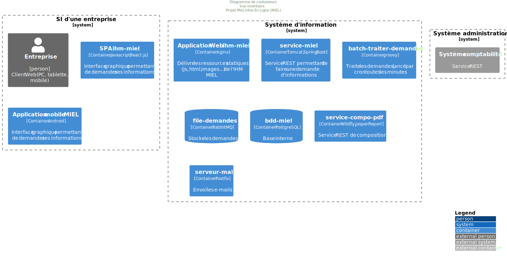

# Vue architecture applicative
:sectnumlevels: 4
:toclevels: 4
:sectnums: 4
:toc: left
:icons: font
:toc-title: Sommaire

*Dernière modification* : _{docdate}_

*Date de la dernière revue globale* : _<Faire régulièrement des revues complètes de la vue (au moins une fois par an tant que le projet est actif) et mentionner la date ici>_

*Statut du document* :  _<Indiquer ici le statut de la vue, par exemple 'DRAFT', 'FINALISÉ',...>_

## Introduction

La vue applicative du projet décrit les modules applicatifs en jeu et leurs échanges.

Les autres vues du dossier sont accessibles link:./README.adoc[d'ici].

Le glossaire du projet est disponible link:glossaire.adoc[ici]. Nous ne reprendrons pas ici les termes fonctionnels ou techniques déjà définis.

### Documentation de Référence

Mentionner ici les documents d'architecture de référence (mutualisés). Ce dossier ne doit en aucun cas reprendre leur contenu, sous peine de devenir rapidement obsolète et immaintenable.

.Références documentaires
[cols="1e,1e,4e,4e"]
|===
|N°|Version|Titre/URL du document| Détail

|1|2.0.4|XX_Urba_POS.pdf|POS du SI|
|===

## Non statué

### Points nécessitant une étude complémentaire

.Points nécessitant une étude complémentaire
[cols="1e,6e,1e,1e,1e"]
|===
|Sujet| Détail | Statut| Porteur du sujet  | Échéance

|Utilisation des services Y
|En fonction de l’avancement du projet Y, ce module applicatif pourrait appeler les services de ce dernier ou ceux de l’ancien module Z
|EN_ATTENTE
|Projet Y
|Avant 2040
|===

### Hypothèses

.Hypothèses
[cols="1e,6e"]
|====
|ID| Détail

|HA1
|Même si la décision de généralisation de l'annuaire centralisé n'est pas totalement entérinée, l’application s’appuiera sur celui-ci et non sur un annuaire local..
|====

## Contexte général

### Objectifs

[TIP]
Décrire succinctement le projet et en rappeler les objectifs. Mettre en évidence ceux qui sont structurants pour l’architecture.

====
Exemple 1 : Cette application doit permettre la dématérialisation des factures reçues de nos fournisseurs et une consultation aisée de ces documents par les services comptables.
====
====
Exemple 2 : Ce projet consiste en la réécriture en version Web de l’application Cobol X. Elle doit en faciliter la maintenance.
====
====
Exemple 3: l’application X est l’un des modules principaux du programme Y. Il s’adosse sur les référentiels `Personne` et `Facturation` pour enrichir le CMS en données clients temps réel.
====

### Existant

[TIP]
Si ce document présente un projet de refonte ou de migration, décrire a minima l'application existante. Ne pas reprendre la documentation, y faire simplement référence et pointer vers son éventuel dossier d'architecture. Mentionner néanmoins toute information ayant un impact fort sur la migration ou la conception du nouveau projet.
====
Exemple 1 : L'application VENIR2 est une application Client-Server en FORMS 4 pointant vers une base Oracle 9i. Son dossier d'architecture est donné en [REFxyz].
====
====
Exemple 2 : L'application existante se base et alimente un annuaire LDAP pour ses autorisations. Le nouveau projet devant fonctionner un temps avec l'ancienne, il convient de prendre en compte les accès concurrents et la cohérence du LDAP pendant la période de tuilage.
====

### Positionnement dans le SI

[TIP] 
Si le SI est urbanisé, reprendre le plan d’occupation au sol et préciser le bloc concerné.

### Acteurs

#### Acteurs internes 

[TIP]
Par ‘internes’, on entend les acteurs appartenant à l’organisation, qu’il s’agisse d’humains ou de modules applicatifs.

.Liste des acteurs internes
[cols="2e,3e,2e,2e"]
|===
|Acteur|Description|Population|Localisation

|Système de l'administration B
|fournit les données comptables des entreprises
|N/A
|Site de Berlin

|Agent
|Agent back-office
|100
|Site de Paris

|===

#### Acteurs externes

.Liste acteurs externes
[cols="2e,3e,2e,2e"]
|===
|Acteur| Description| Population| Localisation

|Client Web
|Un utilisateur pro depuis un PC
|Max 1M
|Monde entier

|Client mobile
|Un utilisateur pro depuis un mobile
|Max 2M
|Monde entier
|===

## Contraintes

### Budget

TIP: Donner un ordre de grandeur des contraintes budgétaires du projet (ou donner un lien vers un document pertinent).
====
Exemple 1: Enveloppe globale de 1 M€.
====
====
Exemple 2: Coûts d'infrastructure cloud inférieurs à 20 K€ par mois.
====

### Planning

TIP: Sans reprendre dans le détail les plannings du projet, donner les éléments pertinents pour l'architecture.
====
Exemple 1: Mise en production avant février 2034, prérequis au programme HEAVY en mai 2034.
====

### Urbanisation

[TIP]
====
Lister ici les contraintes relatives à l'urbanisation, ceci inclut par exemple mais pas seulement :

* Les règles applicables dans les appels entre modules (SOA) ;
* Les règles d'appels entre zones réseau ;
* Les règles concernant la localisation des données (MDM) ;
* Les règles concernant la propagation des mises à jours par événements (EDA).

====
====
Exemple 1 : Les appels inter-services sont interdits sauf les appels de services à un service de nomenclature.
====
====
Exemple 2 : Pour en assurer la fraîcheur, il est interdit de répliquer les données du référentiel PERSONNE. Ce dernier devra être interrogé au besoin en synchrone.
====
====
Exemple 3 : Lors de la modification d'une commande, les zones `comptabilité` et `facturation` se mettront à jour de façon asynchrone via un événement.
====
====
Exemple 4 : Tous les batchs doivent pouvoir fonctionner en parallèle des IHM sans verrouillage des ressources.
====
====
Exemple 5 : Les services ne peuvent être appelés directement. Les appels se feront obligatoirement via une route exposée au niveau du bus d'entreprise qui appellera à son tour le service. Il est alors possible de contrôler, prioriser, orchestrer ou piloter les appels.
====
====
Exemple 6 : Les modules de cette application suivent l'architecture SOA telle que définie dans le document de référence X.
====
====
Exemple 7 : Les modules en zone Internet ne peuvent appeler les modules en zone Intranet pour des raisons de sécurité.
====

### Juridique

Lister ici (sans détailler) les éventuelles contraintes juridiques liées au projet.

====
Exemple 1 : Le contrat cadre établi avec l'ESN XYZ prévoit de transférer à notre société les droits patrimoniaux du code source.
====

====
Exemple 2 : Le code du projet sera en licence libre et open source GPL V3.
====

====
Exemple 3 : Les données produites par le projet seront en licence Ouverte version 2.0.
====

====
Exemple 4 : Le CLUF du progiciel prévoit un accès aux sources des utilisateurs ayant des parts dans la société.
====

## Exigences

TIP: Fournir ici les exigences d'architecture applicative pouvant s'appliquer au projet. En fonction de votre contexte, ne pas hésiter à ajouter des sous-sections.

### Exigences stratégiques

TIP: Décrire ici les exigences en rapport avec la stratégie générale du projet en termes de trajectoire, de budget et d'organisation.

====
Exemple 1 : Le développement devra pouvoir se faire au sein d'équipes distribuées, chacune travaillant sur des modules distincts.
====

====
Exemple 2 (projet de migration) : Les modules legacy devront faire l'objet d'aussi peu d'adaptations que possible par manque de ressources humaines.
====

### Interopérabilité

TIP: Décrire ici les exigences portant sur les protocoles, formats et sémantiques à respecter afin de favoriser les échanges avec des organismes ou tiers.

====
Exemple 1: Nos modules XYZ devront pouvoir être exposés aux organismes X depuis Internet et sous la forme d'API REST authentifiées.
====

====
Exemple 2 (pour une administration): Le projet devra respecter le https://www.numerique.gouv.fr/publications/interoperabilite/[référentiel Général d’Interopérabilité (RGI)].
====

### Exigences de gestion de la concurrence

[TIP]
====
Préciser ici les modules internes ou externes pouvant interférer avec l’application.
====
====
Exemple 1  : Tous les modules de cette application doivent pouvoir fonctionner en concurrence. En particulier, la concurrence batch/IHM doit toujours être possible car les batchs devront pouvoir tourner de jour en cas de besoin de rattrapage
====
====
Exemple 2 : le batch X ne devra être lancé que si le batch Y s’est terminé correctement sous peine de corruption de données.
====

### Archivage

[TIP]
====
L'archivage est la recopie de données importantes sur un support dédié offline en vue non pas d'une restauration comme la sauvegarde mais d'une _consultation_ occasionnelle. Les archives sont souvent exigées pour des raisons légales et conservées trente ans ou plus.

Précisez si des données de l’application doivent être conservées à long terme. Précisez les raisons de cet archivage (https://www.service-public.fr/professionnels-entreprises/vosdroits/F10029[légales] le plus souvent).

Précisez si des dispositifs spécifiques de protection de l'intégrité (pour prévenir ou détecter toute modification) doivent être mis en place.
====

====
Exemple 1: comme exigé par l'article L.123-22 du code de commerce, les données comptables devront être conservées au moins dix ans.
====
====
Exemple 2 : Les pièces comptables doivent être conservées en ligne (en base) au moins deux ans puis peuvent être archivées pour conservation au moins dix ans de plus. Une empreinte SHA-512 sera calculée au moment de l'archivage et stockée séparément pour vérification de l'intégrité des documents au besoin.
====

### Durées de rétention

TIP: Précisez ici combien de temps doivent être conservées les données et documents stockés par vos modules applicatifs. À noter que ces durées peuvent être contraintes par le droit (voir contraintes juridiques plus haut), par exemple dans le cadre du droit à l'oubli du RGPD.

TIP: Ne pas oublier de mentionner les données techniques (comme les journaux ou les tables techniques) ainsi que les archives.

====
Exemple :

.Durée de rétention des données et documents
[cols="1e,1e"]
|====
| Donnée | Durée maximale de rétention

| Données de paiement (CB)
| 2 mois

| Liste des commandes
| 2 ans

| Logs d'accès
| 1 mois

| Archives des données comptables
| 30 ans

|====
====

## Architecture cible

### Architecture applicative générale

[TIP]
====
Présenter ici l'application dans son ensemble (sans détailler ses modules ou composants) en relation avec les autres applications du SI. Présenter également les principales données échangées ou stockées. 

Rappeler :

 * Le type d'architecture (client-serveur, Web monolithique, SOA, micro-service, event-driven…) ;
 * Les flux principaux entre les modules (micro-service/SOA) ou applications (monolithe) ;
 * D'éventuelles dérogations aux règles d'architecture du SI.
 
Si l'application est prévue pour être implémentée en plusieurs étapes, décrire succinctement la trajectoire cible.
====

[TIP]
====

Le choix de la représentation est libre mais un diagramme https://c4model.com/diagrams/system-landscape[C4 System Landscape] semble le plus adapté. Nous fournissons des patterns et des détails à ce sujet dans https://florat.net/architecture-as-code-with-c4-and-plantuml/[cet article].

Ne pas faire figurer les nombreux systèmes d'infrastructure (serveur SMTP, dispositif de sécurité, reverse proxy, annuaires LDAP, …) qui sont du domaine de l’infrastructure. Mentionner en revanche les éventuels bus d'entreprise qui ont un rôle applicatif (orchestration de service par exemple).
====

====
Exemple : MesInfosEnLigne (MIEL) permet à une entreprise de récupérer par mail un document récapitulant toutes les informations dont l’administration dispose sur elle. L'administration peut compléter ses données par celles d'une autre administration. Elle  est constituée de plusieurs modules indépendants (modules IHM, batchs ou services REST).

image::diagrammes/archi-applicative-generale.svg[Diagramme architecture applicative générale]
====

### Architecture applicative détaillée

[TIP]
====
Détailler ici tous les modules de l’application, leurs interdépendances et leurs échanges avec d'autres applications du SI ou de partenaires.

Les flux sont logiques et non techniques. Par exemple, on peut représenter un flux HTTP direct entre deux modules alors qu'en réalité, il passe par un répartiteur de charge intermédiaire : ce niveau de détail sera donné dans la vue infrastructure. 

Proposer un ou plusieurs schémas (de préférence des diagrammes C4 de type conteneurs ou diagramme UML2 de composant). 

Idéalement, le schéma tiendra sur une page A4, sera autoporteur et compréhensible par un non-technicien. Il devrait devenir l'un des artefacts documentaires les plus importants et figurer dans la war room d'un projet agile ou être imprimé par chaque développeur. 

====

#### Principes ayant dicté les choix

[TIP]
====
Fournir ici l'intention dans la construction de l'architecture.
====
====
Exemple : nous utiliserons une approche monolithique et non micro-service par manque d'expertise à ce stade.
====

#### Vue inventaire

[TIP]
====
Exposer les modules applicatifs dans leurs différentes zones et/ou domaines.
====
====
Exemple 1 : module `X`, `Y` et `Z` dans le domaine `GED`. Modules `A`, `B` dans le domaine `PERSONNE`.
====
====
Exemple 2 : vue inventaire du projet MIEL :

 
====

#### Vue dynamique

[TIP]
====
Exposer les dépendances entre l'ensemble des modules applicatifs dans leurs différentes zones ou domaines. Ne pas détailler les flux techniques (comme les flux liés à la supervision ou  au clustering).

Si (et seulement si) la complexité de l'application le justifie, proposer en plus de ce schéma global un schéma détaillant chaque chaîne de liaison principale en numérotant les échanges (utiliser un diagramme de séquence ou (mieux) un Dynamic Diagram C4). 

Utiliser comme ID des flux une simple séquence non signifiante et hiérarchique  (`1`, `2.1`, `2.2.3`, …, `n`).

Pour chaque flux, donner le protocole, un attribut lecture/écriture/exécution et une description pour que le schéma soit auto-porteur. Si le flux est asynchrone, le spécifier (dans l'exemple plus bas, l'appel est en pointillés).

Chaque chaîne de liaison décrit une fonctionnalité majeure. Dans les cas d'enchaînements complexes, il est préconisé de découper la fonctionnalité en plusieurs chaines de liaison comprenant uniquement des appels synchrones (voir https://florat.net/architecture-as-code-with-c4-and-plantuml/[cet article]). 

====
====
Exemple: 

image:diagrammes/archi-applicative-detaillee-dynamique.svg[Diagramme architecture applicative détaillée (vue dynamique)] 

====

### Archivage

[TIP]
====
Décrire ici les dispositifs permettant de répondre aux exigences d'archivage. Cette section contiendra principalement : 

* La technologie générale utilisée : idéalement, on dupliquera par sécurité l'archive sur plusieurs supports de technologies différentes : bande magnétique type LTO, disque optique (Blu-ray Disc Recordable par exemple), stockage sur cloud (comme 'Glacier' d'AWS ou 'Coldline' de GCP), disques durs en mode SMR,...).
* Un lieu de stockage spécifique et distinct des sauvegardes classiques (Cloud, coffre-fort en banque par exemple).
====
====
Exemple : les relevés bancaires de plus de 10 ans seront archivés sur bande LTO et disque dur. Un jeu de chacun des deux supports sera stocké en coffre dans deux banques différentes.
====

### Purges

[TIP]
====
Fournir ici les dispositifs techniques répondant aux exigences de purge.
====

====
Exemple 1: L'historique des consultations sera archivé par un dump avec une requête SQL puis purgé par une requête SQL après validation par l'exploitant de la complétude du dump.
====

====
Exemple 2: Chaque API est responsable de la purge des données qu'elle expose. Pour cela, prévoir des traitements internes qui suppriment les données suivant une planification paramétrable.
====

### Matrice des flux applicatifs

[TIP]
====
Lister ici les flux principaux de l'application. 

Ne pas détailler les flux techniques, notamment ceux liés à la supervision ou au clustering.
====

.Exemple partiel de matrice de flux applicatifs
[cols='1e,3e,1e,1e,1e']
|====
|Source|Destination|Type de réseau|Protocole| Mode.footnote:[(L)ecture, (E)criture ou Lecture/Ecriture (LE), (A)ppel (vers un système stateless)]

|Entreprise|PC/tablette/mobile externe |WAN| ihm-miel | LE
|batch-traiter-demandes | service-compo-pdf |LAN | HTTP | A
|====

