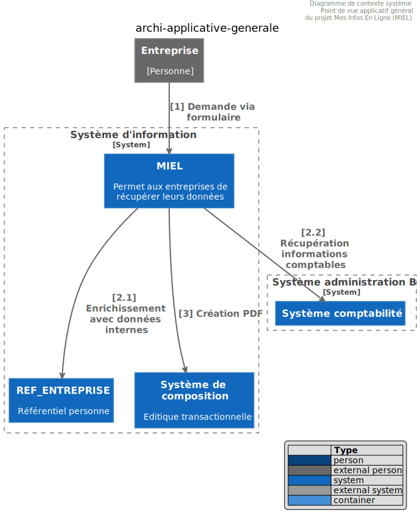
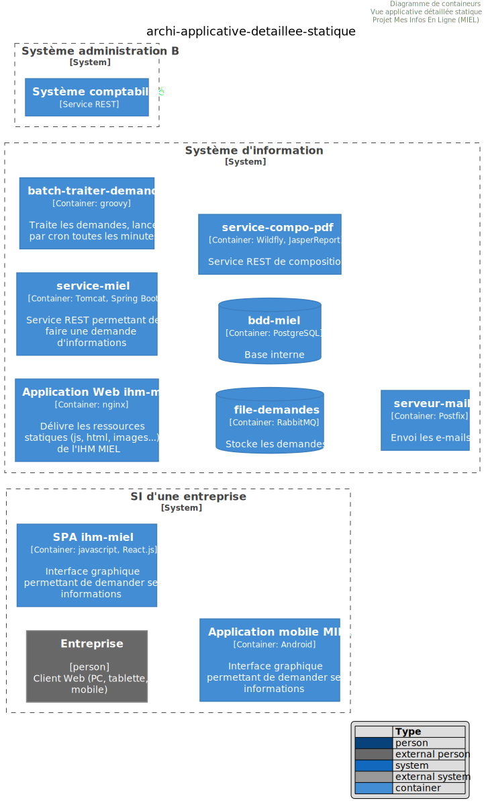
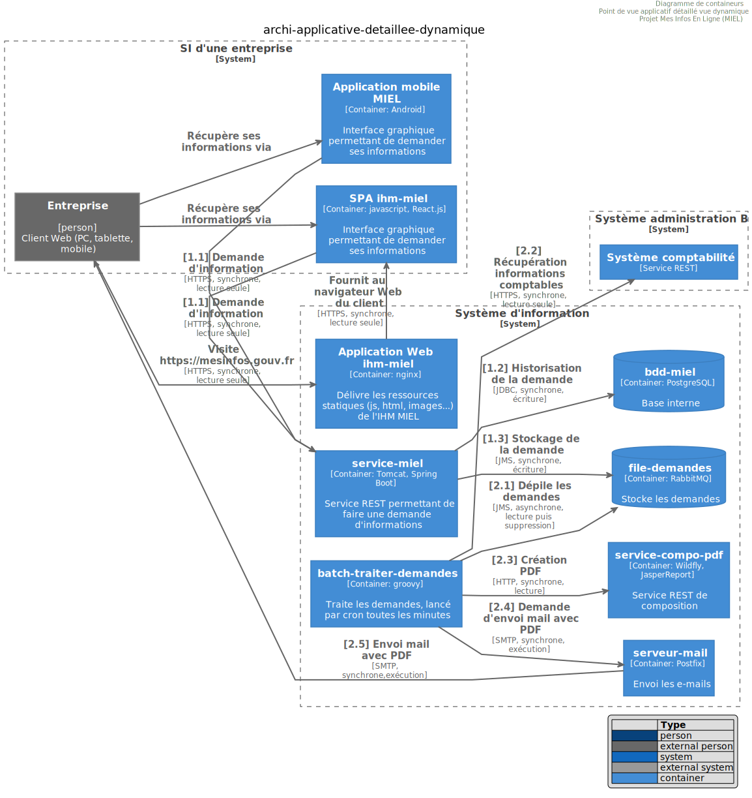

# Vue architecture applicative
:sectnumlevels: 4
:toclevels: 4
:sectnums: 4
:toc: left
:icons: font
:toc-title: Sommaire

Dernière modification : {docdate} 

## Introduction

Ceci est le point de vue applicatif du projet. Il décrit les modules applicatifs en jeu et leurs échanges.

Les autres vues du dossier sont accessibles link:./README.adoc[d'ici].

Le glossaire du projet est disponible link:glossaire.adoc[ici]. Nous ne redéfinirons pas ici les termes fonctionnels ou techniques utilisés.

### Documentation de Référence

Mentionner ici les documents d'architecture de référence (mutualisés). Ce dossier ne doit en aucun cas reprendre leur contenu sous peine de devenir rapidement obsolète et inmaintenable.

.Références documentaires
[cols="1e,1e,4e,4e"]
|===
|N°|Version|Titre/URL du document| Détail

|1|2.0.4|XX_Urba_POS.pdf|POS du SI|
|===

## Non statué

### Points soumis à étude complémentaire

.Points soumis à étude complémentaire
[cols="1e,6e,1e,1e,1e"]
|===
|Sujet| Détail | Statut| Porteur du sujet  | Échéance

|Utilisation des services Y
|En fonction de l’avancement du projet Y, ce composant pourrait appeler les services de ce dernier ou ceux de l’ancien composant Z
|EN_ATTENTE
|Projet Y
|AVANT 2040
|===

### Hypothèses

.Hypothèses
[cols="1e,6e"]
|====
|ID| Détail

|HA1
|Même si la décision de généralisation de l'annuaire centralisé n'est pas totalement entérinée, l’application s’appuiera dessus et non sur un annuaire local.
|====

## Contexte général

### Objectifs

[TIP]
Décrire succinctement le projet et en rappeler les objectifs. Mettre en évidence ceux qui sont structurants pour l’architecture.

====
Exemple 1 : Cette application doit permettre la dématérialisation des factures reçues de nos fournisseurs et une consultation aisée de ces documents par les services comptables.
====
====
Exemple 2 : ce projet est la réécriture en technologies Web de l’application Cobol X. Elle doit en faciliter la maintenance.
====
====
Exemple 3: l’ application X est l’un des composants principaux du programme Y. Il s’adosse sur les référentiels Personne et Facturation pour enrichir le CMS en données clients temps réel.
====

### Existant

[TIP]
Si ce document présente un projet de refonte ou migration, décrire a minima l'application existante. Ne pas reprendre la documentation, y faire simplement référence et pointer vers son éventuel dossier d'architecture. Mentionner néanmoins toute information ayant un impact fort sur la migration ou la conception du nouveau projet.
====
Exemple 1 : L'application VENIR2 est une application Client-Server en FORMS 4 pointant vers une base Oracle 9i. Son dossier d'architecture est donné en [REFxyz].
====
====
Exemple 2 : L'application existante se base et alimente un annuaire LDAP pour ses autorisations. Le nouveau projet devant fonctionner un temps avec l'ancienne, il convient de prendre en compte les accès concurrents et la cohérence du LDAP pendant la période de tuilage.
====

### Positionnement dans le SI

[TIP] 
Si le SI est urbanisé, reprendre le plan d’occupation au sol et préciser le bloc concerné 

### Acteurs

#### Acteurs internes 

[TIP]
On entend par ‘internes’ les acteurs appartenant à l’organisation. Il peut s’agir d'humains ou de composants applicatifs.

.Liste des acteurs internes
[cols="1e,1e,4e,4e"]
|===
|Acteur|Description|Population|Localisation

|Système de l'administration B
|fournit les données comptables des entreprises
|N/A
|Site de Berlin

|Agent
|Agent back-office
|100
|Site de Paris

|===

#### Acteurs externes

.Liste acteurs externes
[cols="e,e,e,e"]
|===
|Acteur| Description| Population| Localisation

|Client Web
|Une entreprise depuis un PC
|Max 1M
|10 appels à l’IHM par session, une session par jour et par acteur
|Client mobile
|Une entreprise depuis un mobile
|Max 2M
|Monde entier
|===

## Contraintes

### Budget

TIP: Donner les contraintes budgétaires du projet
====
Exemple 1: Enveloppe globale de 1 M€
====
====
Exemple 2: Coûts d'infrastructure cloud < 20K€ / mois
====

### Planning

TIP: Sans reprendre dans le détail les plannings du projet, donner les éléments intéressants pour l'architecture.
====
Exemple 1: MEP avant fev 2034, prérequis au programme HEAVY en mai 2034.
====

### Urbanisation

[TIP]
====
Lister ici les contraintes relatives à l'urbanisation, ceci inclut par exemple mais pas seulement :

* Les règles applicables dans les appels entre composants (SOA)
* Les règles d'appels entre zones réseau
* Les règles concernant la localisation des données (MDM)
* Les règles concernant la propagation des mises à jours par événements (EDA)

====
====
Exemple 1 : les appels inter-services sont interdits sauf les appels de services à un service de nomenclature.
====
====
Exemple 2 : pour en assurer la fraicheur, il est interdit de répliquer les données du référentiel PERSONNE. Ce dernier devra être interrogé au besoin en synchrone.
====
====
Exemple 3 : Lors de la modification d'une commande, les zones comptabilité et facturation seront mises à jour de façon asynchrone via un événement.
====
====
Exemple 4 : tous les batchs doivent pouvoir fonctionner en concurrence des IHM sans verrouillage des ressources.
====
====
Exemple 5 : les services ne peuvent être appelés directement. Les appels se feront obligatoirement via une route exposée au niveau du bus d'entreprise qui appellera à son tour le service. Il est alors possible de contrôler, prioriser, orchestrer ou piloter les appels.
====
====
Exemple 6 : Les composants de cette application suivent l'architecture SOA telle que définie dans le document de référence X.
====
====
Exemple 7 : Les composants en zone Internet ne peuvent appeler les composants en zone Intranet pour des raisons de sécurité.
====

## Exigences

TIP: Donner ici les exigences d'architecture applicative pouvant s'appliquer au projet.

====
Exemple 1 (projet de migration) : Les modules legacy devront faire l'objet d'aussi peu d'adaptations que possible. 
====

====
Exemple 2 : Les modules devront pouvoir s'interfacer avec le partenaire XYZ via leurs API.
====

====
Exemple 3 : Le développement devra pouvoir se faire au sein d'équipes distribuées, chacune travaillant sur des modules distincts.
====

## Architecture cible

### Architecture applicative générale

[TIP]
====
Présenter ici l'application dans son ensemble (sans détailler ses sous-composants) en relation avec les autres applications du SI. Présenter également les macro-données échangées ou stockées. 

Rappeler :

 * Le type d'architecture (client-serveur, Web monolithique, SOA, micro-service…).
 * Les grands flux entre les composants ou entre les applications dans le cas des monolithes.
 * D'éventuelles dérogations aux règles d'architecture du SI.
 
Si l'application est prévue pour être implémentée en plusieurs étapes, décrire succinctement la trajectoire cible.
====

[TIP]
====

Le choix de la représentation est libre mais un diagramme C4 de System Landscape ou un diagramme de composant UML2 semble le plus adapté.

Numéroter les étapes par ordre chronologique assure une meilleure compréhension du schéma. Grouper les sous étapes par la notation x, x.y, x.y.z, …

Ne pas faire figurer les nombreux systèmes d'infrastructure (serveur SMTP, dispositif de sécurité, reverse proxy, annuaires LDAP, …) qui sont du domaine de l'architecture technique. Mentionner en revanche les éventuels bus d'entreprise qui ont un rôle applicatif (orchestration de service par exemple).
====

====
Exemple 1 : MesInfosEnLigne permet à une entreprise de récupérer par mail un document récapitulant toutes les informations dont l’administration dispose sur elle. L'administration peut compléter ses données par celles d'une autre administration.
====
====
Exemple 2 : MesInfosEnLigne est constituée de plusieurs microservices indépendants (composants IHM, batchs ou services REST)
====
====
Exemple 3 : Suite à la dérogation du DSI le 03 aout 20xx, l'IHM sera en architecture SPA (Single Page Application)
====

### Architecture applicative détaillée

[TIP]
====
Détailler ici tous les composants de l’application, leurs flux entre eux et avec les autres applications du SI.

Proposer un ou plusieurs schémas (de préférence des diagrammes C4 de type containers ou diagramme UML2 de composant). 

Idéalement, le schéma tiendra sur une page A4, sera autoporteur et compréhensible par un non-technicien. Il devrait devenir l'un des artefacts documentaires les plus importants et figurer dans la war room d'un projet agile ou être imprimé par chaque développeur. 

Si l'application est particulièrement complexe, faire un schéma par chaîne de liaison.

Utiliser comme ID des flux une simple séquence non signifiante (1, 2, …, n).
Les flux sont logiques et non techniques (par exemple, on peut représenter un flux HTTP direct entre deux composants alors qu'en réalité, il passe par un répartiteur de charge intermédiaire : ce niveau de détail sera donné dans la vue infrastructure). 

Pour chaque flux, donner le protocole, un attribut synchrone/asynchrone, un attribut lecture/écriture/exécution et une description pour que le schéma soit auto-porteur.
====

### Principes ayant dicté les choix

[TIP]
====
Donner ici l'intention dans la construction de l'architecture.
====
====
Exemple : nous utiliserons une approche monolithique et non micro-service par manque d'expertise.
====

### Vision statique

[TIP]
====
Exposer les modules applicatifs dans leurs différentes zones ou domaines.
====
====
Exemple: module X, Y et Z dans le domaine GED. Modules A, B dans le domaine PERSONNE.
====

 

### Vision dynamique

[TIP]
====
Exposer les modules applicatifs dans leurs différentes zones ou domaines avec leurs flux applicatifs principaux.

Ne pas détailler les flux techniques (comme les flux liés à la supervision ou au clustering).

Si l'application est complexe, proposer un schéma global exposant tous les flux applicatifs puis un schéma par chaîne de liaison principale en numérotant les échanges (utiliser un diagramme de séquence ou (mieux) un Dynamic Diagram C4). 
Il est possible également de détailler les chaînes de liaison par fonctionnailité principale.
====
====
Exemple: 

 

====

### Matrice des flux applicatifs

[TIP]
====
Lister ici les flux principaux de l'application. 

Ne pas détailler les flux techniques de supervision ou liés au clustering par exemple. Mentionner le type de réseau (LAN, WAN). 
====

.Exemple partiel de matrice de flux applicatifs
[cols='1e,3e,1e,1e,1e']
|====
|Source|Destination|Type de réseau|Protocole| Mode.footnote:[(L)ecture, (E)criture ou Lecture/Ecriture (LE), (A)ppel (vers un système stateless)]

|Entreprise|PC/tablette/mobile externe| ihm-miel |WAN | LE
|batch-traiter-demandes | service-compo-pdf | HTTP |LAN | A
|====

