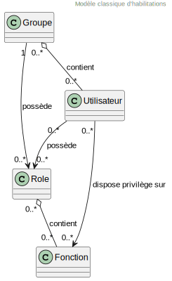

# Vue architecture sécurité
:sectnumlevels: 4
:toclevels: 4
:sectnums: 4
:toc: left
:icons: font
:toc-title: Sommaire

*Dernière modification* : {docdate} 

*Date dernière revue globale* : _<Faire régulièrement des revues globale de la vue (au moins une fois par an tant que le projet est actif) et mentionner la date ici>_

*Statut du document* :  _<Donner ici le statut de la vue, par exemple 'DRAFT', 'FINALISÉ',...>_

## Introduction

Ceci est le point de vue sécurité. Elle décrit l'ensemble des dispositifs mis en œuvre pour empêcher l'utilisation non-autorisée, le mauvais usage, la modification illégitime ou le détournement des modules applicatifs.

Les autres vues du dossier sont accessibles link:./README.adoc[d'ici].

Le glossaire du projet est disponible link:glossaire.adoc[ici]. Nous ne redéfinirons pas ici les termes fonctionnels ou techniques utilisés.

[TIP]
La disponibilité est traitée dans la vue infrastructure.

### Documentation de Référence

[TIP]
====
Mentionner ici les documents d'architecture de référence (mutualisés). Ce document ne doit en aucun cas reprendre leur contenu sous peine de devenir rapidement obsolète et non maintenable.
====

.Références documentaires sécurité
[cols="1e,1e,3e,3e"]
|====
|N°|Version|Titre/URL du document|Détail

|1|1.0|Dispositifs_securite.pdf|Catalogue de dispositifs de sécurité habilités
|2|latest|Normes sécurité société|http://masociete/monurl
|====

## Non statué

### Points soumis à étude complémentaire

.Points soumis à étude complémentaire
[cols="1e,3e,1e,1e,2e"]
|====
|ID|Détail|Statut|Porteur du sujet | Échéance

|ES1
|Il conviendra de valider que les dispositifs anti-CSRF mis en place résolvent également les failles liées au couplage TLS + compression (type CRIME ou BREACH). 
|EN_COURS
|Équipe sécurité
|AVANT 2040

|====

### Hypothèses

.Hypothèses
[cols="e,e"]
|====
|ID|Détail

|HS1
|La solution SAML actuellement en place dans l’organisation ne permet pas de répondre aux besoins d’authentification exprimés pour cette application Internet. Une solution OpenID Connect sera proposée. 
|====

## Contraintes

[TIP]
====
Lister ici les contraintes relatives à la sécurité, ceci inclut par exemple mais pas seulement :

* L'isolation des composants au sein de zones réseaux étanches (DMZ, pare-feux, reverse-proxy…)
* Les normes applicables (comme les politiques de mot de passe)
* Les contraintes légales (RGPD par exemple)

====
====
Exemple 1 : la politique de mot de passe devra se conformer à la norme xyz
====
====
Exemple 2 : il est formellement interdit à un composant de la zone internet d'accéder à la zone intranet 
====
====
Exemple 3 : en application du RGPD, les données utilisateur devront être chiffrées
====

## Exigences

[TIP]
====
Présenter ici les exigences, *pas les dispositifs y répondant*. Ceux-ci seront détaillées au chapitre 3. 

Pour les projets particulièrement sensibles, prévoir un dossier d’analyse de risque. Pour cela, utiliser par exemple la méthode https://www.ssi.gouv.fr/guide/la-methode-ebios-risk-manager-le-guide/[EBIOS Risk Manager] (Expression des Besoins et Identification des Objectifs de Sécurité).
====

[[exigences-integrite]]
### Exigences d'intégrité

[TIP]
====
L’intégrité concerne la durabilité, la justesse et le niveau de confiance dans les données de l’application. 

Gérer l’intégrité des données consiste à vérifier qu’elle ne peuvent être altérées ou supprimées (involontairement, suite à un crash disque par exemple) ou volontairement, par exemple dans le cadre d’une attaque de type "man in the middle" ou par une personne s’étant octroyé des droits indus.

Attention à ne pas multiplier les classes de données. Il est possible de ne définir qu’une seule classe de donnée pour l’ensemble de l’application (cas courant). 
====

.Niveau d'intégrité exigée par classe de données
[cols='2e,1e,1e,1e,1e']
|====
|Classe de données
|Niveau « Non intègre » ([small]#La donnée peut ne pas être totalement intègre)#
|Niveau « Détectable » ([small]#La donnée peut ne pas être intègre si l'altération est identifiée dans un délai raisonnable)#
|Niveau « Maîtrisé » ([small]#La donnée peut ne pas être intègre, si l'altération est identifiée et l'intégrité du bien essentiel retrouvée)#
|Niveau « Intègre » ([small]#La donnée doit toujours être rigoureusement intègre)#

|Données de la base métier
|
|
|
|X

|Données archivées
|
|X
|
|

|Données calculées stats entreprises
|
|
|X 
|

|Silo NoSQL des données Big Data avant consolidation
|X
|
|
|

|Sources de l’application
|
|
|
|X

|Avis d‘imposition en PDF
|
|
|
|X
|====

### Exigences de confidentialité

[TIP]
====
[quote ]
La confidentialité est le fait de s’assurer que l’information n’est accessible qu’à ceux dont l’accès est autorisé (norme ISO 27018). 

Attention à ne pas multiplier les classes de données. Il est possible de ne définir qu’une classe de donnée pour l’ensemble de l’application (cas courant). 
====

.Niveau de confidentialité exigée par classe de données
[cols="e,e,e,e,e"]
|====
|Classe de données | Niveau « Public » ([small]#Tout le monde peut accéder à la donnée)# 
|Niveau Limité » ([small]#La donnée n’est accessible qu’aux personnes habilitées)# 
|Niveau « Réservé » ([small]#La donnée n’est accessible qu’au personnel interne habilité)# 
|Niveau « Privé » ([small]#La donnée n’est visible que par l’intéressé(e))#

|Contenu éditorial 
|X
|
|
|

|Profil du compte du site Web
|
|X
|
|

|Historique du compte
|
|
|X
|

|Logs techniques des activités de l’internaute
|
|
|X
|

|Données RH de type "aides sociales aux employés"
|
|
|
|X
|====

[[exigences-identification]]
### Exigences d'identification

[TIP]
====
L’identification est l’ensemble des dispositifs permettant de différentier un utilisateur d’un autre (mais sans vérifier qu’il est bien celui qu’il prétend être). 
====

====
Exemple 1 : Un utilisateur ne peut avoir qu’un identifiant et un identifiant ne peut être partagé par plusieurs utilisateurs. L'adresse e-mail personnelle est donc un bon identifiant.
====
====
Exemple 2 : l’identité d’un internaute fera l’objet d’un test d’existence avant tout appel de service.
====
====
Exemple 3 : un ID est non supprimable, non modifiable et non réutilisable
====

[[exigences-authentification]]
### Exigences d'authentification

[TIP]
====
L’authentification permet de vérifier la cohérence entre l’identité d'un utilisateur et une personne physique se connectant. 

A noter que les dispositifs techniques (comme les batchs) peuvent également faire l'objet d'identification et d'authentification (batch qui utilise un access-token pour appeler un service par exemple).

L’authentification peut être à un ou plusieurs facteurs (dans ce dernier cas, on parle d’authentification forte). Ces facteurs peuvent être : 

* Quelque chose que l’on *connaît* (classiquement un mot de passe).
* Quelque chose qu’on *est* (biométrie).
* Quelque chose qu’on *possède* (token, générateur de mot de passe unique, pièce d’identité avec photo…).

Penser à décrire le système d'authentification une fois inscrit mais également lors de l’inscription (authentification initiale).

Une éventuelle délégation d’authentification s’appuie sur une technologie de fédération d’identité pour authentifier l’utilisateur.

Il est bien sûr possible d’ajouter au besoin dans le tableau ci-dessous des facteurs d’authentification spécifiques à votre organisation.
====

Les facteurs d’authentification requis en fonction des situations sont (on peut exiger plusieurs occurrences du même facteur, utiliser autant de croix) :

.Exigence d'authentification par cas d'utilisation
[cols="e,e,e,e,e,e,e,e"]
|====
|Cas d’authentification
|Mot de passe respectant la politique de mot de passe P
|Clé publique ssh connue
|OTP par Token
|Biométrie
|Connaissance de données métier
|E-mail d’activation
|Délégation d’authentification

|Utilisateur déjà inscrit
|X||||||

|Création d’un compte
|||||XX|X|

|Modification du mot de passe 
|X|||||X|

|Accès aux logs
||X|||||

|Ajout d’un bénéficiaire de virement
|X||X||||

|Application mobile Y
|||||||X
|====

[[exigence-federation-identite]]
### Exigences de fédération d’identité

[TIP]
====
La fédération d’identité est l’utilisation d’une même identité gérée par un identity provider (IdP) depuis plusieurs entités différentes. 

Par exemple, France Connect très utilisé par les administrations et basé sur OpenId Connect permet de réutiliser le compte d’une administration pour se loguer sur le compte d’une autre (DGFiP et CNAM par exemple). 

Voir aussi les « Connect with [Google|Twitter|…] » en technologie OpenId Connect. Contrairement au SSO, la fédération d'identité n’assure pas un login automatique à une application comme le SSO mais permet simplement de réutiliser les mêmes credentials (login/mot de passe).
====

====
Exemple : L’identification et l’authentification seront externalisés au fournisseur d’identité Auth0 pour simplifier la gestion de la sécurité et réduire les coûts de développement et d’exploitation.
====

### Exigences de SSO et SLO

[TIP]
====
Décrire les besoin en terme de Single Sign On et Single Log Out.

Nous entendons ici SSO dans son sens le plus complet : une authentification automatique à une application d’un utilisateur déjà authentifié depuis une autre application du même domaine de confiance. 

Attention, la mise en place de SSO peut être complexe, surtout si l’infrastructure (ID provider…) n’existe pas encore. 

Elle nécessite souvent une adaptation des applications. 

Le SSO est souvent demandé par les métiers mais cette exigence doit être justifiée. 

Une application périphérique ou un outil rarement utilisé n’a en général pas besoin de SSO (une simple authentification centralisée au sein d’un annuaire peut suffire). 

Attention également à évaluer l’impact qu’aurait une authentification faible (mauvais mot de passe par exemple) sur la sécurité de l’ensemble du SI.
====
====
Exemple 1 : aucun SSO n’est exigé puisque toutes les IHM de l’application sont exposées au sein d’un portail JSR352 qui gère déjà l’authentification.
====
====
Exemple 2 : aucun besoin de SSO ou SLO n’est identifié
====
====
Exemple 3 : cette application Web métier devra fournir une authentification unique mutualisée avec celle des autres applications de l’intranet : une fois authentifié sur l’une des applications, l’agent ne doit pas avoir à se reconnecter (jusqu'à expiration de sa session). De même, une déconnexion depuis l’une des applications doit assurer la déconnexion de toutes les applications de l’intranet.
====

### Exigences de non répudiation

[TIP]
====
Lister ici les actions métiers possédant une exigence de non-répudiation, c’est à dire un dispositif permettant de rendre impossible la remise en cause d’un contrat en prouvant l’identité des deux parties et l’intégrité du document par signature numérique comme décrit dans le texte n°2000-230 du 13 mars 2000 du code civil.
====

.Besoins de non-répudiation
[cols="e,e,e"]
|===
|Donnée signée|Origine du certificat client|Origine du certificat serveur

|Déclaration d’impôt sur le revenu (données X, Y et Z)
|PKI de l’administration fiscale
|Verisign
|===

[[exigence-anonymat]]
### Exigences d'anonymat et de respect de la vie privée

[TIP]
Lister les contraintes d’anonymat et de vie privée légale (exigée par le RGPD). Voir https://www.cnil.fr/fr/rgpd-par-ou-commencer.

====
Exemple 1  : Aucune consolidation de donnée de pourra être faite entre les données du domaine PERSONNE et du domaine SANTE.
====
====
Exemple 2  : Par soucis de confidentialité en cas d’intrusion informatique, certaines données des personnes seront expurgées avant réplication vers la zone publique : le taux de cholestérol et le poids.
====
====
Exemple 3 : aucune donnée raciale, politique, syndicales, religieuse ou d’orientation sexuelle ne pourra être stockée sous quelque forme que ce soit dans le SI.
====
====
Exemple 4 : Les données OpenData issues du domaine « logement » ne contiendront que des données consolidées de niveau commune, pas plus précise.
====
====
Exemple 5 : En application de la directive européenne « paquet telecom », un bandeau devra informer l’usager de la présence de cookies.
====
====
Exemple 6 : En application du RGPD, un consentement explicite des utilisateurs dans la conservation de leurs données personnelles de santé sera proposé.
====

### Exigences sur les habilitations

[TIP]
====
Une habilitation (ou autorisation) permet de donner l’accès à une fonction applicative (ou « privilège » ou « permission ») à un utilisateur ou un groupe d’utilisateur. 

Exemples de fonctions : 'faire un virement inter-bancaire', 'voir l’historique de son compte', 'supprimer un utilisateur'

Attention à ne pas multiplier le nombre de fonctions et de rôles pour éviter une explosion combinatoire et des coûts de gestion associés.

Pour simplifier la gestion des habilitations par factorisation, on peut :

* Regrouper les utilisateurs dans des groupes (comme `G_chef_service`).
* Associer une liste de fonctions à un rôle (comme `R_Administrateur`, `R_banquier_niv1`, `R_chef_service`) qu’on peut affecter à une personne ou à un groupe.

Exemple de modèle classique de gestion des habilitations :

Penser à spécifier les éventuels pseudo-utilisateurs et leurs rôles comme :

* `@anonyme` : les personnes non connectées
* `@connecte` : les personnes connectées

Préciser si l’application doit utiliser de la délégation d’autorisation (type OAuth2) et si oui, l’application est-elle fournisseur ou consommateur d’autorisations ? Quelles sont les autorisations concernées ?
====

====
Exemple 1  : les personnes non connectées auront accès à tous les privilèges en lecture seule
====
====
Exemple 2 : l’application s’appuiera sur une gestion des autorisations matricielle de type [rôles] -> [groupes ou utilisateurs] comme décrit plus bas. Le détail des autorisations sera donnée dans les SFD.
====

====
.Exemple de matrice de rôles
[cols="e,e,e,e"]
|===
|_Groupe ou utilisateur_|_Rôle_ `suppression`|_Rôle_ `administration`|_Rôle `_consultation données de base`

|Groupe `g_usagers`
|
|
|X

|Groupe `@anonyme`
|
|
|

|Groupe `g_admin`
|X
|X
|X

|Utilisateur `xyz`
|X
|
|X
|===

====

[[exigences-tracabilite]]
### Exigences de traçabilité et d'auditabilité

[TIP]
====
Lister ici les besoins en traces permettant de détecter par exemple :

* Un usage abusif des applications Back Office par des employés
* Des intrusions informatiques
* Des modifications de données

Les traces sont des données nominatives et complètes pour permettre l’audit. Elles sont donc elles-mêmes sensibles et nécessitent souvent un bon niveau de confidentialité.

Différentier :

* Les traces métier (bilan d’un acte de gestion complet comme `l’agent X a consulté le dossier de Mme Y`) ;
* … et les traces applicatives (logs) comme dans un fichier de log : `[INFO] 2016/12/23 11:14 [Agent X] Appel du service consulter` qui sont de niveau technique. 

Pour les données les plus sensibles, il est possible de prévoir une traçabilité à deux niveaux (tracer la consultation des traces) pour éviter une traçabilité hiérarchique abusive.

La traçabilité des données des référentiels (base des personnes typiquement) nécessite une historisation complète, ce qui est de toute façon une bonne pratique d'urbanisation (voir par exemple Longépé « Le projet d’Urbanisation du SI », règles applicatives 1, 2 et 3). 

Pour cela, prévoir un MCD permettant d’ajouter un enregistrement à chaque changement de la donnée avec une date de modification et une date d’effet.
====

====
Exemple 1 : pour le module X, toute action métier (en mise à jour comme en consultation) devra faire l’objet d’une trace métier contenant a minima l’agent, la date et en cas de modification l’ancienne et la nouvelle valeur.
====
====
Exemple 2 : Toute intrusion dans le SI devra être détectée (dans la mesure du possible).
====
====
Exemple 3 : nous devons pouvoir reconstituer l’historique du dossier de tout patient à n’importe quelle date.
====

.Données à conserver pour preuves
[cols="e,e,e"]
|===
|Donnée|Objectif|Durée de rétention

|Log complet (IP, heure GMT, détail) des commandes passées sur le site
|Prouver que la commande a bien été passée
|1 an 

|Date et contenu du mail de confirmation
|Prouver que le mail de confirmation a bien été envoyé 
|2 ans

|Contrat d’assurance signé et numérisé en PDF
|Prouver que le contrat a bien été signé
|5 ans

|Avis d’imposition primitif avec signature numérique
|Conserver le montant et de l’impôt.
|5 ans
|===

## Mesures de sécurité

### Intégrité

Dispositifs répondant aux <<exigences-integrite,exigences d'intégrité>> :

.Mesures pour assurer le niveau d'intégrité demandée
[cols="e,e,e"]
|===
|Classe de données|Niveau exigé|Mesures

|Données de la base métier
|Intègre
a|
* Utilisation du SGBDR SGBD PostgreSQL avec un niveau d’isolation transactionnelle SERIALIZABLE 
* Les entités seront référencées uniquement par des ID techniques issues de séquences PostgreSQL

|Données archivées
|Détecté
|Génération de checksums SHA-256 des backups

|Données calculées D1
|Maîtrisé
|Stockage d’un checksum SHA1, relance du calcul automatiquement par batch dans les 24H.

|Silo NoSQL des données Big Data avant consolidation
|Non intègre
|Pas de mesure particulière, pas de backup

|Sources
|Intègre
|Utilisation du SCM Git

|Avis d’imposition PDF
|Intègre
|Signature numérique du montant net + date + nom au format PKCS#7 (RSA, SHA256) avec horodatage. La signature résultante sera intégrée a posteriori au format hexadécimal en pied de page du PDF.
|===

### Confidentialité

Dispositifs répondant aux <<Exigences de confidentialité>> :

.Mesures pour assurer le niveau de confidentialité demandé
[cols="e,e,e"]
|===
|Classe de données|Niveau exigé|Mesures

|Contenu éditorial
|Public
|Échanges en HTTPS, pas d’authentification

|Profil du compte du site Web
|Limité
|L’accès à ce contenu nécessite une authentification réussie par login/mot de passe

|Historique du compte
|Réservé
|L’accès à ce contenu est réservé aux exploitants habilités, uniquement via des requêtes PL/SQL de la base de données

|Logs des activités de l’internaute
|Réservé
|L’accès aux fichiers de log est réservé aux exploitants habilités (accès SSH à la machine M et mot de passe Unix)

|Données RH aides sociales aux employés
|Privé
|Ces données sont chiffrées en AES 256 sous forme d’un BLOB en base, remontées au client Web via le service REST Y puis déchiffrées au sein du navigateur dans l’application Angular (librairie forge.js) via un mot de passe complémentaire de l’utilisateur (non stocké coté serveur). +
Il s’agit donc d’un chiffrement client uniquement. Une perte de mot de passe rend les données irrécupérables. Les données modifiées sur le client sont chiffrées et enregistrées à nouveau dans le BLOB via le service REST X.
|===

[TIP]
====
Penser aussi à la confidentialité des données dérivées :

* chiffrement des backups ;
* chiffrement des données clientes pour les applications lourdes. Cela peut être un chiffrement matériel en SED (Self Encryption Disk), un chiffrement logiciel de niveau partition (SafeGuard, dm-crypt) ou de niveau fichier (encfs, TrueCrypt…)
====

### Identification

Dispositifs répondant aux <<exigences-identification,exigences d'identification>> :

_Exemple 1  : L’Id des usagers de l’application sera l’attribut uid des DN `cn=XXX,ou=service1,dc=entreprise,dc=com` dans l’annuaire LDAP central. Un filtre sera également appliqué sur l’appartenance au groupe `ou=monapplication,dc=entreprise,dc=com`._

_Exemple 2  : Pour assurer la non réutilisation des ID des comptes supprimés, une table d’historique sera ajoutée dans l’application et requêtée avant toute création de nouveau compte._

### Authentification

Dispositifs répondant aux <<exigences-authentification,exigences d'authentification>> :
[TIP]
====
Pour les authentifications par mot de passe, décrire le mode de stockage et de vérification. Penser également à décrire les solutions de changement de mot de passe.
====
====
Exemple 1 : L’authentification des internautes inscrits se fera par login/mot de passe (respectant la politique de mot de passe P)
====
====
Exemple 2 : L’authentification des internautes à l’inscription se fera par la saisie du code internaute figurant sur les factures + la valeur de la dernière facture puis par l’activation du compte via un lien figurant dans un e-mail de vérification.
====
====
Exemple 3 : lors de la création d’un nouveau bénéficiaire de virement dans l’espace internet, l’utilisateur devra fournir un mot de passe unique issu de son token OTP en plus d’être authentifié.
====
====
Exemple 4 : Les mots de passe ne seront en aucun cas conservés mais stockés sous la forme de digest bcrypt.
====

#### Comptes de service

[TIP]
====
Les comptes de service sont utilisés pour l'authentification à un composant technique depuis un batch ou une API.
====

.Comptes de service
[cols='1,2,2']
|====
|Compte | Ressource requérant authentification | mode de stockage des credentials

|Comptes JDBC (un compte par base de données) | Instances PG et SqlServer. 
| Stockage en clair dans la configuration des datasources. Valorisé à partir des pilars Salt des API.
|====

### Fédération d’identité

Dispositifs répondant aux <<exigence-federation-identite,exigences de fédération d’identité>> :

[TIP]
====
Les solutions les plus courantes sont actuellement : OpenId Connect (OIDC), SAML ou Oauth 2.0 (pseudo-authentification seulement pour cette dernière). 

Pour les applications Web, préciser les contraintes navigateur (activation des cookies en particulier).
====

====
Exemple  : L’IHM grand public permettra une identification et authentification France Connect (basé sur OIDC) de sorte que les utilisateurs puissent utiliser leur compte DGFiP ou CNAM pour s’identifier et s’authentifier. La cinématique d’authentification sera la suivante : <faire un schéma>
====

### SSO, SLO

Dispositifs répondant aux <<Exigences de SSO et SLO> :
[TIP]
====
Détailler la technologie choisie et son intégration. Quelques solutions courantes : CAS, OpenAM, LemonLDAP::NG. Pour les applications Web, préciser les contraintes navigateur (activation des cookies en particulier).
====
====
Exemple 1 : L’IHM X intégrera un client CAS spring-security pour le SSO. Le serveur CAS utilisé sera YYY. Son royaume d'authentification (realm) sera l’annuaire AD Y.
====
====
Exemple 2 : Comme toutes les applications du portail métier, l’IHM X devra gérer les callbacks de déconnexion provenant du serveur CAS suite à une demande de SLO. 
====

### Non-répudiation et horodatage

Dispositifs répondant aux <<Exigences de non répudiation>> :

====
Exemple : La déclaration d’impôt sera signée par le certificat client de l’usager (certificat X509, RSA, SHA-256) qui lui a été fourni par le composant X.
====

[TIP]
====
Les solutions d'horodatage cryptographiques ne répondent pas à un besoin propre mais sont souvent requis pour répondre à des besoins de non répudiation (spécialement via des jetons d'horodatage utilisés conjointement avec une signature électronique afin de prévenir d'antidatage ou le postdatage). 

====
Exemple : Les signatures électroniques seront accompagnées d'un jeton d'horodatage qualifié eIDAS délivrés par le prestataire de service de confiance XYZ.
====
====

### Anonymat et vie privée

Dispositifs répondant aux <<exigence-anonymat,exigences d'anonymat et de respect de la vie privée>> :

====
Exemple 1 : un audit interne sera mené une fois par an sur le contenu des données en base et les extractions à destination des partenaires.
====
====
Exemple 2 : les données à destination de la zone publique seront exportées partiellement via un `COPY (SELECT …) TO <fichier>`. Les colonnes sensibles seront ainsi exclues de la réplication.
====
====
Exemple 3 : le bandeau d’acceptation des cookies sera mis en ouvre sur toutes les pages de l’application Angular via le module `angular-cookie-law`.
====

### Habilitations

Dispositifs répondant aux <<Exigences sur les habilitations>> :
====
Exemple 1 : la gestion des autorisations sera gérée applicativement et stockée dans la base applicative PostgreSQL. Ces tables seront décrites dans le dossier de spécification.
====
====
Exemple 2 : L’obtention du carnet d’adresse Facebook sera en OAuth2. On utilisera l’API Java Google Oauth2.
====

### Tracabilité, auditabilité

Dispositifs répondant aux <<exigence-tracabilite,exigences de traçabilité et d'auditabilité>> :

====
Exemple 1 : à la fin de chaque action métier, l’application ReactJS appellera dans une action asynchrone un service REST de trace métier. Ce service stockera les traces dans une base Elastic Search pour consultation en Kibana.
====
====
Exemple 2 : l’outil d’IDS hybride (réseau + host) OSSEC sera installé sur l’ensemble des machines utilisées par l’application.
====
====
Exemple 3 : Les  tables X, Y, .. seront historisées suivant le principe suivant : … <diagramme de classe>
====
====
Exemple 4 : tous les documents servant de preuve seront archivés dans la GED.
====
====
Exemple 5 : Les logs contenant le tag `[PREUVE]` et issu de l’ensemble des composants seront centralisés via le système de centralisation de log Elastic Search puis insérés avec traitement Logstash de façon journalière vers l'index Elastic `preuves`.
====

## Auto-contrôles

### Auto-contrôle des vulnérabilités

[TIP]
====
La gestion des vulnérabilités dépasse largement le cadre de ce document mais il est bon de s’auto-contrôler pour s’assurer que les failles les plus courantes sont bien prises en compte et comment. Cette liste est en partie basée sur le https://owasp.org/Top10/[TOP 10 OWASP]. 

Bien entendu, il existe de nombreux autres points de contrôle dépendants du contexte de l’application
====

.Checklist d'auto-contrôle de prise en compte des vulnérabilités courantes
[cols="e,e,3e"]
|===
|Vulnérabilité
|Pris en compte ?
|Mesures techniques entreprises

|Accès à des ports privés
|X
|Configuration du pare-feu iptables sur la machine exposée à Internet. Seul les ports 80 et 443 sont ouverts. Le pare-feu sera configuré en mode stateful (avec extension conntrack)

|Attaque de mot de passe par force brute
|X
|Utilisation de fail2ban, mise en prison de 1h au bout de 3 tentatives de connexion ssh. 

|Visibilité des URLs directes
|X
|Centralisation de tous les accès depuis Internet via un reverse proxy Apache + mod_proxy. Réécriture d’URLs pour masquer les URL internes.

|Contournement du contrôle d’accès
|X
|Utilisation du SSO CAS, voir chapitre 3

|Injection SQL
|X
|Utilisation de PreparedStatement uniquement, audit des requêtes SQL.

|Injection NoSQL
|X
|Désactivation du suport JS par MongoDB 

|Injection OS
|X
|Vérification qu’il n’y a aucun appel de commandes systèmes dans le code (type Runtime.exec() )

|Violation de gestion d’authentification et de session
|X
|Traité avec le dispositif anti-CSRF, voir plus bas. On logue l’IP à fin d’audit.

|XSS
|X
a|
* _Utilisation de librairie d’échappement. Pour les modules Java, nous utiliserons StringEscapeUtils.escapeHtml4() de commons-lang_
* __Utilisation des headers HTTP : X-Frame-Options SAMEORIGIN, Content-Security-Policy__
* __Spécification systématique de l’encoding dans le header de réponse Content-Type (ex : text/html;charset=UTF-8) pour parer les attaques basées sur des caractères spéciaux contournant l'anti-XSS__

|ReDOS
|X
|Vérification que les expressions régulières utilisées par les dispositifs anti-XSS ne sont pas éligibles à ce type d’attaque, voir https://www.owasp.org/index.php/Regular_expression_Denial_of_Service_-_ReDoS

|Référence directe à un objet
|X
|Vérification à chaque requête que les arguments passés correspondent bien à la personne identifiée. Par exemple, toute requête contient son ID et on vérifie par une requête que le dossier qu’elle tente de consulter lui appartient bien avant de poursuivre la requête initiale.

|Planification des mises à jour de sécurité
|X
a|
* __Les mises à jour Centos seront planifiées tous les premiers mercredi du mois__
* __Les mises à jour Wildfly sont appliquées au plus deux semaines après leur sortie__

|Exposition de données sensibles
|X
a|
* __Tous les algorithmes de sécurité sont à jour : au minimum SHA-256, AES 256__
* __Le SSL V2 et V3 est désactivé coté Apache suite à la faille DROWN ( SSLProtocol all -SSLv2 -SSLv3)__
* __L’application ne fonctionne qu’en HTTPS__
* __Le serveur Web fixera le header HSTS avec includeSubDomains sur toutes les ressources__

|CSRF
|X
|Utilisation du dispositif anti-CSRF d’AngularJS (https://docs.angularjs.org/api/ng/service/$http )

|Manque de contrôle d’accès au niveau fonctionnel
|X
a|
* __Mise en place de la politique d’autorisation décrite au chapitre 2__
* __Campagne de tests fonctionnels__

|Log injection
|X
a|
* __Échappement des logs avant de les transmettre à log4j__
* __Vérification des outils de consultation de logs__

|Attaques HTTPS + compression CRIME/BREACH 
|X
a|
* __Désactivation de la compression HTTPS au niveau de l’Apache : SSLCompression off __
* __Dispositif anti-CSRF__

|Upload de fichiers malicieux
|X
| Validation des pièces jointes par l'anti-virus ClamAV

|===

### Auto-contrôle RGPD

[TIP]
====
Cette section aide à vérifier la prise en compte des exigences du https://www.cnil.fr/fr/rgpd-par-ou-commencer[RGPD].

A noter que le RGPD ne concerne que les personnes physiques, pas les personnes morales.

Cette liste n'est qu'un exemple partiel, faire valider votre projet par votre service sécurité et juridique.
====

.Checklist d'auto-contrôle de respect du RGPD
[cols="e,e,e"]
|===
|Exigence RGPD
|Prise en compte ?
|Mesures techniques entreprises

|Registre du traitement de données personnelles
|X
|Liste des traitements et données personnelles dans le document XYZ

|Pas de données personnelles inutiles
|X
|Vérifié, la rétention de numéro de CB a été supprimée car inutile.

|Droits des personnes (information, accès, rectification, opposition, effacement, portabilité et limitation du traitement.)
|X
|Oui, traitement manuel sur demande depuis le formulaire situé à http://xyz, traitement en 1 mois max

|Sécurisation des données
|X
|Oui, voir les mesures listées dans ce document notamment sur la confidentialité, audibilité et intégrité.
|===
