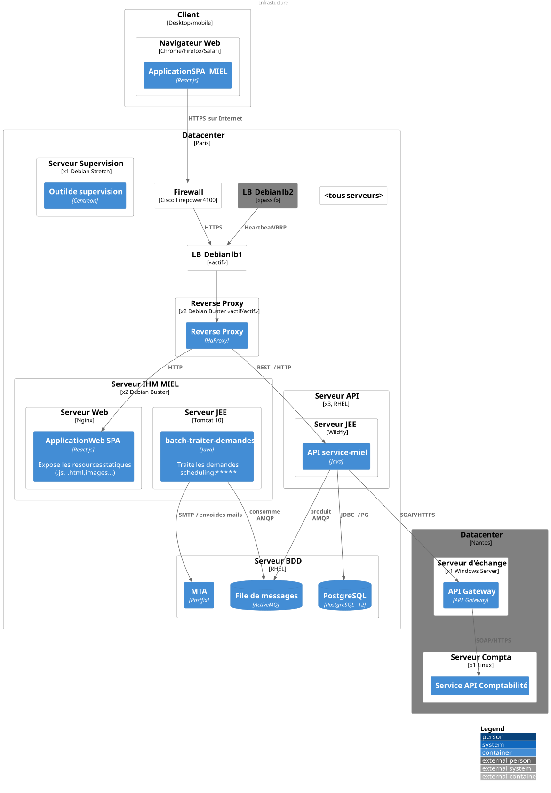

# Vue infrastructure
:sectnumlevels: 4
:toclevels: 4
:sectnums: 4
:toc: left
:icons: font
:toc-title: Sommaire

[PRE-FILLED]
====
*Dernière modification* : _{docdate}_

*Date de la dernière revue globale* : 

*Statut du document* :  

====

TIP: Faire régulièrement des revues complètes de la vue (au moins une fois par an tant que le projet est actif) et mettre à jour la date plus haut.

TIP: Indiquer le statut de la vue, par exemple 'DRAFT', 'FINALISÉ',...

//🏷{"id": "e3208a9c-8d35-46a1-9399-aacea9817e0a", "labels": ["contexte"]}
## Introduction

La vue infrastructure décrit le déploiement des modules applicatifs dans leur environnement d’exécution cible et l'ensemble des dispositifs assurant leur bon fonctionnement.

Les autres vues du dossier sont accessibles link:./README.adoc[d'ici].

Le glossaire du projet est disponible link:glossaire.adoc[ici]. Nous ne reprendrons pas ici les termes fonctionnels ou techniques déjà définis.

[TIP]
====
Cette vue est aussi souvent appelé « vue  technique » et concerne l'infrastructure : serveurs, réseaux, systèmes d'exploitation, bases de données, intergiciels, … 

Bref, elle porte sur tout ce qui est externe à l'application et nécessaire à son exécution.
====

//🏷{"id": "06fd3383-f875-4a44-a1f8-d135f9050038", "labels": ["references"]}
### Documentation de Référence
[TIP]
Mentionner ici les documents d'architecture de référence (mutualisés). Ce document ne doit pas reprendre leur contenu sous peine de devenir rapidement obsolète et non maintenable.

[PRE-FILLED]
====
[cols="1,1,4,4"]
|===
|N°|Version|Titre/URL du document| Détail

|1
|
|
|
|
|===
====

//🏷{"id": "933039be-008f-40c7-a630-a08002b379f1", "labels": ["contexte","incertitude"]}
## Non statué

//🏷{"id": "87385297-c5c3-44f6-b9e8-7599576dda0a", "labels": []}
### Points nécessitant une étude complémentaire

====
Exemple: 

[cols="1e,5e,2e,2e,2e"]
|===
|ID|Détail|Statut|Porteur du sujet | Échéance

|EI1
|Le choix technique de la solution d’API Management reste soumise à étude complémentaires
|EN_COURS
|Équipe Archi Technique
|AVANT 2040

|===
====

[PRE-FILLED]
====
[cols="1,5,2,2,2"]
|===
|ID|Détail|Statut|Porteur du sujet | Échéance

|
|
|
|
|
|===
====

//🏷{"id": "30d20b83-e35d-464b-8286-3ff230fb1471", "labels": []}
### Hypothèses

[TIP]
====
Donner ici les éventuelles hypothèses structurantes

Exemple :

[cols="1e,6e"]
|===
|ID|Détail

|HI1
|Nous prenons l'hypothèse que d'ici à la MEP du projet, PostgreSQL 17 sera validé en interne.
|===

====

[PRE-FILLED]
====
[cols="1,6"]
|===
|ID|Détail

| 
| 
|===
====

//🏷{"id": "82a207de-bc6f-4a62-a586-96a2b4c9f4dc", "labels": ["niveau_detail::général", "contrainte"]}
## Contraintes

[TIP]
====
Les contraintes définissent les limites applicables aux exigences du projet.

Il est intéressant de les expliciter pour obtenir des exigences réalistes. Par exemple, il ne serait pas valide d'exiger une disponibilité incompatible avec le niveau de sécurité Tier du datacenter qui l'hébergera.

====

//🏷{"id": "cc4a17a8-d68b-43cf-8b4e-c64829d950fc", "labels": ["disponibilité"]}
### Contraintes sur la disponibilité

[TIP]
====
Les éléments ici fournis pourront servir de base au SLO (Service Level Objective). Idéalement, ce dossier devrait simplement pointer sur un tel SLO sans plus de précision.

Ce chapitre a une vocation pédagogique car il rappelle la disponibilité plafond envisageable : la disponibilité finale de l’application ne pourra être qu’inférieure.
====

//🏷{"id": "a18eb613-e522-4bf5-a1fd-742b9d754ce1", "labels": ["niveau_detail::détaillé","supervision"]}
#### Contraintes de MTTD

[TIP]
====
Détailler les éléments permettant d'estimer le temps moyen de détection d'incident (Mean Time To Detect).
====
====
Exemple 1 : Le SI est supervisé en 24/7/365.

Exemple 2 : Le service support production est disponible durant les heures de bureau mais une astreinte est mise en place avec alerting par e-mail et SMS en 24/7 du lundi au vendredi.
====

//🏷{"id": "dc11b031-5685-4972-9832-138fa74cd30b", "labels": ["niveau_detail::détaillé","supervision"]}
#### Contraintes sur les outils et normes de supervision

[TIP]
====
Fournir ici les outils et normes de supervisions imposés au niveau du SI et les éventuelles contraintes liées.
====
====
Exemple 1 : L'application sera supervisée avec Zabbix.
====

====
Exemple 2 : L'alerting se fera depuis les journaux via des alertes Grafana.
====

//🏷{"id": "6903a99e-8b8e-464b-909c-d40da5a808d1", "labels": ["niveau_detail::détaillé"]}
#### Contraintes de MTTR

[TIP]
====
Fournir les éléments permettant d'estimer le temps moyen de réparation (Mean Time To Repair). A noter qu'il est important de distinguer le MTTD du MTTR. En effet, ce n'est pas parce qu'une panne est détectée que les compétences ou ressources nécessaires à sa correction sont disponibles.

Préciser les plages de présence des exploitants en journée et les possibilités d'astreintes.

Si vous disposez de statistiques ou de post-mortems, mentionnez les durées effectives moyennes déjà observées.

Lister ici les durées d’intervention des prestataires matériels, logiciels, électricité, télécom…

Nous subdivisons de façon indicative cette section en sous-sections "Hardware", "Système et virtualisation", "Réseau", et "Restauration de données". D'autres catégories sont possibles.
====

//🏷{"id": "e7470aba-8588-4792-bc94-28e4bf186b63", "labels": ["niveau_detail::approfondi"]}
##### Matériel

TIP: Décrire ici les éléments permettant de prévoir le MTTR des éléments hardware (serveurs / baies / équipements réseau / systèmes électriques, etc.). Lister par exemple ici les durées d’intervention des prestataires matériels, électricité….

====
Exemple 1 : Cinq serveurs physiques de spare sont disponibles à tout moment.

Exemple 2 : Le contrat de support Hitashi prévoit une intervention sur les baies SAN en moins de 24h.

Exemple 3 : Le remplacement de support matériel IBM sur les lames BladeCenter est assuré en 4h de 8h à 17h, jours ouvrés uniquement.
====

//🏷{"id": "96cd73f1-0dca-447e-8fc8-2d9c03399e1c", "labels": ["niveau_detail::approfondi"]}
##### Système et virtualisation

TIP: Lister ici les éléments permettant d'estimer le temps de correction d'un problème lié à l'OS ou à une éventuelle solution de virtualisation.

====
Exemple 1 : Au moins un expert de chaque domaine principal (système et virtualisation, stockage, réseau) est présent durant les heures de bureau.

Exemple 2 : Comme toute application hébergée au datacenter de la région X, l’application disposera de la présence d’exploitants de 7h à 20h jours ouvrés. Aucune astreinte n’est possible.

Exemple 3 : Le temps de restauration observé d'une sauvegarde Veeam de VM de 40 Gio est de 45 mins.

====

//🏷{"id": "22a1f1de-1ab0-4a54-bd0f-64c7c5ab9713", "labels": ["niveau_detail::approfondi"]}
##### Réseau

TIP: Lister ici les éléments liés au réseau permettant d'estimer les durées d’intervention des prestataires ou fournisseurs Telecom…

====
Exemple 1 : un ingénieur réseau est d'astreinte chaque week-end.

Exemple 2 : Le SLA d'Orange prévoit un rétablissement de la connexion à Internet en conditions nominales en moins de 24H.
====

//🏷{"id": "b39586c3-6bbe-417f-ad64-eff53c81d283", "labels": ["niveau_detail::détaillé"]}
##### Restauration de données
TIP: Lister ici les éléments permettant d'évaluer la durée de restauration de données (fichiers / objets / base de données). Les exigences de RTO listées plus bas devront prendre en compte ce MTTR.

====
Exemple 1 : Le temps de restauration Barman d'une base PostgreSQL est d'environ `x/V + y*T/P` heures avec `x`, la taille de la base en Gio, `V` la vitesse de lecture/écriture (Go/h), `y` le nombre de jours de journaux à rejouer, `T` le temps moyen pour rejouer un 1 jour de WAL et `P` le niveau de parallélisme de la restauration. 
62
Exemple 2 : La restauration d'une sauvegarde offline (sur bandes) nécessite au minimum 4H de préparation supplémentaire.
====

//🏷{"id": "421860fb-b6b3-461a-b149-57c6ba6dae41", "labels": ["niveau_detail::approfondi"]}
#### Contraintes sur les interruptions programmées

[TIP]
====
Fournir ici la liste et la durée des interruptions programmées standards dans le SI.
====

====
Exemple 1 : On estime l'interruption de chaque serveur à 5 mins par mois. Le taux de disponibilité effectif des serveurs en prenant en compte les interruptions programmées système est donc de 99.99 %.

Exemple 2 : suite aux mises à jour de sécurité de certains packages RPM (kernel, libc…), les serveurs RHEL sont redémarrés automatiquement la nuit du mercredi suivant la mise à jour. Ceci entraînera une indisponibilité de 5 mins en moyenne 10 fois par an.

====

//🏷{"id": "21d704f6-f740-40f9-986c-36274643a711", "labels": ["niveau_detail::détaillé"]}
#### Contraintes liées au niveau de service du datacenter

[TIP]
====
Fournir ici le niveau de sécurité du datacenter (DC) selon l’échelle Uptime Institute (Tier de 1 à 4).  

TIP: A noter que les architectures Cloud modernes privilégient la redondance des DC sur des sites distants plutôt qu'un niveau Tier plus élevé sur un seul site (à condition de pouvoir répliquer efficacement des données et d'accepter un délais sur la cohérence immédiate des données, voir le https://fr.wikipedia.org/wiki/Th%C3%A9or%C3%A8me_CAP[théorème CAP]). De façon simpliste, on peut calculer que la disponibilité de deux DC actifs en parallèle est de sept neufs contre quatre neufs pour un DC Tier 4. Un compromis entre les deux modèles est le déploiement dans des zones redondantes d'un même site au prix d'une plus grande vulnérabilité aux catastrophes.

.Niveaux Tier des datacenters (source : Wikipedia)
[cols="1,5,2,2,2,2"]
|===
|Niveau Tier|Caractéristiques|Taux de disponibilité|Indisponibilité statistique annuelle| Maintenance à chaud possible ?| Tolérance aux pannes ?

|Tier 1
|Non redondant
|99,671 %
|28,8 h
|Non
|Non

|Tier 2
|Redondance partielle
|99,749 %
|22 h
|Non
|Non

|Tier 3
|Maintenabilité
|99,982 %
|1,6 h
|Oui
|Non

|Tier 4
|Tolérance aux pannes
|99,995 %
|24 mins
|Oui
|Oui

|===
====

====
Exemple : Le datacenter de Paris est de niveau Tier 3 et celui de Toulouse Tier 2.
====

//🏷{"id": "7c1d0446-34df-4572-92b0-19baaba54183", "labels": ["niveau_detail::général"]}
#### Plafond de disponibilité

[TIP]
====
Expliquez clairement aux parties prenantes que, même avec de la HA au niveau applicatif, la **disponibilité de bout en bout maximale** est plafonnée par la disponibilité des dépendances sous-jacentes (datacenter, réseau, plateforme).
Ce **plafond de disponibilité** est le produit de leurs SLA et est toujours
< à la dépendance la moins disponible.

`A_plafond = ∏(A_SLA de chaque dépendance en série)  ≤  min(A_SLA)`

**Implication :** les cibles SLO **ne doivent pas dépasser** ce plafond. La HA aide à
s’approcher du plafond, pas à le dépasser.

**Notes de périmètre**

* Si toutes les répliques se trouvent dans le **même domaine de défaillance** (même DC/énergie/accès),
  le SLA du DC **fixe effectivement le plafond**.
* Pour **rehausser le plafond**, utilisez des **domaines de défaillance indépendants** (p. ex. multi-AZ/région) ;
  pour la redondance en parallèle : `A_parallel = 1 - ∏(1 - A_i)` (indépendance supposée).
====

====
*Exemple (sériel, un seul DC) :*  
`<Datacenter 99,9 %> × <Réseau interne 99,95 %> × <Plateforme 99,9 %> ≈ **99,75 %**`

Même si la couche applicative est « HA 99,999 % », la disponibilité **de bout en bout**
ne peut pas dépasser ~**99,75 %** sur cette infrastructure.
====

//🏷{"id": "4860fb1c-98e9-4c2c-adfc-09ea8149235d", "labels": ["niveau_detail::général"]}
#### Contraintes liées à la gestion des catastrophes

[TIP]
====

Les catastrophes peuvent être classées en trois catégories :

* Naturelles (tremblements de terre, inondations, ouragans, canicules, etc.) ;
* Infrastructurelles (accidentelles comme les accidents industriels, incendies, pannes électriques majeures, pannes majeures du réseau / stockage / serveurs, erreurs critiques d’administrateurs ou intentionnelles : militaires, terroristes, sabotage, etc.) ;
* Cyber (DDoS, virus, ransomware, etc.).

Le **Disaster Recovery (DR)** est l’ensemble des stratégies et solutions mises en place pour **restaurer un système informatique après une catastrophe**, minimisant ainsi les pertes de données et le temps d’arrêt. Le DR peut inclure des solutions comme :

* **Cold site** : centre de secours prêt à être activé mais sans infrastructure active ;
* **Warm site** : infrastructure préinstallée mais nécessitant une mise en production manuelle ;
* **Hot site** : réplication en temps réel avec bascule automatique possible ;
* **Disaster Recovery as a Service (DRaaS)** : solutions cloud de restauration rapide (AWS Elastic Disaster Recovery, Azure Site Recovery, etc.).

Le PRA (Plan de Reprise d’Activité) et le PCA (Plan de Continuité d’Activité) sont des stratégies spécifiques de **DR** répondant à un risque de catastrophe sur le SI :

* **PRA (Plan de Reprise d’Activité)** ou _Comment revenir à la normale après le problème ?_ 
  Permet de **reprendre l’activité après une catastrophe** dans un délai défini (RTO). Il repose sur des **synchronizations asynchrones entre sites, des sauvegardes, des restaurations et des infrastructures de secours** comme des **DC secondaires, du stockage répliqué** ou des **solutions DRaaS**. L’objectif est d’assurer la reprise, mais avec une **interruption temporaire** et l'acceptation d'un RPO non nul.

* **PCA (Plan de Continuité d’Activité)** ou _Comment continuer à travailler malgré le problème ?_ 
  Permet d’assurer la **continuité des activités critiques** sans interruption notable et avec un RPO quasi-nul. Il comprend des mesures organisationnelles (équipes de crise, mode dégradé comme utilisation du papier, sites de repli,...) et techniques comme des **clusters actifs-actifs multi-zonaux, une réplication synchrone des données et des infrastructures hautement redondantes**.

Un architecte n’utilise pas les mêmes technologies selon que l’on vise un **PRA ou un PCA** :

* **PRA** →  Se concentre sur la **sauvegarde et la restauration** dans un DC de secours, avec un **RTO défini**.  
  Exemples on-premises : **snapshots de VM avec Veeam, solutions DRaaS, bases de données répliquées en mode asynchrone** (ex. : **MySQL/MariaDB asynchrone, PostgreSQL streaming replication, SQL Server log shipping, VMware vSphere Replication, Dell EMC SRDF en mode asynchrone, Zerto**).  
  Exemples cloud : **AWS Aurora Global Database (réplication asynchrone inter-régions), Amazon RDS cross-region read replicas, Azure SQL Geo-Replication, Google Cloud SQL cross-region replication**.  

* **PCA** → Repose sur des **clusters actifs-actifs multi-zones** répartis sur plusieurs DC distants, avec une **réplication généralement synchrone** pour garantir un RPO nul (ou quasi nul).  
  Exemples on-premises : **Oracle RAC, VMware vSphere Metro Storage Cluster, NetApp MetroCluster, Dell EMC SRDF en mode synchrone, Ceph RADOS synchrone**.  
  Exemples cloud : **Google Cloud Spanner (réplication synchrone multi-régions), Azure SQL Managed Instance Business Critical avec zones redondantes, AWS Aurora Multi-AZ (synchronous replication)**.

Notes :  

* Pour un PCA, la réplication synchrone est souvent utilisée pour garantir un RPO nul, mais certaines architectures (ex. : vSphere Metro Storage Cluster avec SRDF asynchrone) permettent un PCA avec une réplication asynchrone, à condition que le RPO reste dans des limites acceptables (perte de quelques transactions seulement). Cependant, une réplication sur longue distance peut introduire une latence élevée, impactant les performances. C’est pourquoi ce type de réplication synchrone n’est pas envisageable pour des DC éloignés de plus de 50 km environ.  
* Un PRA peut quant à lui tolérer une réplication asynchrone ou des sauvegardes périodiques selon les exigences métier.  
* Les systèmes de sauvegarde classiques peuvent suffire pour un PRA avec un RTO adapté, mais sont généralement insuffisants pour un PCA, qui requiert une réplication en temps réel.  
* Dans le cas d’un PRA, il faut prévoir une bascule et une préparation conséquente du DC de secours alors que dans le cas d’un PCA, tous les DC fonctionnent en parallèle en mode actif/actif de façon nominale.  
* Les tests de bascule devraient être réalisés au moins une fois par an pour un PRA, et trimestriellement pour un PCA. Ils doivent inclure des tests unitaires (failover d’une application) et globaux (bascule totale du SI).

Note : la gestion des catastrophes est un sujet complexe. C’est l’un des points forts des clouds publics (OVH, GCP, Azure, AWS, etc.) que de gérer une partie de cette complexité pour vous. Des solutions cloud spécifiques existent (Disaster Recovery as a Service – DRaaS).

Décrire entre autres :

* Les matériels redondés dans le second DC, le nombre de serveurs de spare, la capacité du DC de secours par rapport au DC nominal.  
* Pour un PRA, les dispositifs de restauration (OS, données, applications) prévus et le RTO.  
* Pour un PCA, la latence et la dégradation de performances induites par la réplication synchrone des données entre DC ou la quantité de transactions perdues acceptables en cas de réplication asynchrone.  
* Présenter la politique de failback (réversibilité) : doit-on rebasculer vers le premier DC ? Comment ?  
* Comment sont organisés les tests de bascule à blanc ? Avec quelle fréquence ?  

====
====
Exemple 1 - PRA basé sur site de secours et replication asynchrone  : Les VM de production sont répliquées de façon continue vers un site de secours situé à 100km via la solution de réplication asynchrone Zerto. En cas de catastrophe, les VM du site secondaire peuvent être démarrées rapidement. Le RPO est de l’ordre de 5 minutes, et le RTO d’environ 30 minutes.
====

====
Exemple 2 - PRA basé sur sauvegardes cloud  (PME avec son propre DC à Paris) : deux serveurs de spare sont stockés dans les locaux de Lille. Les données principales de l’entreprise sont sauvegardées toutes les quatre heures et envoyées (avec chiffrement côté client) vers BackBlaze.com. En cas de sinistre majeur, les serveurs de spare peuvent être réinstallés et restaurés. Le RPO est de 4 h et le RTO visé de 2 à 4 h, selon le temps de transfert et de remise en service.
====

====
Exemple 3 - PCA avec élasticité : les applications s’exécutent sous forme de pods Kubernetes répartis sur au moins trois clusters situés dans différentes zones de disponibilité. Les données MongoDB sont shardées et répliquées entre zones via un système de ReplicaSet. Le système est auto-régulé par Kubernetes : en cas de panne d’un DC, de nouveaux pods sont redéployés en quelques secondes sur les clusters restants. Ainsi, les utilisateurs ne subissent pas d’interruption de service et l’impact sur les performances reste très limité.
====

//🏷{"id": "c7c4fce5-c971-4ec8-bef7-006381492aff", "labels": ["niveau_detail::général"]}
### Contraintes d'hébergement

* Où sera hébergée cette application ? DC "on premises" ? Cloud interne ? Cloud IaaS ? PaaS ? autre ?
* Qui administrera cette application ? en interne ? Sous-traité ? Pas d’administration (PaaS) … ?
====
Exemple 1: Cette application sera hébergée en interne dans le DC de Nantes (seul à assurer la disponibilité de service exigée) et il sera administré par l’équipe X de Lyon. 
====

====
Exemple 2 : Étant donné le niveau de sécurité très élevé de l’application, la solution devra être exploitée uniquement en interne par des agents assermentés. Pour la même raison, les solutions de cloud sont exclues.
====

====
Exemple 3 : Étant donné le nombre d’appels très important de cette application vers le référentiel `PERSONNE`, elle sera colocalisée avec le module `COMPTA-API` dans le VLAN `XYZ`.
====

//🏷{"id": "6f7d74be-7024-4a6e-af4d-d084d49109ae", "labels": ["niveau_detail::détaillé"], "link_to":["8d948872-15f9-49b6-9527-f511a2f7597d"]}
### Contraintes réseau

[TIP]
====
Lister les contraintes liées au réseau, en particulier les découpages en zones de sécurité. Les aspects débit sont listées dans la vue dimensionnement.
====
====
Exemple : Les modules applicatifs intranet doivent se trouver dans une zone de confiance inaccessible d'Internet.
====

//🏷{"id": "86a3082e-7069-4120-b86f-f886ef919986", "labels": ["niveau_detail::détaillé"]}
### Contraintes de déploiement

[TIP]
====
Lister les contraintes liées au déploiement des applications et services d’infrastructure.
====
====
Exemple 1 : Une VM ne doit héberger qu'une unique instance PostgreSQL.

Exemple 2 : Les applications Java doivent être déployées sous forme de .jar exécutables et non de .war.

Exemple 3 : Toute application doit être publiée sous forme d'image OCI et déployable sur Kubernetes via un ensemble de manifests structurés au format Kustomize.

====

//🏷{"id": "16781642-a7f3-40f1-b208-e4064ffedaa4", "labels": ["niveau_detail::détaillé"]}
### Contraintes liées au cycle de vie des composants d'infrastructure

[TIP]
====
Lister les contraintes liées aux mises à jour et maintenance des composants d’infrastructure (systèmes d'exploitation, intergiciels, bases de données, etc.).
====

====
Exemple 1 : Toute mise à jour de système d'exploitation doit être validée en environnement de recette avant déploiement en production.

Exemple 2 : Les mises à jour des bases de données doivent être appliquées en mode rolling upgrade pour éviter toute interruption de service.

Exemple 3 : Les versions de noyau Linux utilisées en production doivent être exclusivement des versions LTS validées par l’équipe infrastructure.

Exemple 4 : Tout correctif de sécurité critique doit être appliqué dans un délai de 72 heures suivant sa publication.

Exemple 5 : Les images OCI utilisées en production doivent être mises à jour tous les trimestres avec les dernières versions validées des dépendances.

Exemple 6 : Un calendrier de mise à jour des composants critiques sera établi afin d’éviter les failles de sécurité et d'assurer la compatibilité avec les dépendances.

====

//🏷{"id": "0a25770c-6a02-4fa3-82cc-bf5152d3cba6", "labels": ["niveau_detail::détaillé"]}
### Contraintes liées aux journaux

[TIP]
====
Lister les contraintes liées aux journaux
====
====
Exemple 1 : Une application ne doit pas produire plus de 1 Tio de journaux / mois.

Exemple 2 : La durée de rétention maximale des journaux est de 3 mois.
====

//🏷{"id": "608d63e6-7299-4976-bf59-52fa1c6ac486", "labels": ["niveau_detail::détaillé"]}
### Contraintes de sauvegardes et restaurations

[TIP]
====
Lister les contraintes liées aux sauvegardes. 

Une contrainte courante est le respect de la méthode 3-2-1 :

* Au moins 3 exemplaires des données (la donnée vivante + 2 copies) ;
* Au moins 2 technologies de stockage différentes pour ces 3 copies (exemple : disques SSD pour les données vivantes et deux sauvegardes sur bandes) ;
* Au moins 1 exemplaire hors-ligne et hors site (exemple : 1 jeu de bandes conservé dans un coffre ignifugé à la banque).

====
====
Exemple 1 : L'espace disque maximal pouvant être provisionné par un projet pour les backups est de 100 Tio sur HDD.

Exemple 2 : La durée de retentions maximale des sauvegardes est de deux ans.

Exemple 3 : Compter 1 min / Gio pour une restauration NetBackup.
====

//🏷{"id": "22e6cfa3-bc3d-466c-a902-9854540258b7", "labels": ["niveau_detail::détaillé"]}
### Contraintes budgétaires

[TIP]
====
Lister les limites budgétaires.
====
====
Exemple 1 : les frais de services Cloud AWS ne devront pas dépasser 5 K€/ an pour ce projet.
====

//🏷{"id": "f9ed2469-e3e5-48a1-8b69-4b9c9492c6cb", "labels": ["niveau_detail::général", "contrainte"]}
## Exigences

[TIP]
====
Contrairement aux contraintes qui fixaient le cadre auquel toute application devait se conformer, les exigences non fonctionnelles sont données par les porteurs du projet (Product Owner, MOA, client, etc.).

Prévoir des interviews pour les recueillir. 

Si certaines exigences ne sont pas réalistes, le mentionner dans le document des points non statués.

Les exigences liées à la disponibilité devraient être précisées via une étude de risque (type https://cyber.gouv.fr/la-methode-ebios-risk-manager[EBIOS Risk Manager])

====

//🏷{"id": "332c967b-3729-4a5f-984e-fc2f301b0329", "labels": []}
### Plages de fonctionnement

[TIP]
====
On liste ici les plages de fonctionnement principales (ne pas trop détailler, ce n’est pas un plan de production). 

Penser aux utilisateurs situés dans d'autres fuseaux horaires.

Les informations données ici serviront d'entrants au SLA de l’application.

Exemple : 

[cols="1e,5e,2e"]
|===
|No plage| Heures | Détail

|1
|De 8H00-19H30 heure de Paris , 5J/7 jours ouvrés
|Ouverture Intranet aux employés de métropole

|2
|De 21h00 à 5h00 heure de Paris
|Plage batch

|3
|24 / 7 / 365
|Ouverture Internet aux usagers

|4
|De 5h30-8h30 heure de Paris, 5J/7 jours ouvrés
|Ouverture Intranet aux employés de Nouvelle Calédonie
|===
====

[PRE-FILLED]
====
[cols="1,5,2"]
|===
|No plage| Heures | Détail

| 
| 
| 
|===
====

//🏷{"id": "08cb1019-20c4-42ef-9bf2-4adf72936c1c", "labels": ["disponibilité"],"link_to":["cc4a17a8-d68b-43cf-8b4e-c64829d950fc"]}
=== Exigences de disponibilité
 
[TIP]
====
Nous listons ici les *exigences* de disponibilité. Les mesures techniques
permettant de les atteindre seront données dans l'architecture technique de la
solution. Les informations données ici serviront d'entrants au SLA de
l'application.
 
*Attention à bien cadrer ces exigences* : un porteur de projet a souvent
tendance à demander une disponibilité très élevée sans toujours se rendre compte
des implications. Le coût et la complexité de la solution augmentent
exponentiellement avec le niveau exigé.
 
L'architecture physique, technique voire logicielle peut changer complètement en
fonction du besoin : clusters d'intergiciels ou de bases de données, redondances
matérielles coûteuses, architecture asynchrone, caches de session, failover.
Ne pas oublier les coûts d'astreinte, souvent importants dès que les exigences
sont élevées. De la pédagogie et un devis permettent en général de modérer les
exigences.
 
On estime généralement que la haute disponibilité commence à trois neufs
(99,9 %), soit environ 8 h 45 d'indisponibilité par an.
 
La disponibilité exigée ici devra être cohérente avec les contraintes de
disponibilité du SI données plus haut.
====
 
*Plages de fonctionnement*
 
Détailler la disponibilité demandée par plage. L'indisponibilité maximale
admissible doit être cohérente avec le niveau retenu dans l'échelle ci-dessous.
 
.Exemple — Durée d'indisponibilité maximale admissible par plage
[cols="1e,5e"]
|===
| N° Plage | Indisponibilité maximale
 
| 1
| 24 h, maximum 7 fois par an
 
| 2
| 1 h, 8 fois dans l'année
 
| 3
| 4 h, 8 fois dans l'année
|===
 
[PRE-FILLED]
====
.Durée d'indisponibilité maximale admissible par plage
[cols="1e,5e"]
|===
| N° Plage | Indisponibilité maximale
 
|
|
|===
====
 
*Échelle de disponibilité*
 
Le niveau de disponibilité croise deux grandeurs :
 
RTO (_Recovery Time Objective_):: Temps maximal autorisé pour la réouverture du
service après un incident.
RPO (_Recovery Point Objective_):: Volume de données, exprimé en durée, que l'on
accepte de perdre.
 
.Échelle de cotation de la disponibilité (exemple)
[cols="1,2,2,3", options="header"]
|===
| Niveau | Interruption tolérée (RTO) | Perte de données tolérée (RPO) | Conséquences et dispositif attendu
 
| *D1*
| `] 5 jours ; 15 jours ]`
| `] 24 h ; 7 jours ]`
| Interruption acceptable au-delà de 5 jours. +
Pas de remise en cause des services essentiels. +
Reconstruction depuis sauvegarde, sans engagement de délai.

| *D2*
| `] 24 h ; 5 jours ]`
| `] 4 h ; 24 h ]`
| L'interruption a des conséquences importantes sur les services essentiels. +
Sauvegarde quotidienne, procédure de restauration documentée.

| *D3*
| `] 4 h ; 24 h ]`
| `] 15 min ; 4 h ]`
| L'interruption a des conséquences graves sur les services essentiels. +
Redondance des composants critiques, PRA documenté et testé.

| *D4*
| `[ 0 ; 4 h ]`
| `[ 0 ; 15 min ]`
| Le service doit toujours être fourni. +
Haute disponibilité requise : redondance active, bascule automatisée. +
En deçà d'une heure, une architecture actif-actif multi-site et une réplication synchrone sont généralement nécessaires.
|===
 
[IMPORTANT]
====
*Convention de mesure.* Sauf mention contraire, les durées s'entendent :
 
* *par incident*, et non cumulées sur l'année ;
* *dans la plage de fonctionnement* concernée. Une interruption hors plage n'est
pas décomptée.
 
Ces deux conventions changent radicalement le sens d'un même chiffre : quatre
heures par incident relèvent d'une exploitation ordinaire, quatre heures
cumulées par an imposent une architecture redondée. Si un engagement de
disponibilité annuelle existe par ailleurs (99,9 %, 99,95 %…), il se cumule avec
le RTO et ne le remplace pas.
 
*Le RTO retenu doit être supérieur ou égal au MTTR* constaté par les exploitants
et donné en contrainte plus haut. Il est vain d'exiger un RTO d'une heure quand
le MTTR effectif est de deux heures : l'engagement serait intenable dès le
premier incident. Si aucun objectif de restauration précis n'est nécessaire, ne
pas surspécifier et renvoyer simplement à la contrainte de MTTR.
====
 
[TIP]
====
*Choisir le cran RPO en partant des scénarios de restauration*, et non du seul
volume de données. Une restauration peut être nécessaire après :
 
* une perte matérielle — peu probable avec des systèmes redondés ;
* une fausse manipulation d'un utilisateur avancé ou d'un administrateur —
assez courant ;
* un bug applicatif ayant corrompu des données ;
* une destruction volontaire (rançongiciel, sabotage interne).
 
Les deux derniers cas sont dimensionnants : ils supposent de pouvoir remonter à
un point *antérieur à la corruption*, ce qu'une simple réplication synchrone ne
permet pas. Un RPO court ne dispense donc jamais d'un historique de sauvegardes.
====
 
[TIP]
====
*RTO et RPO ne se déduisent pas l'un de l'autre.* Un service rétabli en trois
heures mais ayant perdu vingt-quatre heures de données est souvent plus
pénalisant qu'une interruption longue sans perte. Coter les deux axes
séparément ; le niveau retenu est le plus élevé des deux.
 
Si les deux axes divergent fortement et durablement, préférer une cotation en
deux valeurs (ex. : `RTO D3 / RPO D4`) plutôt qu'un chiffre unique qui masquerait
l'écart.
====
 
*Niveau retenu*
 
.Exemple
[cols="1,1,2,2,3", options="header"]
|===
| Périmètre | Niveau | RTO | RPO | Justification
 
| _Application complète_
| _D3_
| _4 h en plage ouvrée_
| _1 h_
| _L'interruption bloque l'instruction des dossiers. Perte d'une heure de saisie acceptable, les agents pouvant ressaisir._
 
| _Module de consultation publique_
| _D2_
| _2 jours_
| _24 h_
| _Service d'information sans engagement contractuel. Contenu régénérable depuis le référentiel._
|===
 
[PRE-FILLED]
====
[cols="1,1,2,2,3", options="header"]
|===
| Périmètre | Niveau | RTO | RPO | Justification
 
|
|
|
|
|
|===
====

//🏷{"id": "231768e7-6a9d-429e-b200-2febdd91a0e3", "labels": ["niveau::intermédiaire", "niveau_detail::détaillé"]}
### Exigences de robustesse

[TIP]
====
La robustesse du système indique sa capacité à ne pas produire d'erreurs lors d’événements exceptionnels comme une surcharge ou la panne de l'un de ses composants d'infrastructure.

Cette robustesse s'exprime en valeur absolue par unité de temps : nombre d'erreurs (techniques) par mois, nombre de messages perdus par an…

Attention à ne pas être trop exigeant sur ce point car une grande robustesse peut impliquer la mise en place de systèmes à tolérance de panne complexes, coûteux et pouvant aller à l'encontre des capacités de montée en charge, voire même de la disponibilité.
====
====
Exemple 1 : Pas plus de 0.001% de requêtes en erreur.
====
====
Exemple 2 : L'utilisateur ne devra pas perdre son panier d'achat même en cas de panne [attention, ce type d'exigence impacte l'architecture en profondeur].
====
====
Exemple 3 : Le système devra pouvoir tenir une charge trois fois supérieure à la charge moyenne avec un temps de réponse de moins de 10 secondes au 95e centile.
====

//🏷{"id": "cdb68f23-d2c5-4373-9f7d-e358191f0ebf", "labels": ["niveau::intermédiaire","niveau_detail::détaillé"]}
### Exigences de déploiements et de mises à jour

//🏷{"id": "663ee84f-7dde-4c6d-acf6-a810ab8fafb4", "labels": []}
#### Coté serveur

[TIP]
====
Préciser ici comment l’application devra être déployée coté serveur. 

Par exemple :

* L'installation est-elle manuelle ? scriptées avec des outils d'IT Automation comme Ansible ou Terraform ? via des images Docker/OCI ?
* Comment sont déployées les unités déployables (modules ou composants d'infrastructure) ? Sous forme de paquets ? Utilise-t-on un dépôt de paquets (type yum ou apt) ? Utilise-t-on des conteneurs ?
* Comment sont appliquées les mises à jour ?
====

//🏷{"id": "fd64ad27-05da-42f0-9491-f790642b5d91", "labels": ["ihm"]}
#### Coté client

[TIP]
====
Préciser ici comment l’application devra être déployée coté client :

* Si l’application est volumineuse (beaucoup de JS ou d’images par exemple), risque-t-on un impact sur le réseau ?
* Une mise en cache de proxy locaux est-elle à prévoir ?
* Des règles de firewall ou QoS sont-elles à prévoir ?

Coté client, pour une application client lourd :

* Quel version de l’OS est supportée ?
* Si l’OS est Windows, l’installation passe-t-elle par un outil de déploiement (Novell ZENWorks par exemple) ? l’application vient-elle avec un installeur type Nullsoft ? Affecte-t-elle le système (variables d’environnements, base de registre…) ou est-elle en mode portable (simple zip) ?
* Si l’OS est Linux, l’application doit-elle fournie en tant que paquet ? 
* Comment sont appliquées les mises à jour ?
====

//🏷{"id": "0bbb4d10-bb6c-4cb0-b227-2e97db99eae1", "labels": ["niveau::intermédiaire","niveau_detail::détaillé"]}
#### Stratégie de déploiement spécifiques

[TIP]
====
* Prévoit-on un déploiement de type blue/green ? 
* Prévoit-on un déploiement de type canary testing ? si oui, sur quel critère ?
* Utilise-t-on des feature flags ? si oui, sur quelles fonctionnalités ?
====

====
Exemple: L'application sera déployée sur un mode blue/green, c'est-à-dire complètement installée sur un ensemble de machines initialement inaccessibles puis une bascule DNS permettra de pointer vers les machines disposant de la dernière version.
====

//🏷{"id": "da0d11fe-0dc9-478e-a984-7a80ea1be482", "labels": ["niveau::intermédiaire"]}
### Exigences d'écoconception

[TIP]
====
L'écoconception consiste à limiter l'impact environnemental des logiciels et matériels utilisés par l’application. Les exigences dans ce domaine s'expriment généralement en wattheures ou équivalent CO2.

A noter que la loi française (voir loi https://ecoresponsable.numerique.gouv.fr/publications/guide-pratique-achats-numeriques-responsables/demarche-numerique-responsable/que-prevoit-la-loi/[du n°2020-105 du 10 février 2020, ou loi AGEC]) exige de réduire le gaspillage lié au numérique, notamment concernant l'obsolescence matérielle (art. 19). 

Prendre également en compte les impressions et courriers.

Selon l'ADEME (estimation 2014), les émissions équivalent CO2 d'un KWH en France continentale pour le tertiaire est de 50 g/KWH.
====
====
Exemple 1 : Le Power Usage Effectiveness (PUE) du site devra être de 1.5 ou moins.
====
====
Exemple 2 : La consommation d'encre et de papier devra être réduite de 10% par rapport à 2024.
====

//🏷{"id": "602a7a0a-7f25-4512-b0ab-3b97c8a734e0", "labels": ["niveau_detail::général", "solution"]}
## Architecture cible

//🏷{"id": "8088138c-5258-4f3a-a293-0984501bb5db", "labels": ["niveau_detail::détaillé"]}
### Principes

[TIP]
====
Quels sont les grands principes d'infrastructure de notre application ?
====
====
Exemples :

* Les modules applicatifs exposés à Internet dans une DMZ protégée derrière un pare-feu puis un reverse-proxy et sur un VLAN isolé. 
* Concernant les interactions entre la DMZ et l’intranet, un pare-feu ne permet les communications que depuis l’intranet vers la DMZ.
* Les clusters actifs/actifs seront exposés derrière un LVS + Keepalived avec direct routing pour le retour.
====

//🏷{"id": "17a46000-c51d-4fb7-868c-7386aef5b523", "labels": ["niveau::intermédiaire","disponibilité"],"link_to":["08cb1019-20c4-42ef-9bf2-4adf72936c1c"]}
### Disponibilité 
 
[TIP] 
==== 

La disponibilité mesure le pourcentage de temps pendant lequel un système est utilisable dans des conditions acceptables, c'est-à-dire accessible et opérationnel selon les critères définis (temps de réponse, capacité de traitement, etc.). Il est exprimé en % (exemple: 99.9% = ~8h45 d’indisponibilité/an).

Fournir ici les dispositifs permettant d'atteindre les Exigences de disponibilité. 

Les mesures permettant d’atteindre la disponibilité exigée sont nombreuses et devront être choisies par l’architecte en fonction de leur apport et de leur coût (financier, en complexité, etc.).  

Les indisponibilités peuvent-être de deux natures :

* Indisponibilités non planifiées (imprévues) : pannes matérielles (serveur, disque, réseau, etc.), bugs ou crashs logiciels, attaques (DDoS, ransomware, etc.), problèmes d’infrastructure (coupure électrique, incendie), ...
* Indisponibilités programmées (maintenance planifiée) : mises à jour logicielles (OS, application, base de données), remplacements matériels, changements d’architecture (migration, refonte), tests de bascule (DRP/PRA, failover test), ...

Les indisponibilité programmées sont en général prises en compte dans le calcul de la disponibilité globale (sauf si le SLA prévoit le contraire) puisque le service aux utilisateurs n'est alors pas rendu.

Nous regroupons ici les dispositifs de disponibilité en cinq grandes catégories : 

* Dispositifs de *supervision* (technique et applicative) permettant de détecter au plus tôt les pannes et donc de limiter le MTTD (temps moyen de détection). 

* *Dispositifs organisationnels* :  

** la présence humaine (astreintes, heures de support étendues…) qui permet d'améliorer le MTTR (temps moyen de résolution) et sans laquelle la supervision est inefficiente ; 

** La qualité de la gestion des incidents (voir les bonnes pratiques ITIL), par exemple un workflow de résolution d'incident est-il prévu ? si oui, quel est sa complexité ? sa durée de mise en œuvre ? des validations hiérarchiques (affectant donc le MTTR) sont-elles prévues ? 

* Dispositifs de *haute disponibilité (HA)* (clusters, load balancers, failover automatique, etc.) qu'il ne faut pas surestimer si les dispositifs organisationnels sont insuffisants. 

* Dispositifs de *restauration de données* : La procédure de restauration est-elle bien définie et testée régulièrement ? L’isolement des sauvegardes est-il assuré pour éviter toute compromission (ex: ransomware, corruption) ? Le temps de restauration est-il compatible avec le RTO défini ? En cas de perte de données causée par une fausse manipulation ou bug dans le code, il faut alors arrêter l'application et dans cette situation, pouvoir restaurer rapidement la dernière sauvegarde améliore grandement le MTTR. 

* Architectures et modèles de déploiement limitant les indisponibilité programmées : mise à jour sans coupure (Rolling Update, Blue/Green Deployment), clusters HA avec failover automatique (voir plus bas), maintenance sans coupure via redondance active/active (voir plus bas).
 

==== 
[TIP] 
==== 

*Principes de disponibilité et de redondance*: 

* La *disponibilité d’un ensemble de composants d'infrastructure en série* : `D = D1 * D2 * … * Dn`. Exemple : la disponibilité d’une application utilisant un serveur Tomcat à 98 % et une base Oracle à 99 % sera de 97.02 %. 

* La *disponibilité d’un ensemble de composants d'infrastructure en parallèle* : `D = 1 – (1-D1) * (1- D2) * ..* (1-Dn)`. Exemple : la disponibilité de trois serveurs Nginx en cluster dont chacun possède une disponibilité de 98 % est de 99.999 %. 

* Il convient d'être cohérent sur la *disponibilité de chaque maillon de la chaîne de liaison* : rien ne sert d'avoir un cluster actif/actif de serveurs d'application JEE si tous ces serveurs attaquent une base de données localisée sur un unique serveur physique avec disques sans RAID. 

* On désigne par *«spare»* un dispositif (serveur, disque, carte électronique…) de rechange qui est dédié au besoin de disponibilité mais qui n'est pas activé en dehors des pannes. En fonction du niveau de disponibilité recherché, il peut être dédié à l’application ou mutualisé au niveau SI.  

* Les *niveaux de redondance* d'un système (modèle NMR = N-Modular Redundancy) les plus courants sont les suivants (avec N, le nombre de dispositifs assurant un fonctionnement correct en charge) :  

** *N* : aucune redondance (exemple : si l'alimentation unique d'un serveur tombe, le serveur s'arrête) 

** *N+1* : un composant d'infrastructure de rechange est disponible, on peut supporter la panne d'un matériel (exemple : on a une alimentation de spare disponible). 

** *N+M*: Un seul spare n'est pas suffisant pour tenir la charge, on prévoit au moins M spares. 

** *2N* : le système est entièrement redondé en parallèle et peut donc supporter la perte de la moitié des composants d'infrastructure (exemple : on dispose de deux alimentations actives en même temps dont chacune suffit à alimenter le serveur). Ce système est tolerant aux pannes (FT = fault-tolerant). 

** *2N+1*: En plus d'un système entièrement redondé, un système de secours est disponible (pour les opérations de maintenance par exemple). Elle est courante dans les DC critiques et les architectures cloud multi-zonales (AWS, Azure, GCP).

==== 
[TIP] 
==== 
Quelques mots sur les *répartiteurs de charge* : 

* Un répartiteur de charge (Load Balancer = LB) est un composant réseau ou logiciel qui distribue automatiquement le trafic entrant entre plusieurs serveurs afin d’optimiser la disponibilité, la performance et la tolérance aux pannes d’une application ; il peut fonctionner à différents niveaux du modèle OSI, du niveau 4 (TCP/UDP, ex: LVS, F5 LTM) au niveau 7 (HTTP, ex: HAProxy, Nginx, Traefik).

* Un répartiteur de charge (Load Balancer = LB) est une *brique indispensable à un cluster actif/actif*. 

* Dans la plupart des clusters à vocation de haute disponibilité, il faut redonder le répartiteur de charge pour éviter un SPOF. Une approche classique est un LB actif/passif (ex: Keepalived avec VRRP), mais un mode actif/actif est possible avec des solutions comme ECMP (repartition interne à un DC) ou GSLB (repartition multi-DC). L’essentiel est d’éviter une centralisation excessive qui recréerait un SPOF.

* Pour les clusters subissant une très forte charge (ex: LB cloud GCP), une approche consiste à déployer les LB en actif/actif avec un équilibrage côté client via Anycast DNS, Weighted DNS Routing ou GSLB. 

* Il est crucial de configurer correctement et à fréquence suffisante les tests de vie (*heathcheck*) des nœuds vers lesquels le répartiteur distribue la charge car sinon, le répartiteur va continuer à envoyer des requêtes vers des nœuds tombés ou en surcharge. 

* Certains LB avancés (ex: option redispatch de HAProxy) permettent de rejouer une requête sur un autre nœud en cas d’échec. Cela améliore la tolérance aux pannes, mais il faut veiller à ne pas rejouer des requêtes non idempotentes (ex: POST). Pour cela, l’utilisation d’identifiants d’idempotence (ex: header HTTP `Idempotency-Key`) peut être nécessaire.

* Lisser la charge entre les nœuds et ne pas forcement se contenter de round robin. Un algorithme simple est le LC (Least Connection) permettant de privilégier les nœuds les moins chargés, mais il existe d'autres algorithmes, comme Least Response Time, qui prend aussi en compte la latence. Dans le cloud, il peut être pertinent de combiner plusieurs critères (charge, latence, géolocalisation, etc.). Attention néanmoins à bien les tester et en maîtriser les implications pour éviter les catastrophes. 

* Dans le monde Open Source, voir par exemple LVS + Keepalived ou HAProxy + Keepalived. Pour Kubernetes, Traefik et Envoy Proxy sont des alternatives populaires, tandis que NGINX reste une référence pour des architectures classiques. 

* Il existe aussi des "LB as-a-service" comme Cloudflare Load Balancing pour les services web. 

==== 
[TIP] 
====  

*Clustering*: 

* Un cluster est un *ensemble de nœuds (machines) hébergeant le même module applicatif*. 
* En fonction du niveau de disponibilité recherché, chaque nœud peut être : 

** *actif* : le nœud traite les requêtes (exemple : un serveur Apache parmi dix et derrière un répartiteur de charge). Temps de failover : nul ; 

** *passif en mode «hot standby»* : le nœud de secours est installé et démarré mais ne traite pas les requêtes (exemple: une base MySQL slave qui devient master en cas de panne de ce dernier via l'outil mysqlfailover). MTTR de l'ordre de quelques secondes à quelques dizaines de secondes selon la technologie de failover (ex: Patroni pour PostgreSQL, mysqlfailover pour MySQL, Pacemaker pour un cluster Linux).

** *passif en mode «warm standby»* : le nœud est démarré et l'application est installée mais n'est pas démarrée (exemple : un serveur avec une instance Tomcat éteinte hébergeant notre application). En cas de panne, notre application est démarrée automatiquement. MTTR : de l'ordre de la minute (temps de la détection de la panne et d'activation de l'application) ; 

** *passif en mode «cold standby»* : le nœud est un simple spare. Pour l'utiliser, il faut installer l'application et la démarrer. MTTR : de plusieurs dizaines de minutes (si l'application et son environnement sont préconfigurés) à une journée si une installation complète est requise. La virtualisation et les conteneurs (Docker, Kubernetes) peuvent accélérer la remise en service si les images sont préchargées.

* On peut classer les architectures de clusters actif/actif en deux catégories :  

** Les *clusters actifs/actifs à couplage faible* dans lesquels un nœud est totalement indépendant des autres, soit parce que l'applicatif est stateless (le meilleur cas), soit parce que les données transitoires de contexte (typiquement une session HTTP) sont gérées isolément par chaque nœud. Dans le dernier cas, si l’application stocke des données de session en mémoire locale, un répartiteur de charge devra assurer une affinité de session ('Sticky Sessions'). En cas de panne d’un nœud, les utilisateurs affectés perdront leur session. Pour éviter cela, des solutions de stockage des sessions dans un cache distribué (ex: Redis, Hazelcast) ou en base de données peuvent être mises en place (mais ajoutent de complexité et doivent être elles-mêmes redondées pour ne pas devenir un SPOF).

** Les *clusters actifs/actifs à couplage fort* dans lesquels tous les nœuds partagent les mêmes données en mémoire. Dans cette architecture, toute donnée de contexte doit être répliquée dans tous les nœuds (ex : cache distribué de sessions HTTP répliqué avec Redis, JGroups, Infinispan, etc.).  

==== 
[TIP] 
==== 
*Failover (basculement automatique)* :

Le failover est la capacité d'un cluster de s'assurer qu'en cas de panne, les requêtes ne sont plus envoyées vers le nœud défectueux mais vers un nœud opérationnel. Ce *processus est automatique*. 

Sans failover, c'est au client de détecter la panne et de se reconfigurer pour rejouer sa requête vers un nœud actif. Dans les faits, ceci est rarement praticable et les *clusters disposent presque toujours de mécanismes de failover*. 

Une solution de failover peut être décrite par les attributs suivants : 

* Quelle *stratégie de failover* ? Exemples :
  **  Fail Fast : un nœud est marqué comme défectueux dès le premier échec détecté.
  **  Fail Soft : plusieurs échecs consécutifs sont nécessaires avant de déclarer un nœud en panne.
  **  Retry on Next Node : la requête est renvoyée à un autre nœud après un échec.
  **  Failover à escalade : le système tente d'abord un nœud de même niveau (ex: un autre serveur d'application) avant de remonter à un niveau supérieur (ex: un cluster dans une autre zone ou région). 

* Quelle *solution de détection des pannes* ?  

** les répartiteurs de charge utilisent des *sondes* (health check) très variées (requêtes fictives, analyse du CPU, des journaux, etc.…) vers les nœuds ;  

** les détections de panne des clusters actifs/passifs fonctionnent la plupart du temps par écoute des palpitations (*heartbeat*) du serveur actif par le serveur passif, par exemple via des requêtes multicast UDP dans le protocole VRRP utilisé par keepalived. 

* Quel *délai de détection* de la panne ? Paramétrer un délai trop court peut entraîner des bascules inutiles. Il est recommandé d’utiliser un seuil (ex: 3 échecs consécutifs) pour éviter les faux positifs. En actif/actif, les nœuds en erreur peuvent être retirés rapidement, tandis qu’en actif/passif, la promotion du standby peut nécessiter plusieurs secondes.

* Quelle *pertinence de la détection* ? le serveur en panne est-il *vraiment* en panne ? un mauvais paramétrage ou une microcoupure réseau ne doit pas provoquer une indisponibilité totale d'un cluster alors que les nœuds sont sains.  

* Quelle stratégie de failback ? 

** dans un cluster "N-to-1", on rebasculera (failback) sur le serveur qui était tombé en panne une fois réparé et le serveur basculé redeviendra le serveur de secours ; 

** dans un cluster N-to-N (architecture en voie de démocratisation avec les solutions PaaS comme AWS Lambda ou CaaS comme Kubernetes) : la charge est automatiquement redistribuée entre les nœuds restants, et un autoscaler peut ajouter de nouvelles instances si nécessaire. 

* *Transparent via à vis de l’appelant* ou pas ? La transparence du failover dépend de l’architecture. En HTTP, un répartiteur de charge peut masquer la panne en redirigeant immédiatement les requêtes vers un autre nœud. Dans le cas de bases de données, le client doit souvent gérer un retry. Les systèmes événementiels comme Kafka peuvent assurer un failover largement transparent coté producteurs, tandis que les clients doivent souvent gérer des rééquilibrages de partitions.

==== 
[TIP] 
==== 

La *tolérance de panne* : 

La tolérance de panne (FT = Fault Tolerance) ne doit pas être confondue avec la Haute Disponibilité. Il s'agit d'une version plus stricte de HA visant une disponibilité quasi absolue (99.999% ou plus) et une absence de perte de données dans des conditions normales de fonctionnement (Wikipédia: "La tolérance aux pannes est la propriété qui permet à un système de continuer à fonctionner correctement en cas de défaillance d'un ou de certains de ses composants d'infrastructure"). Seuls les systèmes critiques (santé, militaires, transport, industrie…) ont en général besoin d'un tel niveau de disponibilité.

Historiquement, cela signifiait une redondance matérielle complète. Dans un monde de micro-services, cela peut également être réalisé au niveau logiciel avec des clusters actifs-actifs. De plus, un véritable système de tolérance aux pannes devrait éviter une dégradation significative des performances vue par les utilisateurs finaux. 

Par exemple, un lecteur RAID 1 offre une tolérance aux pannes transparente : en cas de panne, le processus écrit ou lit sans erreur après le basculement automatique sur le disque sain. Ou encore, un cache distribué mémoire en cluster peut éviter de perdre une session HTTP. 

Certains systèmes critiques nécessitent un niveau élevé de tolérance de panne, par exemple :

* L'aéronautique avec les architectures Triple Modular Redundancy (TMR) utilisées dans les avions de ligne.
* Les bases de données distribuées comme CockroachDB ou Google Spanner, qui assurent une réplication multi-région synchrone.
* Les systèmes de messagerie comme Kafka, qui utilisent un système de réplication ISR (In-Sync Replicas).
* Les infrastructures financières ultra-basse latence pour les transactions boursières.
 
Pour permettre la tolérance de panne d'un cluster, il faut obligatoirement *disposer d'un cluster actif/actif avec fort couplage* dans lequel les données de contexte sont répliquées à tout moment. Une autre approche intéressante est d'éviter autant que possible les données de contexte côté serveur en favorisant leur stockage côté client (ex: dans le navigateur via localStorage ou les jetons JWT). Cependant, cette solution peut être limitée par des contraintes de sécurité et de volumétrie. Alternativement, un stockage en base de données ou en cache distribué peut être envisagé, en tenant compte des compromis entre fiabilité, performance et latence.

Un système tolérant aux pannes (FT) peut rendre une erreur totalement invisible pour le client si un mécanisme de rejeu automatique, de réplication synchrone ou de reprise transactionnelle est en place (ex: Oracle RAC, PostgreSQL avec réplication synchrone, Kafka avec rejeu des messages) ; sinon, une requête en cours peut échouer et nécessiter une nouvelle soumission (ex: failover manuel en PostgreSQL, crash d’un serveur Redis non répliqué, perte d’une transaction financière en cours), ce qui peut poser un **risque d’incohérence** si l’opération n’est pas **idempotente** (ex: double facturation d’un paiement, duplication d’un message non contrôlé en MQ, insertion partielle en base de données).

Attention à *bien qualifier les exigences* avant de construire une architecture FT car en général ces solutions : 

* *Complexifient l'architecture* et la rendent donc moins robuste et plus coûteuse à construire, tester, exploiter. 

* *Peuvent dégrader les performances* : les solutions de disponibilité et de performance vont en général dans le même sens (par exemple, un cluster de machines stateless va diviser la charge par le nombre de nœuds et dans le même temps, la disponibilité augmente), mais quelque fois, disponibilité et performance peuvent être antagonistes : dans le cas d'une architecture stateful, typiquement gérant les sessions HTTP avec un cache distribué (type Infinispan répliqué en mode synchrone ou un Redis persistant sur le master), toute mise à jour transactionnelle de la session ajoute un surcoût lié à la mise à jour et la réplication synchrone des caches, ceci pour assurer le failover. En cas de plantage d'un des nœuds, l'utilisateur conserve sa session à la requête suivante et n'a pas à se reconnecter, mais à quel coût ?  

* *Peuvent même dégrader la disponibilité* si les nœuds sont fortement couplés. Une mise à jour logicielle peut alors nécessiter l’arrêt de l’ensemble du cluster. Cependant, des stratégies comme les rolling updates, le blue/green deployment ou l'event sourcing peuvent atténuer ces contraintes.

* *Peuvent créer des problèmes d'intégrité de données* dans le cas de rejeux automatiques (pour rendre l'erreur invisible au client) de requêtes non-idempotentes.

==== 

[TIP] 
==== 

La *Haute Disponibilité (HA)* : 

Un système est généralement considéré comme hautement disponible (HA) à partir de 99.9% de disponibilité (~8h45 d’indisponibilité/an).

Un système HA repose généralement sur :

* Des *mécanismes de redondance* (ex: clustering, répartition de charge, réplication).
* Des dispositifs de *failover* pour basculer automatiquement en cas de panne.

La Tolérance de Panne (FT) inclut toujours la Haute Disponibilité (HA), mais la HA ne garantit pas nécessairement la FT.

.Exemples de solutions de disponibilité
[cols="1e,1e,1e,1e"]
|===
| Solution | Coût | Complexité de mise en œuvre | Amélioration de la disponibilité

| Disques en RAID 1
| XX
| X
| XXX

| Disques en RAID 10
| X
| X
| XX

| Redondance des alimentations et autres composants d'infrastructure
| XX
| X
| XX

| Bonding des cartes Ethernet
| XX
| X
| X

| Cluster actif/passif
| XX
| XX
| XX

| Cluster actif/actif (souvent avec LB)
| XXX
| XXX
| XXX

| Serveurs/matériels de spare
| XX
| X
| XX

| Bonne supervision système
| X
| X
| XX

| Bonne supervision applicative
| XX
| XX
| XX

| Systèmes de test de vie depuis un site distant
| X
| X
| XX

| Astreintes dédiées à l’application, 24/7/365
| XXX
| XX
| XXX

| Réplication asynchrone des bases de données (ex: PostgreSQL Streaming)
| XX
| XX
| XX

| Réplication synchrone des bases (ex: Galera, Oracle Data Guard)
| XXX
| XXX
| XXX

| Réplication des données sur baie SAN pour restauration rapide
| XX
| X
| XX

| Auto-scaling et orchestration dynamique (Kubernetes, Serverless)
| XXX
| XXX
| XXX

| Stockage distribué HA (Ceph, GlusterFS, MinIO)
| XXX
| XXX
| XXX

| CDN avec mise en cache distribué (Cloudflare, Akamai)
| XX
| XX
| XX
|===
====

====
Exemple 1 : Pour atteindre la disponibilité requise de 98 % :

* Serveur unique avec **RAID 1**
* Sauvegardes quotidiennes
* Supervision basique (ex. : Nagios)
* SLA de remplacement matériel en **4 heures**
====

====
Exemple 2 : Pour atteindre la disponibilité requise de 99,97 % :

* Cluster **actif/passif** de 2 serveurs (Apache + mod_php)
* PostgreSQL avec **réplication synchrone** (ex. : Patroni)
* Répartiteur HAProxy + keepalived **dédié**
* Datacenter Tier 3 avec **réseau multi-opérateurs**
* Tests de bascule **trimestriels**
====

//🏷{"id": "c23ff676-32e3-4957-8cec-6a7619a33567", "labels": ["niveau_detail::détaillé"]}
### Déploiement en production

[TIP]
====
Fournir ici le modèle de déploiement des modules et composants d'infrastructure en environnement cible sur les différents intergiciels et nœuds physiques (serveurs). 
Ne représenter les équipements réseau (pare-feu, switchs, routeurs, etc.) que s'ils aident à la compréhension. 

On le documentera de préférence avec un diagramme de déploiement UML2 ou (mieux) un diagramme de déploiement C4.

Pour les clusters, donner le facteur d'instanciation de chaque nœud.

Préciser au besoin les contraintes d'affinité (deux modules doivent s'exécuter sur le même nœud ou le même intergiciel) ou d'anti-affinité (deux modules ne doivent pas s'exécuter sur le même nœud ou dans le même intergiciel). Exemple : Les bases de données et les serveurs d'application doivent être sur des nœuds séparés pour éviter la contention CPU et garantir l'isolation des ressources.

Identifier clairement le matériel dédié à l’application (et éventuellement à acheter).
====

====
Exemple :

====

//🏷{"id": "28ba010e-1c33-41b9-8061-9596710563bc", "labels": ["niveau_detail::détaillé"]}
### Composants d'infrastructure

[TIP]
====
Lister ici OS, bases de données, MOM, serveurs d'application, etc. Ne détailler la version précise (le `y` ou le `z` de la version que si cette information est pertinente)

.Exemple de composants d'infrastructure
[cols="1e,2e,1e,2e"]
|===
|Composant d'infrastructure|Rôle|Version |Environnement technique

|Express.js
|Serveur d'application Node.js
|4.21.x
|Debian 13, OpenJDK 1.8.0_144

|Tomcat
|Container Web pour les IHM 
|10.x.x
|RHEL 9, Sun JDK 1.8.0_144

|Nginx 
|Serveur Web
|1.11.x
|Debian 13

|PHP + php5-fpm
|Pages dynamiques de l'IHM XYZ
|8.3.x
|Windows Server 2025 + IIS

|PostgreSQL
|SGBDR
|17.x
|AlmaLinux 9.x 

|===
====

[PRE-FILLED]
====
[cols="1,2,1,2"]
|===
|Composant d'infrastructure|Rôle|Version |Environnement technique

| 
| 
| 
| 
|===

====

//🏷{"id": "3ff53ea7-2e7f-4d71-8848-6819ba23c930", "labels": ["niveau_detail::approfondi"]}
### Matrice des flux techniques

[TIP]
====
Lister ici l'intégralité des flux techniques utilisés par l'application. Les ports d’écoute sont précisés. On détaille aussi les flux d'exploitation (en protocoles JMX ou SNMP par exemple). 

Dans certaines organisations, cette matrice sera trop détaillée pour un dossier d'architecture et sera maintenue dans un document géré par les intégrateurs ou les exploitants.

Il n'est pas nécessaire de faire référence aux flux applicatifs entre modules mais aux flux entre machines car les lecteurs ne recherchent pas les mêmes informations. Ici, les exploitants ou les intégrateurs recherchent l’exhaustivité des flux à fin d'installation et de configuration des pare-feu par exemple.

Les types de réseaux incluent les informations utiles sur le réseau utilisé afin d'apprécier les performances (TR, latence) et la sécurité: LAN, VLAN, Internet, LS, WAN…)

Exemple : 

[cols="1e,2e,2e,2e,1e,1e,1e"]
|===
|ID|Source|Destination|Type de réseau|Protocole|Port d'écoute | Chiffrement ?

|1|lb2|IP multicast 224.0.0.18|LAN|VRRP sur UDP|3222 | Non
|2|lb1|host1, host2|LAN|HTTPS|80 | Oui (TLS)
|3|host3, host4, host5|bdd1|LAN|PG|5432 |Oui (via VPN)
|4|sup1|host[1-6]|LAN|SNMP|199 | Non mais utilisation du VLAN d'admin
|===

====

[PRE-FILLED]
====
[cols="1e,2e,2e,2e,1e,1e,1e"]
|===
|ID|Source|Destination|Type de réseau|Protocole|Port d'écoute | Chiffrement ?

|
|
|
|
|
|
| 

|===
====

//🏷{"id": "93947744-e0ec-4bc3-af30-cc60473b7caf", "labels": ["taille_projet::moyen","taille_projet::grand", "niveau_detail::détaillé"]}
### Environnements

[TIP]
====
Fournir ici une vision générale des environnements utilisés par l'application. Les environnements les plus communs sont : développement, recette, pré-production/benchmarks, production, formation.

Dans les grands systèmes d'information, il est souvent utile de segmenter les environnements en "plateformes" (ou "couloirs") constituées d'un ensemble de machines isolées les unes des autres (même s'ils peuvent partager des ressources communes, selon la politique de l'organisation). Par exemple, un environnement de recette peut être constitué des plateformes `UAT1` et `UAT2` permettant à deux testeurs de travailler en isolation.

[cols='1,2,2,2']
|===
|Environnement| Rôle| Contenu | Plateforme

|Développement
|Déploiement continu (CD) pour les développeurs
|Branche `develop` déployée à chaque commit
|Unique

|Recette 
|Recette fonctionnelle effectuée par les testeurs
|Tag déployé à la fin de chaque Sprint
|UAT1 et UAT2
|===
====

[PRE-FILLED]
====
[cols='1,2,2,2']
|===
|Environnement| Rôle| Contenu | Plateforme

| 
| 
| 
| 
|===
====

//🏷{"id": "0bbc320c-6291-4a89-b263-66abf1906ab0", "labels": ["niveau::intermédiaire"], "link_to":["da0d11fe-0dc9-478e-a984-7a80ea1be482"]}
### Écoconception

[TIP]
====
Les enjeux d'écoconception sont souvent alignés avec les exigences de **performance** (temps de réponse, latence, optimisation des ressources) et de **coût** (réduction de la consommation énergétique, rationalisation des infrastructures). Lorsqu’une solution impacte plusieurs de ces dimensions, il est préférable d'y faire simplement référence.

Cependant, certaines pratiques sont **spécifiquement liées à l’écoconception** et doivent être prises en compte dès la conception de l'architecture.

====

#### Optimisation énergétique et infrastructure
* **Mesure et suivi de la consommation électrique** :  
  - Utiliser des sondes d’analyse de la consommation comme http://www.powerapi.org/[PowerAPI] (développé par l'INRIA et l'université Lille 1) ou Scaphandre.  
  - Intégrer des solutions de monitoring énergétique dans les systèmes de supervision (ex : Prometheus avec métriques spécifiques).  

* **Gestion des ressources et mutualisation** :  
  - Prioriser l'utilisation de **caches** (opcodes, mémoire, HTTP…) pour réduire la charge CPU et les accès disque.  
  - **Optimiser l’utilisation des conteneurs** en orchestrant dynamiquement les ressources via Kubernetes ou des solutions similaires, pour adapter la consommation en fonction de la charge réelle.  

* **Efficacité des datacenters** :  
  - Héberger ses serveurs dans un **datacenter à haut rendement énergétique**. Le PUE (**Power Usage Effectiveness**) est l'indicateur clé.  
  - **Exemples de PUE**: OVHcloud atteint un PUE moyen de 1.29 en 2023 avec des optimisations avancées (refroidissement liquide) ; Certains datacenters hyperscale comme Google Cloud peuvent atteindre 1.1 grâce à l’IA et aux optimisations thermiques.  
  - **Attention :** L'efficacité énergétique ne se limite pas au PUE, il faut aussi considérer **l'origine de l'énergie** (renouvelable ou fossile). Par exemple en 2024, l'intensité carbone de la France est de 21,7 gCO₂e/kWh contre 352 gCO₂e/kWh en moyenne aux USA.

#### Impact énergétique global
* **Évaluer l’impact complet de l’application** :  
  - L’énergie consommée **du côté des terminaux client et du réseau** est souvent bien plus élevée que celle du serveur.  
  - **Allonger la durée de vie des équipements** (terminaux et serveurs) est une approche efficace pour limiter l'empreinte carbone.  

* **Optimisation des déploiements** :  
  - Réduire le nombre d’instances actives pendant les périodes creuses en scalant dynamiquement.  
  - Prioriser le **serverless computing** lorsque cela est pertinent pour éviter d’allouer des ressources inutilisées.  

[TIP]
====
Pour évaluer et améliorer l'empreinte énergétique d'un SI, des solutions comme le **Green Software Foundation** proposent des modèles d'analyse.
====

====  
**Exemple 1** : La mise en place d'un cache **Varnish** devant notre CMS réduira de **50%** le nombre de constructions de pages dynamiques PHP et permettra **l'économie de deux serveurs**.  
====  

====  
**Exemple 2** : L'application sera hébergée dans un **datacenter avec un PUE de 1.29**, alimenté à **80 % par de l’énergie renouvelable**.  
====  

====  
**Exemple 3** : Le **scaling automatique des pods Kubernetes** permettra de **réduire l’empreinte carbone** en désactivant les instances inutiles durant les heures creuses.  
====

//🏷{"id": "46e9c057-75cb-4bc0-9c8d-9af81f737c61", "labels": ["niveau::avancé", "niveau_detail::détaillé"]}
### Régulation de la charge

//🏷{"id": "32466600-a3a5-465f-9679-2a244b34321e", "labels": ["niveau::avancé", "niveau_detail::approfondi"]}
#### Coupe-circuits

[TIP]
====
Dans certains cas, des pics extrêmes et imprévisibles sont possibles (effet "Slashdot"). 

Si ce risque est identifié, prévoir un système de fusible avec déport de toute ou partie de la charge sur un site Web statique avec message d'erreur par exemple. 

Ce dispositif peut également servir en cas d’attaque de type DDOS et permet de gèrer le problème et non de le subir car on assure un bon fonctionnement acceptable aux utilisateurs déjà connectés.
====

//🏷{"id": "44f0732c-3b29-4bd5-873f-046fc010f728", "labels": ["niveau::avancé", "niveau_detail::approfondi"]}
#### Qualité de Service

[TIP]
====
Il est également utile de prévoir des systèmes de régulation dynamiques, par exemple :

* **Throttling** : régulation du débit des requêtes (exemple : si un client dépasse **1000 appels par minute**, ses requêtes sont mises en attente ou ralenties artificiellement).
* **Rate Limiting** : limitation stricte du nombre d'appels qu'un client peut effectuer sur un endpoint (exemple : chaque client est limité à **100 appels/minute sur le endpoint E**. Toute requête excédentaire retourne une **erreur 429 Too Many Requests**).
* **Systèmes de jetons** (pour les intranets dont on maitrise les machines) : chaque client dispose d'un quota de jetons qui limite ses appels. Ce système permet d’accorder des **priorités différenciées** en attribuant plus de jetons à certains clients stratégiques.
====

====
**Exemple 1 :**  
Un **système de jetons** régulera l'accès à la ressource `DetailArticle` avec un total de **1000 jetons simultanés**.  
Au-delà de cette limite, les requêtes obtiendront une **erreur 429 Too Many Requests** et devront appliquer un rejeu avec **backoff exponentiel**.

.Exemple : Répartition des jetons par type d'opération
|===
|Opération sur `DetailArticle`|Proportion des jetons

|GET | 80%
|POST | 5%
|PUT | 15%
|===

====

====
**Exemple 2 :**  
Un **Rate Limiting** de **100 requêtes par source et par minute** sera mis en place au niveau du reverse proxy.  
Les requêtes dépassant ce seuil recevront une **erreur 429 Too Many Requests** et devront être replanifiées par le client.  
====

//🏷{"id": "5fa5ed39-9b6d-4dec-a8c1-1dc1929ff796", "labels": ["niveau::intermédiaire","niveau_detail::détaillé"]}
### Gestion des timeouts

[TIP]
====
Tous les appels distribués (ex : HTTP(S) vers des API, accès à un stockage objet, requêtes vers une base de données) doivent être **strictement limités en temps de connexion et en temps d'exécution**.  
Sans timeouts appropriés, des contentions peuvent émerger, entraînant des **blocages critiques et une saturation des ressources** en cas de ralentissement des systèmes.  

**Principes clés :**

* **Définir des timeouts progressifs** le long de la chaîne de liaison.  
  - Ex : **10 s sur le reverse proxy**, **8 s sur l’API REST**, **5 s sur la base de données**.  
  - Objectif : éviter qu’un service d'infrastructure continue de traiter une requête alors que son module appelant a déjà abandonné.  
* **Éviter des valeurs de timeout identiques partout**, ce qui pourrait provoquer des pics d’expiration simultanés et des effets de cascade indésirables.  
* **Utiliser un retry intelligent avec un backoff exponentiel** (augmentation progressive du délai entre chaque nouvelle tentative).  
* **Ajouter un jitter** au backoff exponentiel pour éviter des pics de charge si plusieurs requêtes expirent en même temps.  

**Jitter :**

- Si plusieurs clients échouent en même temps et appliquent un **retry avec un délai fixe**, ils risquent de saturer le système.  
- Le jitter consiste à **ajouter une variabilité aléatoire** au délai du backoff exponentiel pour éviter ces pics de charge.  
- Exemple :  
  * **Sans jitter** : Tous les clients refont une requête après **1s, puis 2s, puis 4s…** → Risque d’embouteillage.  
  * **Avec jitter** : Les retries sont espacés de **1.1s, 1.8s, 3.6s, 4.2s…** → La charge est mieux répartie.  

====

====
**Exemple de timeouts définis sur une architecture type :**

|===
|Module ou Composant d'infrastructure|Timeout de connexion (ms)|Timeout d'exécution (ms)

|Client Rest JavaScript  | 1000 | 5000
|API Gateway (Reverse Proxy) | 1500 | 4000
|API Rest Node.js  | 1000 | 3500
|Base de données PostgreSQL | 500  | 3000

|===

====

//🏷{"id": "c9a330f1-ffde-44e2-a432-a1e178440333", "labels": []}
### Exploitation

[TIP]
====
Lister ici les grands principes d’exploitation de la solution. 

Les détails (contenu des sauvegardes, plan de production, planification des traitements, etc.) seront consignés dans un Dossier d’EXploitation (DEX) séparé ou -mieux encore- codés sous la forme d'IaC (Infrastructure As Code). 

Si cette application suit les standards de l'organisation, il suffit de se référer au dossier d'exploitation commun.
====

//🏷{"id": "0a3f0e4e-0458-4528-9513-1f75a4ad8464", "labels": ["niveau::intermédiaire", "niveau_detail::détaillé"]}
#### Ordre d’arrêt/démarrage

[TIP]
====
Préciser ici l’ordre de démarrage des machines et modules entre eux ainsi que l’ordre d’arrêt. En fonction des situations, on peut faire figurer les modules externes ou non. 

En général, le démarrage suit l'ordre inverse de la chaîne de liaison, tandis que l'arrêt respecte l'ordre de dépendance des composants.

Préciser d'éventuelles contraintes en cas de démarrage partiel (exemple : le pool de connexions du serveur d’application retente-t-il la connexion à la base de données si celle-ci n'est pas encore disponible ? Combien de fois ? À quelle fréquence ?).
====
====
.Exemple d'ordre de démarrage :

. Base `pg1` sur serveur `bdd1` 
. Base `mq1` sur serveur `bdd1` 
. `services1` sur serveurs `host3`, `host4` et `host5`
. `services2` sur serveurs `host3`, `host4` et `host5`
. `batchs` sur serveurs `host1`, `host2`
. `ihm` sur serveurs `host1`, `host2`

.Exemple d'ordre d'arrêt :

1. `ihm` sur serveurs `host1`, `host2`
2. `batchs` sur serveurs `host1`, `host2`
3. `services2` sur serveurs `host3`, `host4` et `host5`
4. `services1` sur serveurs `host3`, `host4` et `host5`
5. Base `mq1` sur serveur `bdd1`
6. Base `pg1` sur serveur `bdd1`
====

//🏷{"id": "314a1ef0-48b4-42a4-a8b6-be49250c5a50", "labels": ["niveau::intermédiaire", "niveau_detail::détaillé"]}
#### Opérations programmées et suivi

[TIP]
====
Décrire ici les principes portant sur les opérations programmées et leur suivi, y compris quand pertinent :

* Les jobs et leurs éventuelles interdépendances (ordre d'exécution, contraintes, fréquence).
* Les traitements internes (tâches de nettoyage, maintenance) qui remplissent uniquement des rôles techniques (purges, reconstruction d'index, suppression de données temporaires…).
* L’ordonnanceur ou planificateur utilisé pour piloter les jobs et consolider le plan de production (exemple : VTOM, JobScheduler, Dollar Universe, Control-M, etc.).
* Les éventuelles spécificités applicatives :

  - Degré de parallélisme des jobs ;
  - Plages de temps obligatoires ;
  - Rejeux en cas d'erreur ;
  - Production de rapports d’exécution (contenu et format).

Il est également crucial de définir les mécanismes de supervision ou d'alerte pour détecter les échecs des jobs critiques.
====

====
Exemple 1 : Les jobs seront ordonnancés par l'instance JobScheduler de l'organisation.  

* Ils ne devront jamais tourner les jours fériés.  
* Leur exécution sera bornée aux périodes **23h00 - 06h00**. Toute tâche planifiée en dehors de cette plage ne sera pas exécutée.  
* On ne lancera pas plus de **cinq instances simultanées** du job `J1`.  
* Chaque job produira un **rapport d'exécution détaillé** contenant le nombre d'éléments traités, la durée du traitement et les indicateurs métier pertinents.
====

====
Exemple 2 : Le job `traiter-demande` fonctionnera **au fil de l'eau**, exécuté toutes les **5 minutes** via l’ordonnanceur JobScheduler.
====

====
Exemple 3 : Le traitement interne `ti_index` est une **classe Java** appelant des commandes `VACUUM FULL` en JDBC, exécutée via un planificateur Quartz **une fois par mois**.
====

//🏷{"id": "0cf18e71-b20e-4b2b-9377-e104c21c9785", "labels": ["niveau::intermédiaire", "niveau_detail::approfondi"]}
#### Mise en maintenance

[TIP]
====
Détailler les dispositifs et procédures permettant de mettre l'application offline de façon explicite pour les utilisateurs.
====

====
Exemple 1 : Nous utiliserons le F5 BigIp LTM pour afficher une page d'indisponibilité.
====
====
Exemple 2 : Un fichier de verrouillage `maintenance.lock` sera utilisé pour désactiver l'accès au backend. Un script shell déclenchera un mode dégradé affichant une page statique temporaire.
====

//🏷{"id": "fd5b00b0-4b23-4cbc-8117-0dcee74ddd8b", "labels": ["niveau_detail::détaillé"]}
#### Sauvegardes et restaurations

//🏷{"id": "506b442c-ec84-454c-b11b-ddf7fe560701", "labels": []}
##### Périmètre

[TIP]
====

Quel est le périmètre de la sauvegarde  ? 

* des images/snapshots systèmes pour restauration système de serveur ou de VM complets ? 
* des systèmes de fichiers ou des répertoires ?
* des bases de données sous forme de dumps ? 
* les journaux ? les traces ?
====

====
Exemple de périmètre : 

* Sauvegarde système des VM ;
* Sauvegarde des bases PostgreSQL ;
* Sauvegardes des documents Ceph.
====

//🏷{"id": "ef7922e8-8122-4120-86f9-c5fed0676811", "labels": [], "link_to":["08cb1019-20c4-42ef-9bf2-4adf72936c1c","3e07d851-b2dc-422f-9cba-1b4447a5c956"]}
##### Stratégie de sauvegarde

[TIP]
====
Fournir la politique générale de sauvegarde. Elle doit répondre aux exigences de RPO. De même les dispositifs de restauration doivent être compatibles avec les Exigences de disponibilité.

* Quels types de sauvegardes sont effectués ? À chaud ? En lecture seule ? À froid (nécessitant un arrêt de service) ?

* Quelle est la périodicité de chaque type de sauvegarde ? (ne pas trop détailler ici, ceci sera dans le DEX)

* Quelle est la stratégie de sauvegarde ?
** complètes ? incrémentales ? différentielles ? (prendre en compte les exigences de RTO. La restauration d'une sauvegarde incrémentale sera plus longue qu'une restauration de sauvegarde différentielle, elle-même plus longue qu'une restauration de sauvegarde complète) ;
** quel roulement ? (si les supports de sauvegarde sont écrasés périodiquement).

* Comment se fait le bilan de la sauvegarde ? par courriel ? où sont les journaux ? Sont-ils facilement accessibles ? Contiennent-ils des informations sensibles ?

====

====
Exemple de roulement : jeu de 21 sauvegardes sur un an : 

* 6 sauvegardes journalières incrémentales ;
* 1 sauvegarde complète le dimanche, servant de sauvegarde hebdomadaire ;
* 3 sauvegardes hebdomadaires correspondant aux 3 autres dimanches. Le support du dernier dimanche du mois devient la sauvegarde mensuelle ;
* 11 sauvegardes mensuelles correspondant aux 11 derniers mois.
====

//🏷{"id": "93b244a6-976c-465a-80fc-9665a81adeb9", "labels": []}
##### Outillage

[TIP]
====
Lister ici les outils utilisés pour les différents types de sauvegardes.

Quel outillage est mis en œuvre ? 

* Simple cron + rsync + tar ? 
* Outil Open Source orienté fichier comme « backup-manager » ? 
* Outil de sauvegarde dédupliquée type Restic, Borg, Kopia...)
* Outil orienté imaging de VM comme Veeam ou FSArchiver ? 
* Outil orienté Cloud comme « Duplicity » ou « Restic » ?, etc.
* Outil de sauvegarde spécifique de base de données (comme MySqlDump, Barman...) ?

====

====
Exemple 1: Sauvegarde de la base PostgreSQL en streaming avec Barman avec un full chaque nuit.
====
====
Exemple 2: Sauvegarde journalière des documents via Restic avec stockage S3 sur OVH Public Cloud. 
====

//🏷{"id": "49e36233-2293-4135-80b2-5c145fe72c7d", "labels": []}
##### Traitements sur les sauvegardes

[TIP]
====
Lister ici les opérations réalisées sur les sauvegardes :

* Les données sont-elles dédupliquées ? (un même fichier voire bloc de donnée identique sur la source n'est stocké qu'une fois dans tout le jeu de sauvegarde). La plupart des solutions modernes utilisent ce principe. Par exemple des outils Open Source comme Restic ou propriétaires comme Veeam utilisent massivement de type de fonctionnement (proche du fonctionnement d'un dépot Git) pour réduire drastiquement la taille des sauvegardes et éliminer le besoin de sauvegardes full.

* Les sauvegardes sont-elles chiffrées ? si oui, chiffrement de la partition toute entière, fichier par fichier, les deux ? Faut-il chiffrer également le nom des répertoires et fichiers sauvegardés ? Préciser l'algorithme de chiffrement utilisé et comment seront gérées les clés (coffres-forts numériques, code de secours...).

* Les sauvegardes sont-elles compressées ? si oui, avec quel algorithme ? (lzw, deflate, lzma?, …), avec quel niveau de compression ? attention à trouver le compromis entre durée de compression / décompression et gain de stockage.

* Doit-on proposer des fonctionnalité de 'Point In Time Recovery' (PITR), pour permettre une restauration à la situation d'un instant précis paramétrable ?

* Les sauvegardes sont-elles protégées de l'écriture et de l'effacement (anti-ransomware) ? Si oui, de façon temporaire ou définitive ?

* Autres fonctionnalités ? (tests d'intégrité, nettoyage automatique dans l'archive, refactoring des fichiers dans l'archive, ...)
====
====
Exemple 1 : Déduplication des sauvegardes de niveau bloc via Restic.
====
====
Exemple 2 : Chiffrement des sauvegardes en AES-256 via une partition chiffrée LUKS.
====
====
Exemple 3 : Compression lzma2 de niveau 6.
====
====
Exemple 4 : Les sauvegardes en ligne stockées dans le stockage objet S3 seront protégées des ransomewares grâce à S3 Object Lock en mode Compliance.
====
====
Exemple 5 : Activation du PITR sur PostgreSQL via Barman pour permettre une restauration à la seconde près en cas de corruption ou d'erreur humaine.
====

//🏷{"id": "d8955c5f-7ccd-493e-8697-bdd6611ef727", "labels": []}
##### Modalités de stockage

[TIP]
====

Préciser le(s) media de stockage des sauvegardes utilisé(s), son lieu de stockage...

* Le média est-il offline, near-line (accessible via un robot de sauvegarde dans une librairie de cassettes) ou online (accessible en permanence) ? Attention, les sauvegardes online et même near-line sont vulnérables aux erreurs humaines et aux ransomwares.

* Quelle technologie de stockage est utilisée pour les sauvegardes ? (bandes magnétiques type LTO ou DLT ? disques externes ? cartouches RDX ? cloud de stockage comme Amazon S3 ? support optique ? NAS ? etc.)

* Où sont stockées physiquement les sauvegardes ? (idéalement offline et le plus loin possible du système sauvegardé tout en permettant une restauration dans un temps compatible avec le RTO).

* Quelle est la législation du pays hébergeant nos sauvegardes ? Est-ce compatible avec les exigences juridiques comme le RGPD ? (voir le Cloud Act américain).

* Qui accède physiquement aux sauvegardes et à ses journaux ? à la clé de chiffrement ? (penser aux exigences de confidentialité).

* Avons nous connaissance de toutes les dépendances externes pouvant nous ralentir (coffre de banque accessible en journée uniquement par exemple) ?

* Il est fortement préconisé : 

** d'utiliser un support distinct des données sources ; 
** de disposer d'au moins deux supports de stockage distincts si les données sont vitales à l'organisation ;
** de faire en sorte que les sauvegardes ne soient pas modifiables par la machine qui a été sauvegardée (par exemple, une sauvegarde sur NAS peut être supprimée par erreur en même temps que les données sauvegardées).

* Règle des "3-2-1" pour les données importantes : il faut au moins deux copies en plus des données de production, stockées sur deux supports de technologie différentes et au moins une copie offline sur un site externe sécurisé (exemple: coffre-fort en banque).

====

====
Exemple 1: Pour la PME Boucherie Sanzot, on conservera une sauvegarde hebdomadaire des données de comptabilité en ligne sur le NAS + une copie offline sur disque externe chiffré et conservée dans le coffre d'une voiture. On conservera sur les deux supports 12 sauvegardes mensuelles et une sauvegarde annuelle, ce qui permet de revenir jusqu'à 2 ans dans le passé.
====
====
Exemple 2: Pour la sauvegarde des données d'imposition, chaque transaction vers la base de données sera sauvegardée en barman en utilisant les journaux WAL. Chaque nuit, une sauvegarde full barman de la base sera effectuée. On conservera 7J + 4 semaines + 12 mois + 1 an sur sauvegarde online (disques durs) et en near-ligne sur librairie de sauvegarde à base de bandes LTO. Les données seront chiffrées et compressées. Une copie des sauvegardes hebdomadaires sera conservée sur des bandes offline stockées sur un site distant sécurisé.
====

//🏷{"id": "2c96a319-9929-453b-a51e-d1de9b1103af", "labels": []}
##### Restauration

[TIP]
====
Toujours garder à l'esprit que ce que nous voulons _vraiment_, ce sont des restaurations, pas des sauvegardes. Il est crucial de s'assurer que la restauration sera fonctionnelle :

* Les sauvegardes sont-elles correctes et complètes ? 
* Quels tests de restauration sont prévus ? à quelle fréquence [un test annuel est un minimum] ?
* Combien de temps une restauration prendra-t-elle  ? Est-ce compatible avec le RTO ?
* Comment sont gérées les erreurs ? (rejeux, timeouts, journaux, alertes, etc.)

* Avons nous suffisamment de ressources hardware pour la restauration dans le temps imparti par le RTO (stockage intermédiaires, CPU et mémoire pour la décompression/déchiffrement , etc…) ?

* Comment se font les tests de restauration ?

  ** Quels jeux de tests ? 
  ** Quel formalisme de bilan / suivi ?
  ** Où se trouvent les journaux ? 
  ** Risque-t-on d'écraser par erreur les données de production pendant les tests de restauration ? (si oui, tester sur une autre plateforme)
  ** Les données restaurées lors du test sont-elles bien chiffrées (le test de restauration ne doit pas faire courir un risque de perte de confidentialité massive) ?
  ** ...

====

====
Exemple 1: Un test de restauration des données de production sera effectuée en pré-production au minimum une fois par an.
====
====
Exemple 2: Les tests de restauration se feront sur un système de fichier chiffré (LUKS).
====
====
Exemple 3 : Une restauration mensuelle des dernières sauvegardes PostgreSQL sera effectuée sur un environnement de test avec exécution de requêtes de validation des données.
====

//🏷{"id": "74ff1a8d-91b4-4437-bbfd-439e3d4b18b5", "labels": ["niveau::intermédiaire","niveau_detail::détaillé"]}
#### Journaux

[TIP]
====
Sans être exhaustif sur les fichiers de journaux (à prévoir dans le DEX), présenter la politique générale de production et de gestion des journaux (le contenu des journaux est abordé quant à lui dans la vue développement):

* **Politiques de roulement et rétention** :
  ** Comment sont gérés les fichiers de journaux ? Rotation applicative (`DailyRollingFileAppender` log4j, logback) ou système (`logrotate`) ?
  ** Quelle politique de rétention est appliquée ? (ex : durée de conservation, taille maximale avant suppression)
  ** Où sont stockés les anciens journaux ? (fichiers locaux, stockage objet, archive centralisée...)

* **Centralisation et exploitation des journaux** :
  ** Une solution de collecte et d’analyse des journaux est-elle mise en place ? (ELK, Loki, Splunk…)
  ** Un monitoring des logs en temps réel est-il prévu ? (alertes sur erreurs critiques)

* **Niveaux de journalisation** :
  ** Quel niveau de journalisation est prévu par type de module (`WARN`, `INFO`, `DEBUG`…) ?
  ** L'application doit-elle permettre de modifier dynamiquement le niveau de logs en production (ex: via JMX, API) ?

* **Sécurité et conformité** :
  ** Les logs sont-ils protégés contre les injections (`Log Injection`) ?
  ** Une anonymisation ou pseudonymisation des données sensibles est-elle prévue ? (RGPD)
  ** Vérifier la protection contre la modification ou suppression non autorisée des logs.
  ** Si les journaux sont accessibles en consultation, quel est le mécanisme d'authentification et d'autorisation ?
====

====
.Exemple 1 : Gestion des journaux applicatifs
Les journaux applicatifs du module `service-miel` seront en production au niveau `INFO`, avec roulement journalier, conservation de deux mois, et stockage dans ELK.
====

====
.Exemple 2 : Sécurité des journaux
Les journaux seront protégés contre les injections via la méthode `StringEscapeUtils.escapeHtml4()` de `org.apache.commons.text`.
====

====
.Exemple 3 : Logs d’accès
Les logs d’accès seront envoyés sur un serveur distant en plus d’une conservation locale sur 7 jours maximum.
====

//🏷{"id": "2c3d502d-d67c-417b-88f4-d610e158e930", "labels": ["niveau::intermédiaire", "niveau_detail::détaillé","supervision"],"link_to":["a18eb613-e522-4bf5-a1fd-742b9d754ce1"]}
### Supervision

[TIP]
====
La supervision est un **pilier de la disponibilité** en permettant de réduire drastiquement le **MTTD (Mean Time to Detect, temps moyen de détection d’une panne)**.  
Une supervision efficace ne doit pas être **uniquement réactive** (alerte en cas de panne) mais aussi **proactive** en détectant les signaux faibles avant qu’une défaillance ne survienne.

- **Métriques** : données brutes collectées (% CPU, taille FS, nombre de requêtes, etc.), issues de sondes système, middleware ou applicatives.
- **Indicateurs** : combinaisons de plusieurs métriques avec des seuils d’alerte (ex : _"alerte critique si l'utilisation CPU du serveur `s1` dépasse 95% pendant plus de 5 minutes"_).
====

//🏷{"id": "f31e9b70-8bf9-41b5-bbb0-c6b3f6de9347", "labels": ["niveau::intermédiaire", "niveau_detail::approfondi","supervision"]}
#### Supervision technique

[TIP]
====
Lister ici les **métriques techniques (infrastructure & middleware)** à superviser :

- **Système** :  
  * Utilisation CPU (%), charge moyenne (`load average`), usage mémoire (%), swap in/out.
  * Occupation disque et file system (% d’utilisation, inodes libres).
  * Utilisation réseau (latence, débit, taux d’erreurs).
  * Nombre de processus actifs et threads.
  * IO wait (temps CPU bloqué en attente d’IO).

- **Middleware & bases de données** :  
  * % de **HEAP utilisée** sur une JVM.
  * Nombre de **threads actifs** sur une JVM.
  * Utilisation d’un **pool de threads** ou **pool de connexions JDBC**.
  * Temps de réponse moyen d’une base de données, nombre de requêtes en attente, taux de cache hit.
  * Statistiques de garbage collection (GC).
====
====
**Exemple** : Supervision du **% de CPU en IO wait** et de la **charge moyenne du serveur** (`load average`).
====

//🏷{"id": "be41d5fd-e1a8-4a49-bf80-a81c3db693db", "labels": ["niveau::intermédiaire", "niveau_detail::approfondi","supervision"]}
#### Supervision applicative et métier

[TIP]
====
Lister ici les métriques **applicatives** ou **métier** :

- **Métriques applicatives** :  
  * Nombre de requêtes HTTP reçues par service.
  * Temps de réponse moyen par API REST.
  * Taux d’erreur (5xx) des services.

- **Métriques métier** :  
  * Nombre de contrats traités dans l’heure.
  * Volume de commandes validées / rejetées.
  * Nombre de colis à expédier en attente.

**Business Activity Monitoring (BAM)** :  
Une couche BAM peut être mise en place pour générer des indicateurs orientés **processus métier** à partir de ces métriques.
====
====
**Exemple** : L’API REST de supervision exposera une ressource `Metrique` contenant les **indicateurs métier clés** :  

- **Nombre de colis à expédier**.  
- **Nombre de préparateurs actifs**.  
- **Taux d’erreur des transactions**.
====

//🏷{"id": "236fd883-5195-4b81-b5dd-f6c66f9ae3f0", "labels": ["niveau::intermédiaire", "niveau_detail::approfondi","supervision"]}
#### Outils de supervision & monitoring

[TIP]
====
Une plateforme de supervision collecte, stocke et analyse les métriques en temps réel.  
Les outils Open Source les plus courants sont :

- **Collecte des métriques** :  
  * **Prometheus** (scraping métriques en HTTP).
  * **Telegraf** (agent pour collecter CPU, mémoire, réseau, etc.).
  * Protocoles **SNMP, JMX** pour monitoring système et JVM.

- **Stockage des métriques** (bases de données de séries temporelles) :  
  * **InfluxDB, Prometheus TSDB, TimescaleDB**.
  * **ElasticSearch** (si besoin de logs en plus des métriques).

- **Visualisation et alerte** :  
  * **Grafana** (tableaux de bord interactifs), *Kibana*.
  * **Zabbix, Netdata, Nagios** (supervision système classique).

Les indicateurs sont ensuite affichés via **tableaux de bord dynamiques** et des **seuils d’alerte** sont définis pour notifier les équipes.
====
====
**Exemple** :  
La **supervision technique et applicative** reposera sur une stack **Grafana + Prometheus + ElasticSearch**.
====

//🏷{"id": "aa3c7bab-527c-4411-a1f2-583a1d62118f", "labels": ["niveau::intermédiaire", "niveau_detail::détaillé","supervision"]}
#### Alerting & notifications

[TIP]
====
Définir les **conditions de déclenchement des alertes** et les **canaux de notification** :

- **Types d’alertes** :  
  * **Critique** (urgence) → serveur hors ligne, saturation disque, crash applicatif.
  * **Avertissement** → tendance à la hausse, signaux faibles (ex : mémoire consommée > 80%).

- **Canaux de notification** :  
  * Alertes **par e-mail** (non-urgent).
  * **Slack, Mattermost, Microsoft Teams** (suivi opérationnel).
  * **SMS ou PagerDuty** (urgence, astreintes 24/7).

- **Règles de déclenchement et d'arrêt** :  
  * Répétition sur une période avant alerte (éviter le bruit).
  * Conditions de fin d'alerte...
====
====
**Exemple** :  
Une **alerte SMS** sera envoyée si :  

- **Aucune demande n’a été reçue depuis 4 heures**.  
- **Le nombre d’erreurs 5xx dépasse 10/h** sur un module critique.
====

//🏷{"id": "20dff012-aa85-465f-ba2e-272d7580dd0b", "labels": ["niveau::intermédiaire", "niveau_detail::détaillé","supervision"]}
#### Supervision boite noire

[TIP]
====
Il est également fortement souhaitable et peu coûteux de prévoir un système de **tests de supervision boite-noire** (via des scénarios déroulés automatiquement). L'idée est ici de tester un système dans son ensemble et avec une vue end-user la plus externe possible (à l'inverse d'une supervision whitebox pour laquelle on supervise des modules bien précis avec un comportement attendu).

En général, ces tests sont simples (requêtes HTTP depuis un curl croné par exemple). Ils doivent être lancés depuis un ou plusieurs sites distants pour détecter les coupures réseaux. 

Il est rarement nécessaire qu'ils effectuent des actions en mise à jour. Si tel est le cas, il faudra être en mesure d'identifier dans tous les modules les données issues de ce type de requêtes pour ne pas polluer les données métier et les systèmes décisionnels.
====
====
Exemple pour un site Internet : des tests de supervision boite noire seront mis en œuvre via des requêtes HTTP lancées via Netvigie. En cas de panne, un mail est envoyé aux exploitants.
====

//🏷{"id": "f455e87e-47f0-422a-a80b-0ec65517ad53", "labels": ["niveau::avancé", "niveau_detail::détaillé","supervision"]}
#### Mesure et suivi des performances

[TIP]
====
Le suivi des performances de l'application en production est essentiel pour :

* Disposer d'un retour factuel sur les performances _in vivo_, permettant d'améliorer la qualité des décisions pour un éventuel redimensionnement de la plate-forme matérielle.
* Aider à la correction de problèmes en production.
* Réaliser des analyses statistiques sur l’utilisation des modules pour guider la prise de décision (exemple : décommissionnement d'une application peu utilisée).

Trois grandes familles de solutions existent :

* **APM (Application Performance Monitoring)** :  
  Ces outils injectent des sondes avec un impact limité sur l'application, collectent les données et les restituent sous forme de tableaux de bord. Certains reconstruisent même les chaînes de liaison complètes grâce à des identifiants de corrélation injectés lors des appels distribués.  
  **Exemples** : Oracle Enterprise Manager, Oracle Mission Control, Radware, BMC APM, Dynatrace, Glowroot (Open Source), etc.  
  ⚠ Vérifier que l'overhead (impact sur les performances) de ces solutions est négligeable ou maîtrisé.

* **Métrologie maison par journaux** :  
  Une solution simple pour des besoins modestes, utilisant les logs applicatifs pour extraire des métriques de performance.

* **Sites de requêtage externes** :  
  Ces services effectuent des appels périodiques vers l'application et génèrent des tableaux de bord. Ils permettent de prendre en compte les temps de transit sur le WAN, ce qui n'est pas possible avec des outils internes. À utiliser en complément de la supervision en boîte noire.

====

====
Exemple :  

* Les performances du site seront supervisées en continu par Datadog ;
* Des analyses de performances plus poussées seront mises en œuvre par **Glowroot**, selon les besoins.
====

//🏷{"id": "53b2f98c-11d9-4aa0-b762-b8f31db0c30f", "labels": ["niveau::intermédiaire"]}
### Décommissionnement

[TIP]
====
Ce chapitre sera complété lorsque l’application arrivera en fin de vie et devra être supprimée ou remplacée. Il décrit notamment :

- Les **données** à archiver ou, au contraire, à détruire avec un **haut niveau de confiance**.
- Les **équipements physiques** à évacuer, recycler ou détruire de manière sécurisée.
- Les **procédures de désinstallation** côté serveur et/ou client (il est courant que des modules obsolètes restent en exécution, entraînant des risques de **performance et de sécurité**).
- Les **contraintes de sécurité** associées au décommissionnement (c'est une **étape critique** souvent négligée ; par exemple, des disques durs remplis de **données sensibles** peuvent être récupérés après un simple don de matériel).
====

====
Exemple : Les serveurs `X`, `Y` et `Z` seront transmis au service d’action sociale pour don caritatif après un effacement sécurisé des disques durs via la commande `shred` avec **3 passes**, garantissant une suppression définitive des données.
====
