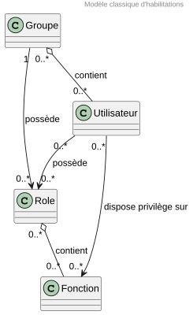

# Vue sécurité
:sectnumlevels: 4
:toclevels: 4
:sectnums: 4
:toc: left
:icons: font
:toc-title: Sommaire

[PRE-FILLED]
====
*Dernière modification* : _{docdate}_

*Date de la dernière revue globale* : 

*Statut du document* :  

====

TIP: Faire régulièrement des revues complètes de la vue (au moins une fois par an tant que le projet est actif) et mettre à jour la date plus haut.

TIP: Indiquer le statut de la vue, par exemple 'DRAFT', 'FINALISÉ',...

//🏷{"id": "a08e807e-1e9b-4752-a5b8-372a40665c49", "labels": ["contexte"]}
## Introduction

La vue sécurité décrit l'ensemble des dispositifs mis en œuvre pour empêcher l'utilisation non-autorisée, le mauvais usage, la modification illégitime ou le détournement du SI.

Les autres vues du dossier sont accessibles link:./README.adoc[d'ici].

Le glossaire du projet est disponible link:glossaire.adoc[ici]. Nous ne reprendrons pas ici les termes fonctionnels ou techniques déjà définis.

[TIP]
La disponibilité est traitée dans la vue infrastructure.

//🏷{"id": "cd8c64f1-d216-4b24-946c-175455e824a7", "labels": ["contexte","references"]}
### Documentation de Référence

[TIP]
====
Mentionner ici les documents d'architecture de référence (mutualisés). Ce document ne doit pas reprendre leur contenu sous peine de devenir rapidement obsolète et non maintenable.
====

[PRE-FILLED]
====
[cols="1,1,4,4"]
|===
|N°|Version|Titre/URL du document| Détail

|1
|
|
|
|
|===
====

//🏷{"id": "ea245600-dbd6-4f56-a58c-8c77556643ad", "labels": ["contexte","incertitude"]}
## Non statué

//🏷{"id": "a058d388-72e1-4136-8659-7a9db1c1a340", "labels": []}
### Points nécessitant une étude complémentaire

=====
Exemple : 

[cols="1e,3e,1e,1e,2e"]
|===
|ID|Détail|Statut|Porteur du sujet | Échéance

|ES1
|Il conviendra de valider que les dispositifs anti-CSRF mis en place résolvent également les failles liées au couplage TLS + compression (type CRIME ou BREACH). 
|EN_COURS
|Équipe sécurité
|AVANT 2040

|===
=====

[PRE-FILLED]
====
[cols="1,3,1,1,2"]
|===
|ID|Détail|Statut|Porteur du sujet | Échéance

| 
| 
| 
| 
| 
|===
====

//🏷{"id": "68a4f41c-1139-4cdd-bb9e-e15667f47fd9", "labels": []}
### Hypothèses

[TIP]
====
Donner ici les éventuelles hypothèses structurantes

Exemple:

[cols="e,6e"]
|===
|ID|Détail

|HS1
|La solution SAML actuellement en place dans l’organisation ne permet pas de répondre aux besoins d’authentification exprimés pour cette application Internet. Une solution OpenID Connect sera proposée. 
|===
====

[PRE-FILLED]
====
[cols="1,6"]
|===
|ID|Détail

| 
| 
|===
====

//🏷{"id": "53ae9c06-1846-4dd2-ab55-f4a784c6a676", "labels": ["niveau_detail::général", "contrainte"]}
## Contraintes

[TIP]
====
Lister ici les **contraintes de sécurité** applicables à l'architecture, incluant notamment :

- **Isolation des modules** au sein de zones réseaux sécurisées (_DMZ, pare-feux, reverse proxy, segmentation réseau, etc._).
- **Normes et politiques applicables** (_ex. : politiques de mots de passe, exigences de chiffrement, MFA, conformité aux standards de sécurité_).
- **Contraintes légales et réglementaires** (_ex. : conformité RGPD, exigences sectorielles spécifiques_).
- **Restrictions d'accès** entre les différentes zones et systèmes.

====
====
Exemple 1 : La politique de gestion des mots de passe devra se conformer à la norme `XYZ`, incluant une complexité minimale et un renouvellement périodique.
====
====
Exemple 2 : Il est formellement interdit à un module de la **zone Internet** d'accéder directement à la **zone Intranet**.
====
====
Exemple 3 : En application du **RGPD**, les données utilisateur devront être chiffrées **au repos et en transit** avec **AES-256 et TLS 1.3**.
====

//🏷{"id": "4882e5b9-c250-4079-8b24-04996016606d", "labels": ["niveau_detail::général", "exigence"]}
## Exigences

[TIP]
====
Présenter ici les **exigences**, *pas les dispositifs y répondant*. Ceux-ci seront détaillés au chapitre 3.

Pour les projets particulièrement sensibles, prévoir un **dossier d’analyse de risque**. Pour cela, utiliser par exemple la méthode https://www.ssi.gouv.fr/guide/la-methode-ebios-risk-manager-le-guide/[EBIOS Risk Manager] (_Expression des Besoins et Identification des Objectifs de Sécurité_).
====

//🏷{"id": "323d4c77-810a-4015-bc1a-11da07e24f3b", "labels": []}
### Exigences d'intégrité

[TIP]
====
L’intégrité concerne la **justesse, la durabilité et le niveau de confiance** des données de l’application.

Garantir l’intégrité des données signifie s’assurer qu’elles **ne peuvent être altérées ou supprimées** de manière involontaire (_ex. : crash disque, corruption logicielle, bug applicatif_) ou volontaire (_ex. : attaque "man-in-the-middle", élévation de privilèges, sabotage interne_).

⚠ **Ne pas multiplier inutilement les classes de données**. Une unique classification pour toute l’application est souvent suffisante.

Exemple : 

[cols='2e,1e,1e,1e,1e']
|===
|Classe de données |Non intègre [small]#(Les erreurs d'intégrité sont tolérées)# |Détectable [small]#(Les erreurs sont identifiées rapidement)# |Maîtrisé [small]#(Les erreurs sont corrigées)# |Intègre [small]#(Aucune altération n’est tolérée)#

|**Données de la base métier** | | | | X
|**Données archivées** | | X | |
|**Données statistiques agrégées** | | | X |
|**Silo NoSQL des données Big Data (avant consolidation)** | X | | |
|**Code source de l’application** | | | | X
|**Documents officiels générés (ex. : avis d’imposition PDF)** | | | | X
|===

====

[PRE-FILLED]
====
[cols='2,1,1,1,1']
|===
|Classe de données |Non intègre [small]#(Les erreurs d'intégrité sont tolérées)# |Détectable [small]#(Les erreurs sont identifiées rapidement)# |Maîtrisé [small]#(Les erreurs sont corrigées)# |Intègre [small]#(Aucune altération n’est tolérée)#

| 
| 
| 
| 
| 

|===
====

//🏷{"id": "acfa846e-0ed7-4f41-a593-f4ee29e94efd", "labels": []}
### Exigences de confidentialité

[TIP]
====
La confidentialité est la garantie que l’information **n’est accessible qu’aux personnes autorisées** (définition ISO 27018).

**Bonnes pratiques** :  

- Ne pas multiplier inutilement les classes de données. Une seule classification peut suffire pour l’ensemble de l’application.
- S’assurer que les niveaux de confidentialité sont **cohérents avec les exigences légales et contractuelles**.

Exemple : 

[cols="e,e,e,e,e"]
|===
|Classe de données |Public [small]#(Donnée accessible à tous sans restriction)# |Limité [small]#(Accessible uniquement aux personnes habilitées)# |Réservé [small]#(Restreint au personnel interne autorisé)# |Privé [small]#(Accès strictement individuel)#

|**Contenu éditorial**  
| X | | | 

|**Données de profil utilisateur**  
| | X | | 

|**Historique du compte**  
| | | X | 

|**Logs techniques des activités**  
| | | X | 

|**Données RH (ex. : aides sociales aux employés)**  
| | | | X
|===

**Exemples d’applications des niveaux de confidentialité** :

- **Public** → Pages web accessibles sans connexion.
- **Limité** → Informations réservées aux utilisateurs authentifiés (ex : tableau de bord d’un SaaS).
- **Réservé** → Données internes sensibles (ex : logs système non accessibles aux clients).
- **Privé** → Données personnelles visibles uniquement par l’utilisateur concerné (ex : fiche de paie).
====

[PRE-FILLED]
====
[cols="1,1,1,1,1"]
|===
|Classe de données |Public [small]#(Donnée accessible à tous sans restriction)# |Limité [small]#(Accessible uniquement aux personnes habilitées)# |Réservé [small]#(Restreint au personnel interne autorisé)# |Privé [small]#(Accès strictement individuel)#

| 
| 
|
|
|
|===

====

//🏷{"id": "94c138c1-3e8b-4eaf-8926-b5b9bfa6a86b", "labels": []}
### Exigences d'identification

[TIP]
====
L’identification permet d'**attribuer un identifiant unique** à chaque utilisateur, afin de le différencier des autres.  

**Attention :**  L’identification **ne garantit pas** que l’utilisateur est bien celui qu’il prétend être. C’est le rôle de l’authentification (exemple : mot de passe, MFA…).

Exemple : 

[cols="1e,3e"]
|===
|Exigence |Description

|**Identifiant unique**  
| Chaque utilisateur doit avoir un identifiant **unique et non partageable**. Une adresse e-mail personnelle est un bon identifiant.

|**Validation de l'identité**  
| L'existence de l'identité d'un internaute doit être vérifiée avant tout appel de service.

|**Pérennité de l’identifiant**  
| Un identifiant ne doit **jamais être supprimé, modifié ou réutilisé**, même après la suppression d’un compte utilisateur.
|===

**Bonnes pratiques** :  

- **Privilégier des identifiants stables et uniques** (e-mail, numéro de client, UUID…).
- **Éviter les identifiants réattribuables** (exemple : ID numérique incrémental risquant d’être réutilisé après suppression d’un compte).
- **S'assurer que l'identifiant est cohérent dans tous les systèmes** où il est utilisé.
====

[PRE-FILLED]
====
[cols="1,3"]
|===
|Exigence |Description

|
| 

|===
====

//🏷{"id": "9d0646cd-3e3f-4878-96de-f215c9f20bdc", "labels": []}
=== Exigences d’authentification

[TIP]
====
L’authentification vérifie qu’un utilisateur est bien celui qu’il prétend être, en validant son identité à l’aide d’un ou plusieurs facteurs de preuve.

⚠ **À ne pas confondre avec l’identification**, qui ne fait que distinguer un utilisateur d’un autre sans valider son identité.

**Cas particuliers :**

- Les **comptes techniques** (ex. : batchs, applications, API) nécessitent également une authentification. Les exigences les concernant sont traitées dans un tableau dédié ci-dessous ; les dispositifs correspondants relèvent de la section « Comptes de service » du chapitre Mesures de sécurité.

- Les **comptes à privilèges** (ex. : `root` sur les serveurs, compte administrateur applicatif...). Ils peuvent être humains ou techniques, mais disposent de droits permettant de lire, modifier ou supprimer de nombreuses données, ou de réaliser des opérations irréversibles (_blast radius_ important).

- L’**enrôlement initial** et, lorsqu’elle est nécessaire, la **vérification d’identité** permettant de rattacher un compte à une personne constituent une étape distincte de l’authentification ultérieure. Cette étape peut nécessiter des contrôles plus stricts que ceux utilisés lors des connexions suivantes.

- Une **authentification fédérée** permet de déléguer l’authentification à un fournisseur d’identité. Les exigences correspondantes sont traitées dans les sections « Exigences de fédération d’identité » et « Exigences de SSO et SLO ». La présente section reste néanmoins à renseigner : elle définit le **niveau d’authentification exigé**, que celui-ci soit obtenu localement ou délégué à un fournisseur d’identité.
====

*Facteurs et mécanismes d’authentification : tableau comparatif*

Les trois catégories de facteurs d’authentification sont :

- **connaissance** : quelque chose que l’utilisateur connaît ;
- **possession** : quelque chose que l’utilisateur possède ;
- **inhérence** : quelque chose que l’utilisateur est.

Le tableau ci-dessous compare les principaux mécanismes utilisés à des fins d’authentification. Certains mécanismes courants, comme un lien envoyé par e-mail, ne constituent pas nécessairement à eux seuls un authentificateur reconnu par tous les référentiels.

[cols="2,1,1,1,4,4", options="header"]
|===

| Mécanisme
| Catégorie
| Force typique
| Résistance au phishing
| Description
| Faiblesses / Risques

| Mot de passe
| Connaissance
| Faible à moyenne
| Non
| Chaîne de caractères secrète connue de l’utilisateur.
| Réutilisation entre services. Fuite par bases compromises. Hameçonnage, force brute. Sa robustesse dépend fortement de sa longueur, de son caractère unique et des protections mises en œuvre côté serveur.

| Phrase de passe
| Connaissance
| Moyenne
| Non
| Suite de mots suffisamment longue et mémorisable par l’utilisateur (ex. : `cheval juste pile agrafe`).
| Peut offrir une meilleure mémorisation et une meilleure entropie qu’un mot de passe court, mais reste vulnérable au hameçonnage, au rejeu et à la réutilisation.

| Question secrète
| Connaissance
| Très faible
| Non
| Question portant sur une information personnelle (ex. : nom du premier animal).
| Réponse souvent devinable, stable dans le temps ou publiquement accessible. Ne constitue pas une preuve d’identité robuste. **Déconseillée comme authentificateur.**

| Code PIN
| Connaissance
| Faible seul
| Non
| Code court servant généralement à déverrouiller localement un authentificateur ou un composant sécurisé.
| Espace de recherche réduit. Sa sécurité repose sur un dispositif limitant les tentatives et protégeant le secret ou la clé associée : carte à puce, TPM, élément sécurisé, clé FIDO2, etc.

| Connaissance de données métier
| Connaissance
| Faible
| Non
| Question portant sur une information liée au dossier de l’utilisateur (ex. : montant de la dernière facture).
| Information partageable, parfois connue de tiers légitimes ou récupérable par ingénierie sociale. **Déconseillée comme facteur d’authentification.** Peut néanmoins être utile lors d’un appariement initial entre un compte et un dossier lorsqu’aucun authentificateur partagé n’existe encore.

| Lien à usage unique par e-mail
| Hors catégorie (canal de transmission)
| Faible
| Non
| Lien temporaire envoyé à l’adresse e-mail déclarée afin de permettre ou de confirmer un accès. Parfois assimilé à une possession indirecte, sans en offrir les garanties.
| La sécurité dépend entièrement de celle de la boîte mail, de ses mécanismes de récupération et des terminaux qui y accèdent. Transfert, compromission de la messagerie et hameçonnage restent possibles.

| OTP par SMS
| Possession (indirecte)
| Faible
| Non
| Code à usage unique envoyé au numéro de téléphone préalablement enregistré.
| Détournement de carte SIM (_SIM swapping_), interception ou redirection des messages, compromission du terminal. Le réseau téléphonique ne fournit pas les mêmes garanties qu’un authentificateur cryptographique.

| OTP par application (TOTP)
| Possession
| Moyenne
| Non
| Code temporaire calculé à partir d’un secret partagé et de l’heure courante.
| Le code peut être capturé par un site contrefait puis relayé immédiatement vers le service légitime. Secret partagé, donc connu du vérificateur et souvent extractible d’une sauvegarde du terminal ou d’un poste compromis. Perte du terminal.

| OTP par jeton matériel
| Possession
| Moyenne à forte
| Non
| Code généré par un dispositif physique dédié.
| Même vulnérabilité au relais en temps réel que le TOTP, mais secret non extractible du dispositif. Coût, logistique de distribution, perte ou remplacement du jeton.

| Notification push
| Possession
| Moyenne
| Non
| Demande de validation envoyée à un terminal préalablement enrôlé.
| Vulnérable au harcèlement de notifications (_MFA fatigue_) et aux attaques par relais. La correspondance de nombre (_number matching_) et l’affichage du contexte réduisent fortement les validations accidentelles mais ne rendent pas, à eux seuls, le mécanisme résistant au phishing.

| SSO intégré au domaine (Kerberos, SPNEGO)
| Dérivé de l’authentification initiale
| Variable : celle du facteur initial
| Partielle
| Le poste joint au domaine obtient un ticket lors de l’ouverture de session et le présente à l’application sans nouvelle saisie de secret.
| N’apporte aucun facteur propre : le niveau réel est celui de l’ouverture de session sur le poste. Vol ou rejeu de tickets, délégation mal configurée, repli sur des protocoles plus faibles. Limité aux postes gérés et joints au domaine.

| Clé SSH
| Possession
| Forte
| Partielle
| Paire de clés asymétriques, la clé privée restant sur le poste client ou dans un dispositif cryptographique. La signature est liée à la session, ce qui interdit son rejeu vers une autre destination.
| La vérification de la clé hôte reposant souvent sur une confiance au premier usage, un serveur interposé peut être accepté par l’utilisateur. Clé privée parfois stockée sans protection suffisante. Vol de fichier, compromission du poste, abus de l’agent SSH et de son transfert.

| Certificat logiciel
| Possession
| Moyenne
| Oui en TLS client mutuel
| Certificat X.509 et clé privée conservés dans un magasin logiciel, un navigateur, le système ou un fichier PKCS#12. En authentification TLS cliente, la preuve porte sur le déroulé de la négociation et est donc liée au canal.
| Clé privée potentiellement exportable et copiable. Exfiltration possible par code malveillant. La possession exclusive de la clé n’est pas garantie.

| Carte à puce
| Possession + connaissance (PIN)
| Très forte
| Oui
| Certificat ou clé cryptographique dont la clé privée est générée et utilisée dans un composant sécurisé. Les opérations cryptographiques sont réalisées par la carte après déverrouillage par code PIN.
| Coût. Lecteur et intergiciel requis. PKI à exploiter : émission, révocation, renouvellement. Gestion du blocage du PIN et de la perte de la carte.

| Clé matérielle FIDO2
| Possession + connaissance ou inhérence si vérification utilisateur
| Très forte
| Oui
| Authentification asymétrique par défi-réponse. La preuve est liée cryptographiquement à l’origine du service. La clé privée est confinée dans un dispositif externe et généralement non exportable.
| Coût et logistique de distribution. Nécessite une stratégie de récupération ou l’enrôlement d’un second authentificateur. Support dépendant des applications.

| Passkey liée à l’appareil
| Possession + connaissance ou inhérence si vérification utilisateur
| Très forte
| Oui
| Authentificateur WebAuthn non synchronisé. La clé privée reste liée à l’appareil et est généralement protégée par les mécanismes de sécurité de la plateforme, par exemple TPM, Secure Enclave ou magasin cryptographique équivalent.
| Perte ou destruction de l’appareil. Nécessite un mécanisme de récupération ou un second authentificateur enrôlé. Le niveau de protection matérielle dépend de la plateforme.

| Passkey synchronisée
| Possession + connaissance ou inhérence si vérification utilisateur
| Forte
| Oui
| Authentificateur WebAuthn dont la clé privée peut être répliquée de manière chiffrée entre plusieurs appareils par l’intermédiaire d’un gestionnaire de justificatifs.
| La clé n’est plus strictement liée à un appareil unique. La sécurité dépend également du service de synchronisation, du compte qui le protège et de ses mécanismes de récupération. Non adaptée aux niveaux exigeant une clé non exportable.

| Biométrie
| Inhérence
| Variable
| Sans objet lorsqu’elle est utilisée seule
| Empreinte digitale, reconnaissance faciale, iris, voix, etc.
| Caractéristique difficilement révocable en cas de compromission. Taux d’erreur, attaques par présentation, enjeux de vie privée et de conformité.

|===

.Références normatives associées
[%collapsible]
====
- **Mot de passe, phrase de passe, OTP, passkey synchronisée** : NIST SP 800-63B-4 ; recommandations ANSSI relatives à l’authentification multifacteur et aux mots de passe.
- **Lien à usage unique par e-mail** : non admis comme authentificateur _out-of-band_ par NIST SP 800-63B-4.
- **OTP par SMS** : usage restreint selon NIST SP 800-63B-4.
- **TOTP / HOTP** : RFC 6238, RFC 4226.
- **Kerberos** : RFC 4120, RFC 4559 (SPNEGO/HTTP).
- **Clé SSH** : RFC 4252.
- **Certificat X.509 et TLS client** : RFC 5280, RFC 8446.
- **Carte à puce** : ISO/IEC 7816, PKCS#11, règlement eIDAS selon l’usage.
- **FIDO2 / passkeys** : W3C WebAuthn, FIDO CTAP2.
- **Biométrie** : ISO/IEC 30107 (détection d’attaques par présentation).
- **Référentiels applicables au secteur public français** : RGS, référentiel d’exigences PVID pour la vérification d’identité à distance, règlement eIDAS pour les niveaux de garantie.
====

[IMPORTANT]
====
**Force et résistance au phishing sont deux axes indépendants.**

La colonne _Force typique_ traduit la difficulté à compromettre l’authentificateur : deviner le secret, voler le dispositif, copier une clé, extraire un secret, contourner la protection locale, etc.

La colonne _Résistance au phishing_ traduit la capacité à résister à un attaquant qui interpose un service contrefait ou un proxy en temps réel entre l’utilisateur et le service légitime (_adversary-in-the-middle_).

Un TOTP peut ainsi constituer un facteur robuste contre le simple vol de mot de passe tout en restant vulnérable au phishing : l’utilisateur saisit son code sur un site contrefait, qui le transmet immédiatement au véritable service.

À l’inverse, une authentification cryptographique peut être résistante au phishing parce que la preuve produite est liée cryptographiquement au service ou au canal de communication et ne peut pas être rejouée vers une autre destination.

Les mécanismes les plus robustes combinent donc deux propriétés distinctes :

- une clé privée difficile ou impossible à extraire, qui protège contre le vol ou le clonage de l’authentificateur ;
- une preuve cryptographiquement liée au vérificateur, à l’origine ou au canal, qui protège contre le phishing et le relais.

Les clés matérielles FIDO2, les passkeys liées à l’appareil et les certificats portés par un élément sécurisé sont des exemples de mécanismes pouvant cumuler ces propriétés. Pour les accès réellement sensibles, ces mécanismes doivent être privilégiés.
====

[NOTE]
====
La **biométrie** est rarement transmise au service distant comme preuve d’authentification.

Dans les usages courants, elle sert à effectuer localement une _vérification utilisateur_ et à déverrouiller un authentificateur cryptographique protégé par le terminal.

La résistance au phishing et une grande partie de la robustesse de l’authentification proviennent alors de l’authentificateur cryptographique déverrouillé, et non du caractère biométrique lui-même.
====

*Niveaux de garantie*

Afin de rendre les exigences traçables et comparables entre projets, chaque cas d’utilisation doit être rattaché à un niveau de garantie. La correspondance ci-dessous est indicative : les référentiels cités n’ont ni le même périmètre ni la même portée juridique.

[cols="1,1,1,4", options="header"]
|===

| Niveau retenu dans le présent dossier
| Ordre de grandeur NIST SP 800-63B-4
| Ordre de grandeur eIDAS
| Caractéristiques attendues

| Standard
| AAL1
| Faible
| Un seul facteur admis. Pas d’exigence de résistance au phishing.

| Renforcé
| AAL2
| Substantiel
| Deux catégories de facteurs distinctes, ou un authentificateur multifacteur unique. Résistance au phishing attendue par défaut.

| Élevé
| AAL3
| Élevé
| Authentificateur multifacteur résistant au phishing reposant sur une clé privée non exportable, portée par un dispositif matériel ou un composant sécurisé.

|===

[NOTE]
====
Les niveaux eIDAS qualifient un **moyen d’identification électronique notifié**, et non un mécanisme d’authentification isolé. La colonne correspondante ne vaut donc que comme repère de dimensionnement, notamment lorsque le service doit être raccordé à un fournisseur d’identité étatique.
====

Préciser ici le niveau de garantie visé par cas d’utilisation, et indiquer si ce niveau doit être **prouvé à l’application** — par exemple par une revendication `acr` ou `amr` transmise par le fournisseur d’identité — ou s’il est simplement garanti par configuration. Les modalités de la fédération elle-même relèvent de la section « Exigences de fédération d’identité ».

*Signaux de contexte*

Les éléments ci-dessous ne prouvent pas une identité et ne constituent donc pas des facteurs d’authentification.

Ils servent à **moduler** l’exigence d’authentification ou la décision d’accès en fonction de la situation d’exécution. Cette démarche est généralement qualifiée d’authentification adaptative, d’authentification fondée sur le risque (_risk-based authentication_) ou participe à une politique d’accès conditionnel.

[cols="2,1,3,3,3", options="header"]
|===

| Signal
| Catégorie
| Ce qu’il permet de détecter
| Modulation typique
| Limites

| Adresse IP ou plage réseau
| Réseau
| Accès depuis un réseau non prévu : Internet public au lieu de l’intranet, du VPN ou d’un réseau partenaire déclaré.
| Exiger une authentification renforcée hors du réseau de confiance ; réserver certaines opérations à des réseaux déterminés.
| VPN, proxy, relais, NAT et postes compromis sur un réseau autorisé. Une adresse IP identifie rarement un utilisateur ou un terminal de manière fiable.

| Géolocalisation
| Localisation
| Connexion depuis un pays ou une région inhabituelle pour l’utilisateur.
| Élever le niveau d’authentification ; bloquer certains pays ne faisant pas partie du périmètre d’activité.
| Contournable par VPN ou relais. Géolocalisation IP imprécise. Faux positifs possibles.

| Voyage impossible
| Localisation
| Deux authentifications géographiquement incompatibles avec le temps écoulé entre elles.
| Réauthentifier, invalider une session, augmenter le score de risque ou alerter le SOC.
| Faux positifs liés aux VPN d’entreprise, relais de confidentialité, infrastructures cloud et variations de géolocalisation IP.

| Empreinte de terminal
| Terminal
| Accès depuis un terminal jamais observé ou présentant des caractéristiques différentes pour ce compte.
| Exiger une vérification supplémentaire lors du premier usage d’un terminal.
| Empreinte falsifiable et instable. Peut devenir un identifiant de traçage persistant. Enjeux de vie privée et de conformité RGPD.

| État de conformité du terminal
| Terminal
| Terminal non géré, système obsolète, chiffrement absent, protection de sécurité désactivée ou configuration non conforme.
| Exiger un terminal géré ; limiter les opérations ; refuser l’accès aux ressources sensibles.
| Nécessite une solution de gestion ou d’attestation du terminal. Un terminal déclaré conforme peut néanmoins être compromis.

| Plage horaire d’activité
| Comportement
| Connexion en dehors des horaires habituels de l’utilisateur ou du service.
| Élever l’exigence ; restreindre certaines opérations irréversibles aux périodes autorisées ; alerter.
| Faux positifs en astreinte, en horaires décalés ou lors de déplacements sur plusieurs fuseaux horaires.

| Dynamique de saisie
| Comportement
| Écart entre le rythme de frappe observé et le profil précédemment appris.
| Alimenter un score de risque ; déclencher une réauthentification au-delà d’un seuil.
| Nécessite une phase d’apprentissage. Peu fiable isolément. Sensible au changement de clavier, de terminal ou aux variations physiques de l’utilisateur.

| Habitudes d’usage
| Comportement
| Séquence d’actions, volumétrie, fréquence ou vitesse de navigation inhabituelles.
| Alimenter un score de risque ; limiter le débit ; demander une réauthentification ; alerter.
| Dérive du profil dans le temps. Risque de faux positifs. Difficulté à expliquer certaines décisions automatiques.

|===

[WARNING]
====
Un signal de contexte ne compte **jamais** comme second facteur.

Une authentification multifacteur doit reposer sur au moins deux catégories distinctes parmi connaissance, possession et inhérence.

Ces facteurs peuvent être fournis :

- par plusieurs authentificateurs distincts, par exemple mot de passe + clé matérielle ;
- ou par un **authentificateur multifacteur unique**, par exemple une carte à puce protégée par PIN ou une passkey utilisant une vérification utilisateur par PIN ou biométrie.

Un mot de passe complété d’une restriction d’adresse IP reste donc une authentification à un seul facteur.

De même, reconnaître un terminal déjà utilisé, constater que l’utilisateur se trouve dans son pays habituel ou vérifier un certificat de poste ne constitue pas un facteur supplémentaire pour l’utilisateur.

Les signaux de contexte peuvent **élever** l’exigence d’authentification ou entraîner une restriction d’accès. Ils ne doivent pas permettre de descendre en dessous du niveau minimal imposé pour l’opération concernée.

Ces signaux permettent notamment la mise en œuvre de l’accès conditionnel décrit ci-dessous.
====

*Accès conditionnel*

Plutôt que d’appliquer les mêmes conditions d’accès en toutes circonstances, ce dispositif consiste à faire varier la décision en fonction du contexte de la tentative : niveau d’authentification déjà atteint, terminal inconnu, connexion depuis une localisation inhabituelle, horaire atypique, niveau de risque, sensibilité de l’opération demandée, etc.

La décision peut notamment être :

- d’autoriser l’accès ;
- de refuser l’accès ;
- de limiter certaines opérations ;
- d’exiger une élévation du niveau d’authentification avant de poursuivre.

Ainsi, la consultation d’un dossier peut rester possible alors qu’une opération sensible, telle que sa validation, impose une réauthentification renforcée.

Cette décision suppose un point de décision capable d’évaluer les signaux disponibles au moment de l’accès. Il peut être porté par le fournisseur d’identité, par l’application, par une passerelle ou par un composant spécialisé de contrôle d’accès.

_Exemple : pour un usager authentifié, si le terminal n’a jamais été utilisé avec ce compte, ou si la localisation apparente et l’horodatage sont incompatibles avec la session précédente, toute opération modifiant le dossier exige une réauthentification renforcée. La consultation seule demeure autorisée._

Préciser ici si un dispositif d’accès conditionnel est exigé, quels signaux il doit pouvoir exploiter et quelles décisions il doit pouvoir rendre.

Les règles déterminant quelles opérations sont accessibles à quels utilisateurs relèvent des exigences sur les autorisations. Les règles d’audit, d’enregistrement de session et d’alerte relèvent quant à elles des exigences de traçabilité et de supervision.

*Enrôlement, récupération et cycle de vie des authentificateurs*

[IMPORTANT]
====
Le niveau réel d’un compte est celui de **son chemin d’accès le plus faible**. Une passkey résistante au phishing dont la réinitialisation s’effectue par un simple lien envoyé par e-mail protège en pratique un compte au niveau de la boîte mail associée.

Le chemin de récupération ne doit donc **jamais** offrir un niveau de garantie inférieur au chemin nominal.
====

Les points ci-dessous doivent être tranchés dans le présent dossier, indépendamment des dispositifs techniques qui y répondront :

- **Vérification d’identité à l’enrôlement** : auto-déclaratif, appariement sur données métier, vérification d’identité à distance, remise en présentiel, ou délégation à un fournisseur d’identité déjà qualifié.
- **Redondance** : nombre minimal d’authentificateurs à enrôler par compte, ou existence de codes de récupération à usage unique, pour les niveaux renforcé et élevé.
- **Récupération** : chemins autorisés, niveau de garantie exigé sur chacun, existence d’un canal hors ligne (guichet, courrier, rappel sortant) et délai applicable.
- **Notification** : information de l’utilisateur lors de tout ajout, remplacement ou suppression d’un authentificateur, et lors de toute réinitialisation.
- **Révocation** : délai maximal de révocation d’un authentificateur perdu, volé ou compromis, et effet de cette révocation sur les sessions en cours.
- **Fin de vie** : désenrôlement au départ d’un agent, à la fin d’un mandat ou à la clôture d’un compte ; durée de validité et renouvellement des certificats.
- **Résistance aux abus** : temporisation croissante et blocage après échecs répétés, aussi bien sur l’authentification que sur l’appariement et la récupération ; absence de divulgation de l’existence d’un compte.

*Sessions et réauthentification*

Préciser les exigences portant sur la durée de validité d’une authentification réussie :

- durée maximale absolue d’une session et délai d’expiration sur inactivité, par niveau de garantie ;
- opérations exigeant une **réauthentification** même au sein d’une session valide, et fraîcheur maximale admise pour celle-ci (ex. : authentification datant de moins de cinq minutes) ;
- possibilité ou interdiction d’une persistance de session de type « se souvenir de moi », et durée associée ;
- invalidation obligatoire des sessions en cours lors d’un changement d’authentificateur, d’une révocation ou d’un incident de sécurité ;
- sessions concurrentes : autorisées, limitées ou visibles par l’utilisateur ;
- révocabilité côté serveur, y compris lorsque des jetons d’accès de courte durée sont utilisés.

Les modalités de propagation de la déconnexion entre applications relèvent de la section « Exigences de SSO et SLO ».

*Comptes techniques et charges de travail*

Les comptes techniques ne peuvent pas bénéficier d’un second facteur détenu par une personne. Leur sécurité repose donc sur la nature du secret, sur son cycle de vie et sur sa durée de validité.

[cols="2,1,4,4", options="header"]
|===

| Mécanisme
| Force typique
| Description
| Faiblesses / Risques

| Secret statique en configuration
| Très faible
| Mot de passe ou clé d’API inscrit dans un fichier de configuration, une variable d’environnement ou une image de conteneur.
| Fuite par dépôt de code, journal, image ou sauvegarde. Rarement renouvelé. Souvent partagé entre environnements. **À proscrire.**

| Clé d’API ou secret client OAuth2
| Faible à moyenne
| Secret partagé présenté par le client lors de l’obtention d’un jeton.
| Le vérificateur connaît le secret. Rejouable s’il est intercepté. Impose une rotation et un stockage en coffre-fort.

| Clé SSH de compte technique
| Moyenne
| Paire de clés utilisée par un batch ou un automate.
| Souvent partagée entre plusieurs traitements, rarement renouvelée, difficilement imputable à un traitement précis.

| Authentification par assertion signée (`private_key_jwt`, JWT bearer)
| Forte
| Le client prouve la détention d’une clé privée sans jamais la transmettre, et obtient un jeton d’accès de courte durée.
| Nécessite une gestion de clés et une horloge fiable. La protection de la clé privée reste déterminante.

| Authentification mutuelle TLS par certificat client
| Forte
| Preuve cryptographique liée au canal TLS, délivrée par une PKI reconnue.
| PKI à exploiter : émission, révocation, renouvellement, supervision des expirations. Clé privée exportable si elle n’est pas portée par un composant sécurisé.

| Identité de charge de travail sans secret durable
| Très forte
| Identité attestée par la plateforme d’exécution puis échangée contre un jeton de courte durée : jeton de compte de service projeté, fédération d’identité vers un fournisseur cloud, certificat de charge de travail à durée de vie courte.
| Suppose une plateforme d’exécution de confiance et correctement cloisonnée. Le périmètre d’attestation doit être restreint au strict nécessaire.

| Certificat de poste ou de machine
| Sans objet comme facteur utilisateur
| Authentifie le **terminal**, non la personne qui l’utilise.
| Ne constitue jamais un facteur d’authentification de l’utilisateur. S’emploie comme condition d’accès complémentaire.

|===

Préciser ici, pour chaque compte technique ou flux automatisé : le mécanisme exigé, la durée de validité maximale du secret ou du jeton, la fréquence de rotation attendue et l’imputabilité recherchée. Les dispositifs de stockage correspondants relèvent de la section « Comptes de service » du chapitre Mesures de sécurité.

*Recommandations par cas d’usage*

[cols="1,2,3,1,2", options="header"]
|===

| Niveau d’accès
| Exemple
| Authentification minimale recommandée
| Facteur résistant au phishing
| Signaux de contexte

| Accès à faible sensibilité
| Compte sur un site d’information, forum ou service ne manipulant pas de données sensibles.
| Un facteur : mot de passe ou phrase de passe correctement dimensionnée. Un lien à usage unique par e-mail peut être admis lorsque le niveau de risque le permet, sans être assimilé à une authentification forte.
| Non
| Aucun signal obligatoire.

| Accès personnel sensible
| Compte bancaire, espace assuré, portail usager, dossier médical.
| Authentificateur multifacteur résistant au phishing, par exemple passkey avec vérification utilisateur, **ou** combinaison de deux facteurs appartenant à des catégories différentes dont au moins un résistant au phishing. Pour un téléservice public, l’authentification peut être déléguée à un fournisseur d’identité étatique offrant le niveau de garantie requis.
| Oui
| Terminal inconnu, voyage impossible ou risque élevé : réauthentification renforcée.

| Accès interne
| Application métier, données RH, intranet d’un agent.
| Carte à puce + PIN, ou passkey liée à l’appareil avec vérification utilisateur. Éventuellement délégué au fournisseur d’identité interne de l’organisation ou au fournisseur d’identité interministériel pour les agents publics.
| Oui
| Réseau d’origine, terminal géré, état de conformité du poste.

| Accès distant
| VPN, bureau à distance, bastion.
| Authentification équivalente à l’accès interne et authentification du terminal géré lorsque nécessaire, par exemple au moyen d’un certificat de poste.
| Oui
| Géolocalisation, état de conformité du terminal, terminal non géré : élévation ou refus selon le niveau de risque.

| Accès à privilèges
| Compte `root`, administration d’un hyperviseur, console cloud.
| Clé matérielle FIDO2 + PIN ou carte à puce + PIN, depuis un poste d’administration dédié. Comptes nominatifs, élévation des privilèges limitée dans le temps.
| Oui
| Plage horaire, terminal d’administration, localisation, voyage impossible.

|===

[WARNING]
====
Dès que la compromission d’un compte peut avoir des conséquences financières, juridiques ou opérationnelles importantes, une authentification résistante au phishing doit être privilégiée.

Les mécanismes adaptés reposent notamment sur WebAuthn/FIDO2 — clé matérielle ou passkey — ou sur une authentification par certificat lorsque la clé privée est suffisamment protégée.

La résistance au phishing ne dispense pas des autres mesures de sécurité : protection du terminal, récupération de compte robuste, gestion du cycle de vie des authentificateurs, journalisation et contrôle des autorisations.
====

[TIP]
====
[Exemple] **Exigences d’authentification requises** selon le contexte d’utilisation :

.Exemple
[cols="2,1,3,1,2", options="header"]
|===

| Cas d’utilisation
| Niveau visé
| Authentificateurs ou mécanismes exigés
| Résistance au phishing
| Signaux de contexte

| _Création de l’espace usager et appariement au dossier existant_
| _Sans objet_
| _Étape d’enrôlement : création de l’authentificateur et appariement au dossier au moyen du numéro de dossier accompagné, par exemple, du montant de la dernière notification. Ces données métier servent à l’appariement et ne sont pas considérées comme un facteur d’authentification durable._
| _Sans objet à ce stade_
| _Blocage ou temporisation après plusieurs tentatives d’appariement infructueuses._

| _Consultation de son dossier par l’usager_
| _Renforcé_
| _Passkey avec vérification utilisateur par PIN ou biométrie. Une variante synchronisée peut être acceptée si le niveau de risque le permet. Une phrase de passe supplémentaire peut être imposée par la politique de sécurité sans être nécessaire au caractère multifacteur de la passkey._
| _Oui_
| _Terminal inconnu, voyage impossible ou score de risque élevé : réauthentification renforcée._

| _Instruction d’un dossier par un agent_
| _Élevé_
| _Carte agent portant un certificat et déverrouillée par code PIN, ou authentificateur équivalent résistant au phishing._
| _Oui_
| _Poste non conforme au référentiel de la flotte gérée : accès refusé ou limité._

| _Accès d’un agent en télétravail_
| _Élevé_
| _Carte agent + PIN ou authentificateur équivalent, et authentification du poste par certificat ou mécanisme d’attestation lorsqu’elle est exigée._
| _Oui_
| _Connexion hors des pays autorisés : accès refusé. Hors plage 7 h - 20 h : élévation du niveau de contrôle ou notification selon la politique définie._

| _Administration des serveurs applicatifs_
| _Élevé_
| _Clé matérielle FIDO2 avec PIN, depuis un poste d’administration dédié. Accès via bastion et élévation des privilèges limitée dans le temps._
| _Oui_
| _Hors plage ouvrée : élévation supplémentaire ou procédure de double validation selon la sensibilité de l’opération._

| _Échange automatisé avec l’organisme partenaire (API)_
| _Élevé_
| _Authentification mutuelle TLS par certificat client délivré par une PKI reconnue. Clé privée protégée et cycle de vie du certificat maîtrisé._
| _Oui — preuve cryptographique liée au canal TLS_
| _Restriction éventuelle aux plages d’adresses déclarées par le partenaire, sans considérer cette restriction comme un facteur d’authentification._

|===

.Exemple d’exigences transverses
[cols="2,4", options="header"]
|===

| Exigence
| Valeur retenue

| _Durée maximale de session_
| _12 h pour un agent, 30 min d’inactivité pour un usager._

| _Opérations exigeant une réauthentification_
| _Validation d’un dossier, ajout d’un authentificateur, modification des coordonnées bancaires. Fraîcheur maximale : 5 minutes._

| _Authentificateurs par compte_
| _Deux authentificateurs distincts enrôlés obligatoires pour les niveaux renforcé et élevé._

| _Chemins de récupération_
| _Usager : second authentificateur enrôlé, ou reprise de l’enrôlement complet avec appariement au dossier. Agent : réémission de la carte par le service de proximité, en présentiel. Aucune réinitialisation par simple lien e-mail._

| _Délai maximal de révocation_
| _1 h en heures ouvrées, 4 h sinon. Invalidation immédiate de toutes les sessions en cours._

| _Résistance aux abus_
| _Temporisation croissante dès le 3e échec, blocage temporaire au 10e, sur l’authentification comme sur la récupération. Aucune réponse ne révèle l’existence d’un compte._

|===
====

[PRE-FILLED]
====
Le tableau ci-dessous indique les **exigences d’authentification** selon le contexte d’utilisation.

[cols="2,1,3,1,2", options="header"]
|===

| Cas d’utilisation
| Niveau visé
| Authentificateurs ou mécanismes exigés
| Résistance au phishing
| Signaux de contexte

|
|
|
|
|

|===

Le tableau ci-dessous complète le précédent par les **exigences transverses** applicables aux sessions, à la récupération et au cycle de vie des authentificateurs.

[cols="2,4", options="header"]
|===

| Exigence
| Valeur retenue

| Durée maximale de session
|

| Opérations exigeant une réauthentification
|

| Authentificateurs par compte
|

| Chemins de récupération
|

| Délai maximal de révocation
|

| Résistance aux abus
|

|===
====

//🏷{"id": "f552f1e6-9aea-4866-8da1-e7ed676fd228", "labels": ["niveau::avancé", "niveau::avancé", "niveau_detail::détaillé"]}
### Exigences de fédération d’identité

[TIP]
====
La fédération d’identité permet à un utilisateur de **réutiliser son identité** (credentials) gérée par un **Identity Provider (IdP)** pour s’authentifier sur plusieurs systèmes indépendants.

Contrairement au **SSO (Single Sign-On)**, qui assure une connexion automatique sans nouvelle saisie des identifiants, la fédération **ne dispense pas** de l’authentification mais centralise la gestion des identités.

**Exemples courants :**  

- **France Connect** → Basé sur OpenID Connect, permet aux citoyens de se connecter aux services administratifs (DGFiP, CNAM…) avec un compte unique.  
- **"Se connecter avec [Google | Facebook | GitHub]”** → Implémenté via **OpenID Connect** ou **OAuth2**, permettant d’utiliser un compte tiers pour l’authentification sur une autre plateforme.

**Avantages de la fédération d’identité :**  

- **Simplifie la gestion des comptes** → Moins d’identifiants à mémoriser pour l’utilisateur.  
- **Réduit les coûts de maintenance** → Moins de réinitialisations de mot de passe et de gestion des utilisateurs.  
- **Améliore la sécurité** → Centralisation de l’authentification auprès d’un IdP de confiance, possibilité d’intégrer une authentification multi-facteurs (MFA).  
====

====
**Exemple d’application**

L’identification et l’authentification des utilisateurs seront externalisées à **Auth0**, un fournisseur d’identité (IdP) supportant **OIDC, SAML et OAuth2**.  

**Objectifs** :  

- **Centraliser la gestion des identités** et éviter la duplication des comptes utilisateurs.  
- **Réduire les coûts** de développement et d’exploitation liés à l’authentification.  
- **Améliorer la sécurité** en déléguant l’authentification à un IdP conforme aux normes de sécurité.
====

//🏷{"id": "400376ad-cc62-4ab3-8e96-5a9f9a954e49", "labels": ["niveau::avancé", "niveau::avancé"]}
### Exigences de SSO et SLO

[TIP]
====
Le **Single Sign-On (SSO)** permet à un utilisateur de s’authentifier une seule fois et d’accéder à plusieurs applications sans ressaisir ses identifiants.  
Le **Single Log-Out (SLO)** assure qu’une déconnexion depuis une application entraîne automatiquement la déconnexion de toutes les autres applications du même domaine de confiance.

**Points d’attention :**

- **Le SSO peut être complexe** à mettre en œuvre, surtout si l’infrastructure IdP (Identity Provider) n’est pas encore en place.
- **Les applications doivent être compatibles** avec le protocole choisi (SAML, OIDC, Kerberos…).
- **Le besoin métier doit être justifié** → Une application rarement utilisée ne nécessite pas forcément de SSO.
- **Risque sécurité** → Une **authentification faible** sur une application SSO met en péril tout le SI (ex. : un mot de passe faible compromet toutes les applications accessibles via SSO).

**Bonnes pratiques :**

- Définir des **périmètres de confiance** limités (ex. : SSO pour les applications internes uniquement).  
- Utiliser une **authentification forte** pour réduire les risques d’usurpation.  
- Gérer correctement les **sessions et expirations de jetons**.  
- Envisager **une authentification centralisée simple (LDAP, CAS)** si le SSO n’est pas justifié.  
====

====
**Exemple 1 : Pas de besoin de SSO**  
Le portail applicatif repose sur un framework JSR352 qui gère déjà l’authentification unique. Aucun besoin de SSO supplémentaire.
====
====
**Exemple 2 : Pas de SSO ni de SLO requis**  
L’application fonctionne de manière autonome et ne partage pas d’authentification avec d’autres services.
====
====
**Exemple 3 : SSO requis pour un environnement intranet**  

- Une fois authentifié sur l’une des applications de l’intranet, l’utilisateur ne doit **pas avoir à se reconnecter** sur les autres applications jusqu’à expiration de la session.  
- Une **déconnexion (SLO)** depuis une application doit entraîner **la déconnexion de toutes les autres applications** du domaine.  
- Le protocole choisi sera **OIDC avec un Identity Provider interne**.
====

//🏷{"id": "01404b83-f96f-4649-ace0-e5611601b830", "labels": ["niveau::avancé"], "link_to":["e72e5ea5-5711-4665-8a91-76c63cbca2bc"]}
### Exigences de non-répudiation et de valeur probante

La *non-répudiation* garantit qu'un acteur ne peut nier avoir réalisé une action
donnée (signature, validation, transaction). La *valeur probante* étend cette
garantie dans le temps : elle porte sur la capacité à établir, plusieurs années
plus tard et devant un tiers, ce qui s'est produit.

[TIP]
====
Le critère discriminant est *l'identité de l'adversaire de la trace*.

Si l'adversaire est un attaquant externe ou un incident, des journaux suffisent :
on cherche à comprendre et à investiguer, et le sujet relève des  de traçabilité.

Si l'adversaire est *l'une des parties, y compris l'organisation qui exploite le
système*, les journaux ne suffisent plus : ils sont produits par celui-là même à
qui on voudrait les opposer. C'est la raison pour laquelle la non-répudiation
repose sur de la cryptographie asymétrique et non sur de la journalisation — la
signature déplace la production de la preuve chez le signataire.

Poser la question « qui contestera, et à qui devrai-je le démontrer ? » suffit en
général à trancher si un besoin relève de cette section ou de la traçabilité.
====

[WARNING]
====
Prouver qu'un événement *a eu lieu* ne demande qu'un élément isolé. Prouver qu'un
événement *n'a jamais eu lieu* (« cet agent n'a jamais consulté ce dossier »,
« je n'ai jamais donné mon consentement ») exige l'*exhaustivité* de la trace sur
toute la période concernée, sans trou ni purge non tracée. Si de tels besoins
existent, ils doivent être identifiés ici car ils contraignent fortement la
politique de rétention et de purge définie en exigences de traçabilité.
====

[NOTE]
====
La signature numérique est reconnue par la loi n° 2000-230 du 13 mars 2000 et par
le règlement eIDAS (UE 910/2014), qui distingue trois niveaux :

Simple:: Vérifie l'identité de l'émetteur.
Avancée (AdES):: Liée de manière unique au signataire et protégée contre toute
modification ultérieure.
Qualifiée (QES):: Conforme aux exigences les plus strictes, avec certificat
qualifié et dispositif de création de signature qualifié. Seule à bénéficier de
la présomption de fiabilité et de l'équivalence avec la signature manuscrite.
====

[NOTE]
====
Le niveau exigé est *rarement déduit de l'analyse de risque*. Il est le plus
souvent imposé de l'extérieur : délais de prescription applicables, obligations
sectorielles, niveau eIDAS requis par un texte. Recueillir ces contraintes
auprès du service juridique avant de coter ce critère.

.Exemple
[cols="2,1,1,1", options="header"]
|===
| Action ou document signé | Niveau de signature exigé | Origine du certificat client | Origine du certificat serveur

| _Déclaration d'impôt sur le revenu (données X, Y et Z)_
| _Signature eIDAS qualifiée_
| _PKI de l'administration fiscale_
| _Autorité de certification Verisign_

| _Contrat d'embauche électronique_
| _Signature eIDAS avancée_
| _PKI interne de l'entreprise_
| _PKI externe certifiée eIDAS_

| _Validation d'un paiement électronique_
| _Signature eIDAS avancée_
| _Certificat bancaire du client_
| _PKI du fournisseur de paiement (ex. : Visa, Mastercard)_
|===
====

[cols="2,1,1,1", options="header"]
|===
| Action ou document signé | Niveau de signature exigé | Origine du certificat client | Origine du certificat serveur

|
|
|
|
|===

*Éléments à conserver et durée de rétention*

[TIP]
====
.Exemple
[cols="3,2,1", options="header"]
|===
| Donnée | Objectif | Durée de rétention

| _Log complet (IP, heure GMT, détail) des commandes passées sur le site_
| _Prouver que la commande a bien été passée_
| _1 an_

| _Contrat d'assurance signé et numérisé en PDF_
| _Prouver que le contrat a bien été signé_
| _5 ans_

| _Avis d'imposition primitif avec signature numérique_
| _Conserver le montant et la validation de l'impôt_
| _5 ans_
|===
====

[cols="3,2,1", options="header"]
|===
| Donnée | Objectif | Durée de rétention

|
|
|
|===

==== Intégrité des éléments de preuve dans la durée

L'intégrité traitée en <<exigences-integrite,exigences d'intégrité>> porte sur
les données métier. Elle ne couvre pas les éléments de preuve eux-mêmes, dont le
besoin est distinct et souvent plus élevé : une trace altérable ne prouve rien.

Trois exigences sont à statuer :

Inaltérabilité:: Les éléments de preuve doivent-ils être protégés contre toute
modification ou suppression, y compris par un administrateur du système ?
Mécanismes possibles : stockage immuable (WORM), chaînage cryptographique des
enregistrements, scellement périodique, archivage sur un système tiers hors du
périmètre d'administration de l'application.

Pérennité cryptographique:: Les algorithmes de signature et de condensation
s'affaiblissent avec le temps. Une signature apposée aujourd'hui peut ne plus
être opposable dans dix ans. Si la durée de rétention excède quelques années,
prévoir un dispositif de conservation à long terme : formats de signature avec
horodatage et données de validation (ex. : *PAdES-LTA*, *XAdES-LTA*),
resignature périodique, ou archivage conforme à la norme *NF Z42-013*.

Restituabilité:: Un élément de preuve que l'on ne sait pas extraire et présenter
sous une forme exploitable ne remplit pas son office. Préciser le format de
restitution attendu et prévoir des tests périodiques de restitution, au même
titre que les tests de restauration de sauvegardes.

[CAUTION]
====
Les traces stockées dans un puits de logs administrable par l'exploitant (ELK,
Loki, SIEM) conviennent à l'investigation mais *ne constituent pas des éléments
de preuve opposables à l'organisation qui les exploite*. Si un besoin de preuve
existe contre l'organisation elle-même, prévoir un dispositif distinct.
====

.Exemple
[cols="2,1,2", options="header"]
|===
| Élément de preuve | Rétention | Dispositif de conservation

| _Journaux marqués `[PREUVE]`_
| _1 an_
| _Chaînage par condensat SHA-256 et scellement quotidien horodaté_

| _Avis d'imposition signés_
| _5 ans_
| _Signature PAdES-LTA, archivage en coffre-fort numérique NF Z42-013_
|===

[cols="2,1,2", options="header"]
|===
| Élément de preuve | Rétention | Dispositif de conservation

|
|
|
|===

//🏷{"id": "958fcccc-60cb-4158-940f-279cd1d12c9b", "labels": []}
### Exigences d'anonymat et de respect de la vie privée

[TIP]
Lister les contraintes d’anonymat et de vie privée légale (exigée par le RGPD). Voir [3].

====
Exemple 1  : Aucune consolidation de donnée ne pourra être faite entre les données du domaine PERSONNE et du domaine SANTE.
====
====
Exemple 2  : Par soucis de confidentialité en cas d’intrusion informatique, certaines données des personnes seront expurgées avant réplication vers la zone publique : le taux de cholestérol et le poids.
====
====
Exemple 3 : aucune donnée raciale, politique, syndicales, religieuse ou d’orientation sexuelle ne pourra être stockée sous quelque forme que ce soit dans le SI.
====
====
Exemple 4 : Les données OpenData issues du domaine « logement » ne contiendront que des données consolidées de niveau commune, pas plus précise.
====
====
Exemple 5 : En application de la directive européenne « paquet telecom », un bandeau devra informer l’usager de la présence de cookies.
====
====
Exemple 6 : En application du RGPD, un consentement explicite des utilisateurs dans la conservation de leurs données personnelles de santé sera proposé.
====

//🏷{"id": "fcad5990-c241-4c88-b2c5-646602f8935a", "labels": ["niveau::intermédiaire"]}
### Exigences sur les autorisations

[TIP]
====
Une autorisation ("droit d'accès" ou "habilitation") permet de **contrôler l’accès** à une fonction applicative spécifique (également appelée **droit**, **privilège** ou **permission**) pour un utilisateur ou un groupe d’utilisateurs.

**Exemples de fonctions applicatives :**

- "Effectuer un virement interbancaire"
- "Consulter l’historique de son compte"
- "Supprimer un utilisateur"

⚠ Il est recommandé de **ne pas multiplier excessivement** les fonctions et les rôles afin d’éviter une explosion combinatoire et des coûts de gestion élevés.

**Bonnes pratiques pour simplifier la gestion des autorisations :**

- **Regrouper** les utilisateurs dans des **groupes** (ex: `G_chef_service`).
- **Associer** une liste de **fonctions** à un **rôle** (ex: `R_Administrateur`, `R_banquier_niv1`, `R_chef_service`).
- **Attribuer** les rôles aux **utilisateurs ou groupes** pour une meilleure factorisation.

**Modèle classique de gestion des autorisations de type RBAC :**  

**Pseudo-utilisateurs et rôles prédéfinis** :
Penser à spécifier les utilisateurs génériques tels que :

- **`@anonyme`** : utilisateurs non connectés.
- **`@connecte`** : utilisateurs authentifiés.

**Délégation d’autorisation (OAuth2, etc.) :**

Si l’application **délègue ou consomme** des autorisations via un **système externe (OAuth2, OpenID Connect, etc.)**, il est nécessaire de préciser :

- **L’application est-elle fournisseur ou consommatrice d’autorisations ?**
- **Quels types d’autorisations sont concernées ?**
====

====
Exemple 1 : Les utilisateurs **non connectés** auront **accès à tous les privilèges en lecture seule uniquement**.
====

====
Exemple 2 : L’application utilisera **une gestion des autorisations matricielle** basée sur une association **[rôles] → [groupes ou utilisateurs]**.  
Le détail des autorisations sera documenté dans les **SFD (Spécifications Fonctionnelles Détaillées)**.
====

**Exemple de matrice de rôles :**  
[cols="e,e,e,e"]
|===
| Groupe ou utilisateur | Rôle `suppression` | Rôle `administration` | Rôle `consultation données de base`

| Groupe `g_usagers`
|
|
| X

| Groupe `@anonyme`
|
|
|

| Groupe `g_admin`
| X
| X
| X

| Utilisateur `xyz`
| X
|
| X
|===

**Modèles de contrôle d’accès**

Les principaux modèles de gestion des autorisations sont les suivants :

- **RBAC (Role-Based Access Control)** :  
  Les droits sont attribués via des rôles.  
  Modèle simple, lisible et largement utilisé, mais peu expressif sans extensions.

- **RBAC étendu par contraintes** :  
  Le RBAC est complété par des règles conditionnelles (temps, localisation, périmètre).  
  C’est le **compromis le plus fréquent** entre sécurité et complexité.

- **ABAC (Attribute-Based Access Control)** :  
  Les décisions d’autorisation reposent sur l’évaluation d’attributs  
  (utilisateur, ressource, action, environnement).  
  Modèle très flexible, mais **plus complexe à gouverner et auditer**.

- **PBAC (Policy-Based Access Control)** :  
  Terme générique plus large, souvent construit sur l’ABAC, permettant de définir des règles d’autorisation complexes sous forme de **politiques** et de les évaluer via des **moteurs de politiques**  
  (ex. : **OPA – Open Policy Agent**).

NOTE:  
Au milieu des années 2020, de nombreuses organisations adoptent un **modèle de contrôle d’accès hybride**, dans lequel :

- le **RBAC** est utilisé pour gérer les **rôles et responsabilités de base** ;
- l’**ABAC / PBAC** est exploité pour appliquer des **règles d’autorisation fines et contextuelles**  
  (localisation, temps, attributs de la ressource, posture de sécurité, etc.).
- le choix du modèle doit rester **proportionné aux enjeux de sécurité**.  
  Dans la majorité des systèmes d’information, un **RBAC enrichi de contraintes contextuelles** offre un excellent équilibre entre sécurité, lisibilité et maintenabilité.

NOTE:  
Le choix du modèle doit rester proportionné aux enjeux de sécurité.  
Dans la majorité des systèmes d’information, un **RBAC enrichi de contraintes contextuelles** offre un excellent équilibre entre sécurité, lisibilité et maintenabilité.

**Autorisations contextuelles (RBAC étendu / ABAC)**

====
Dans de nombreux systèmes d’information, les autorisations ne dépendent pas uniquement des rôles attribués, mais également de **facteurs contextuels**.  
Ces mécanismes permettent d’affiner les contrôles d’accès en fonction de la situation d’exécution réelle.

**Exemples de facteurs contextuels couramment utilisés :**

- **Localisation** :
  * zone géographique (pays, région),
  * réseau d’origine (intranet, VPN, Internet),
  * plage d’adresses IP autorisées.
- **Temps** :
  * plage horaire (heures ouvrées),
  * jours ouvrés / week-end,
  * durée de validité d’une habilitation.
- **Contexte technique** :
  * type de terminal (poste métier, mobile, bastion),
  * niveau de sécurité du poste (poste conforme, MFA actif),
  * canal d’accès (API, interface d’administration).
- **Contexte métier ou de la donnée** :
  * état de la ressource (brouillon, validée, archivée),
  * périmètre fonctionnel ou organisationnel (ex: X a le droit de consulter sur l'Asie uniquement),
  * classification ou sensibilité de la donnée.

====

====
**Exemples d’autorisations conditionnelles :**

Exemple 1 : Un utilisateur disposant du rôle `R_Administrateur` peut supprimer des données  
  **uniquement depuis le réseau interne**.

Exemple 2 : Un chef de service peut valider des dossiers  
  **uniquement pour sa région de rattachement**.

Exemple 3 : Un accès sensible est autorisé  
  **uniquement pendant les heures ouvrées** et avec **authentification forte**.

====

//🏷{"id": "e72e5ea5-5711-4665-8a91-76c63cbca2bc", "labels": ["niveau::intermédiaire"]}
### Exigences de traçabilité et d'auditabilité

[TIP]
====
Lister ici les besoins en **traçabilité et auditabilité** pour détecter et analyser par exemple :

* **Un usage abusif** des applications Back Office par des employés.
* **Des intrusions informatiques** ou tentatives de compromission.
* **Des modifications de données** nécessitant un suivi détaillé.

⚠ **Les traces sont des données nominatives et sensibles**. Elles doivent être protégées avec des **mécanismes de confidentialité** appropriés pour éviter tout abus.

**Différenciation des types de traces :**

- **Traces métier** : elles reflètent des actions de gestion complètes.  
  *Exemple* : `L’agent X a consulté le dossier de Mme Y le 2024-02-23 à 10:30`.  

- **Journaux applicatifs** : ils fournissent un niveau technique d’information.  
  *Exemple* : `[INFO] 2024-02-23 11:14 [Agent X] Appel du service "consulterDossier"`.

**Bonnes pratiques :**

- Pour les **données sensibles**, prévoir **une traçabilité à deux niveaux** (tracer aussi l’accès aux traces) pour limiter les abus hiérarchiques.  
- La **traçabilité des référentiels** (ex: base des personnes) doit inclure **une historisation complète**.  
- Conserver **chaque modification** avec sa date de modification et sa date d’effet.  
- Ne pas oublier les **purges** de ces traces.
====

====
**Exemple 1** : Pour le module X, **toute action métier** (consultation et mise à jour) devra générer une trace métier contenant _a minima_ :

- L'identité de l’agent.
- La date et l'heure.
- En cas de modification : **ancienne et nouvelle valeur**.
====

====
**Exemple 2** : Tout accès VPN sera tracé.
====

====
**Exemple 3** : Il doit être possible de **reconstituer l’historique** complet d’un dossier patient à **n’importe quelle date**.
====

//🏷{"id": "d1f16239-18f7-4a4a-875e-34a587eb88b4", "labels": ["solution"]}
## Mesures de sécurité

//🏷{"id": "e60500e8-b4a3-471c-941c-8fd8c02c4da9", "labels": [], "link_to": ["323d4c77-810a-4015-bc1a-11da07e24f3b"]}
### Intégrité

[TIP]
====
Lister ici les mesures assurant le niveau d'intégrité demandé

**Exemples de dispositifs associés selon le niveau d’intégrité requis :**

- **Détectable** →  
  Logs d’accès, contrôles d’intégrité par empreintes numériques (hashes), détection a posteriori des altérations.

- **Maîtrisé** →  
  Rétention des versions, auditabilité des modifications, mécanismes de correction automatique ou de recalcul en cas d’erreur détectée.

- **Intègre** →  
  Chiffrement, signatures numériques, réplication synchrone, stockage immuable (WORM), horodatage et preuves d’intégrité fortes.

[cols="e,e,e"]
|===
| Classe de données | Niveau exigé | Mesures

| Données de la base métier
| Intègre
a|
* Utilisation du SGBDR **PostgreSQL** avec un niveau d’isolation transactionnelle **SERIALIZABLE**.
* Les entités seront référencées uniquement par des **ID techniques** issus de séquences PostgreSQL.
* Activation du **journaling WAL** pour assurer la reprise en cas de crash.
* Vérification d'intégrité périodique avec `pg_checksums`.

| Données archivées
| Détectable
| Génération de checksums **SHA-256** des sauvegardes et validation systématique lors des restaurations.

| Données calculées D1
| Maîtrisé
| Stockage d’un checksum **SHA-1**, relance automatique du calcul par batch en cas de divergence dans un délai maximal de **24 h**.

| Silo NoSQL des données Big Data avant consolidation
| Non intègre
| Pas de mesure particulière, **pas de sauvegarde** : données temporaires, non critiques et recalculables.

| Sources de l'application
| Intègre
a|
* Utilisation du **SCM Git** avec contrôle d’intégrité natif (hash SHA-1 / SHA-256).
* Vérification des commits par **signature GPG**.
* Stratégie de merge stricte (**fast-forward only**).

| Avis d’imposition PDF
| Intègre
a|
* **Signature numérique** du montant net, de la date et du nom via **PKCS#7 (RSA, SHA-256)**.
* **Horodatage qualifié** intégré à la signature (**PAdES**).
* Inclusion de l’empreinte de signature hexadécimale en **pied de page** du PDF pour vérification ultérieure.
|===

====

[PRE-FILLED]
====
[cols="1,1,1"]
|===
| Classe de données | Niveau exigé | Mesures

| 
| 
|
|===
====

//🏷{"id": "a64b5e5d-e4d4-4ed2-b425-19cd542fa58e", "labels": [], "link_to": ["acfa846e-0ed7-4f41-a593-f4ee29e94efd"]}
### Confidentialité

[TIP]
====
Lister ici les mesures assurant le niveau de confidentialité demandé.

Exemple:

[cols="e,e,e"]
|===
| Classe de données | Niveau exigé | Mesures

| Contenu éditorial
| Public
| Échanges sécurisés via **HTTPS** (TLS 1.2+), **pas d’authentification requise**.

| Profil du compte du site Web
| Limité
a|
* L’accès à ce contenu nécessite une **authentification réussie** par login/mot de passe.
* **Hash sécurisé des mots de passe** avec **Argon2id**.
* Utilisation de **JWT** pour les sessions avec expiration contrôlée.

| Historique du compte
| Réservé
a|
* L’accès est **réservé aux exploitants habilités**.
* Consultation uniquement via **requêtes PL/SQL sécurisées** exécutées avec un rôle limité en base de données.
* Activation du **Data Masking** pour les informations sensibles.

| Logs des activités de l’internaute
| Réservé
a|
* **Accès restreint** aux exploitants habilités via **SSH** et authentification forte (clé SSH + MFA).
* Rotation automatique des logs avec **logrotate**.
* Protection contre l’injection de logs (`log forging`).

| Données RH aides sociales aux employés
| Privé
a|
* **Chiffrement AES-256** en base sous forme de **BLOB**.
* Déchiffrement **côté client uniquement** via la librairie `forge.js` (JavaScript).
* Mot de passe complémentaire **non stocké côté serveur**, la perte du mot de passe rend les données irrécupérables.
* Les données modifiées sur le client sont **chiffrées avant envoi** et enregistrées dans le BLOB via le service REST X.
|===

⚠ **Confidentialité des données dérivées** :  

✔ **Chiffrement des backups** :  

- Utilisation de **Restic, Borg, Kopia** avec **chiffrement AES-GCM** et stockage sécurisé.  
- **Activation de S3 Object Lock (Compliance mode)** pour bloquer toute suppression accidentelle ou malveillante.

✔ **Chiffrement des données clientes pour les applications lourdes** :  

- **Chiffrement matériel** avec **SED (Self-Encrypting Drive)**.  
- **Chiffrement logiciel de partition** avec **LUKS (dm-crypt)** ou **BitLocker**.  
- **Chiffrement au niveau fichier** avec **dm-crypt**, **encfs** ou **Cryptomator**.
====

[PRE-FILLED]
====
[cols="1,1,1"]
|===
| Classe de données | Niveau exigé | Mesures

| 
| 
| 
|===
====

//🏷{"id": "3779a946-fc73-455b-8bab-3d5398ce0311", "labels": [], "link_to": ["94c138c1-3e8b-4eaf-8926-b5b9bfa6a86b"]}
### Identification

[TIP]
====
Décrire ici le mode d’identification des utilisateurs et des systèmes (batchs, API, services externes).  
Préciser les attributs d’identification et les mécanismes garantissant l’unicité et la persistance des identifiants.
====

====
Exemple 1 : L’identifiant des usagers sera l’attribut `uid` des DN `cn=XXX,ou=service1,dc=entreprise,dc=com` dans l’annuaire LDAP central.  
Un filtre sera également appliqué pour restreindre l'accès aux membres du groupe `ou=monapplication,dc=entreprise,dc=com`.
====
====
Exemple 2 : Pour éviter la réutilisation des identifiants de comptes supprimés, une table d’historique `historique_uid` sera ajoutée à la base de données et systématiquement interrogée avant toute création de nouveau compte.
====
====
Exemple 3 : Les comptes de service seront identifiés via une clé API unique stockée dans un **Vault sécurisé** et soumise à une rotation automatique tous les 6 mois.
====

//🏷{"id": "ac587042-7060-44cf-96aa-93fddadc15f5", "labels": [], "link_to": ["9d0646cd-3e3f-4878-96de-f215c9f20bdc"]}
### Authentification

[TIP]
====
Décrire ici les mécanismes d’authentification mis en place, y compris :  

- Le mode de stockage et de vérification des secrets d'authentification.  
- Les éventuels facteurs d’authentification supplémentaires.  
- La gestion du cycle de vie des identifiants (création, mise à jour, suppression).  
====

**Authentification par mot de passe :**

====
Exemple 1 : L’authentification des internautes inscrits se fera par **login/mot de passe**, en respectant la politique de mot de passe `P`.  
Les mots de passe seront hachés et stockés sous forme de digest **bcrypt avec un facteur de coût de 12**.
====
====
Exemple 2 : Les administrateurs internes utiliseront un **SSO basé sur Kerberos** avec délégation via un fournisseur d’identité OAuth2/OpenID Connect.
====
====
Exemple 3 : Pour permettre la récupération de compte, les utilisateurs pourront réinitialiser leur mot de passe via **un lien temporaire envoyé par e-mail** (valable 10 minutes).
====

**Authentification forte (2FA/MFA) :**

====
Exemple 4 : Lors de l’ajout d’un nouveau bénéficiaire de virement dans l’espace internet, l’utilisateur devra fournir :  

 - Son mot de passe habituel.  
 - Un **OTP** généré via une application TOTP (Google Authenticator, FreeOTP…).  
====
====
Exemple 5 : L'accès aux API REST critiques nécessitera une **authentification par clé API + JWT signé**.  
Les clés API seront stockées dans un **Vault** et soumises à une rotation automatique.
====

**Sécurisation des authentifications sensibles: **
====
Exemple 6 : Toute tentative d’authentification échouée sera **journalisée et supervisée**.  
Après **5 échecs successifs**, le compte sera **verrouillé temporairement pendant 30 minutes**.
====
====
Exemple 7 : Les connexions suspectes (nouvelle adresse IP, localisation inhabituelle) nécessiteront une **vérification supplémentaire via un OTP envoyé par e-mail**.
====

//🏷{"id": "49de0015-9e27-4f60-91ca-282feec8345d", "labels": ["niveau::avancé","niveau_detail::détaillé"], "link_to": ["f552f1e6-9aea-4866-8da1-e7ed676fd228"]}
### Fédération d’identité

[TIP]
====
Les solutions les plus courantes sont actuellement :

- **OpenID Connect (OIDC)** : protocole moderne basé sur OAuth2, adapté aux applications Web et mobiles.
- **SAML** : utilisé principalement pour le SSO en entreprise (ADFS, Shibboleth, Okta…).
- **OAuth 2.0** : uniquement pour **l’autorisation**, pas l’authentification (pseudo-authentification possible via un IdP complémentaire).

Pour les applications Web, préciser les **contraintes navigateur** (gestion des cookies, SameSite policy…).
====

====
Exemple  : L’IHM grand public permettra une identification et authentification via **France Connect** (basé sur OpenID Connect).  
Les utilisateurs pourront s’identifier en réutilisant leur compte **DGFiP, CNAM, etc.**  
====

//🏷{"id": "1c4774ab-e6fc-46a4-bb89-97e318a8dd8f", "labels": ["niveau::avancé", "niveau::avancé"],"link_to:":["400376ad-cc62-4ab3-8e96-5a9f9a954e49"]}
### SSO et SLO

[TIP]
====
Décrire ici la technologie choisie et son intégration dans l’architecture.  
Quelques solutions courantes : 

- **CAS** (Central Authentication Service)  
- **Keycloak**  
- **OpenAM**  
- **LemonLDAP::NG**  

Préciser les contraintes spécifiques aux applications Web, notamment la gestion des **cookies**, du **token session**, et les implications de **SameSite / CORS**.
====

====
Exemple 1 : L’IHM X intégrera un client **CAS spring-security** pour le SSO.  
Le serveur CAS utilisé sera **YYY** et le **realm d’authentification** utilisé sera basé sur l’**Active Directory (AD) Y**.
====
====
Exemple 2 : Comme toutes les applications du **portail métier**, l’IHM X devra implémenter le **Single Logout (SLO)** en **gérant les callbacks de déconnexion** du serveur CAS.
====
====
Exemple 3 : Le SSO sera mis en œuvre via **Keycloak** en tant que fournisseur d’identité, avec une délégation vers l’AD via **LDAP**.
====

//🏷{"id": "8e35ee35-b5bc-433b-8389-f07e62a05339", "labels": ["niveau_detail::détaillé"]}
### Comptes de service

[TIP]
====
Les **comptes de service** sont utilisés pour authentifier une application ou un job lorsqu’ils accèdent à un service d’infrastructure (base de données, API…).

**Bonnes pratiques :**

- **Stockage sécurisé** des credentials (éviter le stockage en clair dans la configuration).
- **Rotation automatique** des secrets si possible (HashiCorp Vault, AWS Secrets Manager…).
- **Permissions minimales** (Principe du Moindre Privilège).
====

.Comptes de service
[cols='1,2,2']
|===
|Compte | Ressource requérant authentification | Mode de stockage des credentials

|`jdbc_app` | Base de données PostgreSQL et SQL Server | **Stockage comme secret Kubernetes** (monté en volume uniquement sur les pods concernés)
|`api_backend` | API REST X | **Authentification via JWT signé et stocké dans un coffre-fort numérique sécurisé**
|`ci_cd_runner` | Serveur CI/CD | **Stockage en HashiCorp Vault avec rotation automatique des secrets**
|===

//🏷{"id": "9f09dacf-d151-45af-a5f6-209823e7a401", "labels": ["niveau::avancé"],"link_to":["01404b83-f96f-4649-ace0-e5611601b830"]}
### Non-répudiation et horodatage

====
Exemple : La déclaration d’impôt sera signée par le certificat client de l’usager (*X.509*, *RSA*, *SHA-256*) qui lui a été fourni par l'organisation X.
====

[TIP]
====
L'**horodatage cryptographique** ne répond pas à un besoin isolé mais est souvent utilisé en **complément d'une signature électronique** pour garantir la non-répudiation.  
L’horodatage permet de prévenir toute **altération de date** (*antidatage ou postdatage*).  
Il repose sur des **jetons d’horodatage qualifiés** (*RFC 3161, eIDAS*), délivrés par un **Prestataire de Service de Confiance (TSA – Timestamping Authority)**.

====

====
Exemple : Les signatures électroniques seront **horodatées** avec un **jeton d’horodatage qualifié eIDAS**, délivré par le **prestataire de service de confiance XYZ**.
====

//🏷{"id": "72efb92f-13f8-48e5-aed1-b57c4eab56fc", "labels": [],"link_to":["958fcccc-60cb-4158-940f-279cd1d12c9b"]}
### Anonymat et vie privée

====
Exemple 1 : Un **audit interne annuel** sera mené sur :

- Le **contenu des bases de données**.
- Les **extractions de données** à destination des partenaires externes.
====
====
Exemple 2 : Les données exposées publiquement seront **exportées partiellement** via :  
`COPY (SELECT <colonnes_autorisées> FROM table) TO <fichier>`  
Les **colonnes sensibles seront exclues** de la réplication vers la zone publique.
====

====
Exemple 3 : Un **bandeau de consentement aux cookies** sera mis en place sur toutes les pages de l’application **Angular** via le module `angular-cookie-law`.
====

//🏷{"id": "e6d0ad26-40b7-412e-b861-1f8e6e2299ca", "labels": ["niveau::intermédiaire"],"link_to":["fcad5990-c241-4c88-b2c5-646602f8935a"]}
### Autorisations

====
Exemple 1 : La gestion des **autorisations** sera intégrée **applicativement** et stockée dans la **base PostgreSQL**.  
Les tables dédiées aux autorisations seront détaillées dans le **dossier de spécification**.
====
====
Exemple 2 : L’accès aux **carnets d’adresses** sera contrôlé via **OAuth2**.  
L’API utilisée sera **Google OAuth2 en Java**.
====

//🏷{"id": "3819b8cc-d9c4-4d29-9ca1-adae300a79e2", "labels": ["niveau::intermédiaire"],"link_to":["e72e5ea5-5711-4665-8a91-76c63cbca2bc"]}
### Traçabilité et auditabilité

====
Exemple 1 : À la fin de chaque **action métier**, l’application **ReactJS** effectuera un **appel asynchrone** à un service REST dédié à la **traçabilité des actions**.  
Ce service enregistrera les **traces métier** dans une **base Elasticsearch** pour consultation via **Kibana**.
====
====
Exemple 2 : Un système de **détection d'intrusion (IDS)** hybride (*réseau + hôte*), basé sur **Wazuh**, sera **déployé sur l’ensemble des machines** utilisées par l’application.
====
====
Exemple 3 : Les **tables X, Y, …** seront **historisées** selon le modèle suivant : +
<diagramme de classe décrivant la conservation des versions de données>
====
====
Exemple 4 : Tous les documents **servant de preuve** seront archivés dans la **GED (Gestion Électronique de Documents)** avec des métadonnées permettant leur indexation et leur consultation rapide.
====
====
Exemple 5 : Les journaux **contenant le tag `[PREUVE]`** et issus de **tous les modules** seront :

- **Centralisés** via le système de logs **Elasticsearch**.
- **Transformés et enrichis** via **Logstash**.
- **Indexés quotidiennement** dans l’index **Elastic `preuves`** pour faciliter les recherches et la conformité.
====

//🏷{"id": "5e00eeef-1d5b-4a21-ac19-116ae376d999", "labels": ["niveau::intermédiaire"]}
### Lutte contre les cybermenaces

[TIP]
====
Les cybermenaces incluent : malwares, phishing, attaques DOS/DDOS, exploitation de vulnérabilités (connues ou zero-day), ingénierie sociale, escroqueries en ligne, fuites de données sensibles, etc.

Le cadre de réponse aux menaces peut être aligné sur le **NIST Cybersecurity Framework**, qui définit six fonctions clés :

1. **Gouverner** : Définir la gouvernance de la cybersécurité, les rôles et responsabilités, la stratégie, la gestion des risques, la conformité et la prise de décision au niveau organisationnel.
2. **Identifier** : Comprendre et prioriser les risques.
3. **Protéger** : Mettre en place des mécanismes de défense.
4. **Détecter** : Identifier une attaque en cours.
5. **Réagir** : Contenir et neutraliser la menace.
6. **Récupérer** : Restaurer les services après une attaque.
====

//🏷{"id": "d13f2885-ab5c-4543-9432-f53002c01c2c", "labels": []}
#### Solutions de prévention

[TIP]
====
Ces solutions permettent d’**anticiper** les menaces avant qu'elles ne surviennent.

* **Formations et sensibilisations** des utilisateurs et des équipes IT.
* S’assurer que les développeurs connaissent et appliquent les mesures de mitigation issues du **https://owasp.org/www-project-top-ten/[OWASP Top 10]**, les bonnes pratiques de sécurité applicative (ex. : protection contre les injections, l’authentification défaillante, les conceptions non sécurisées et autres risques critiques).  

* **Systèmes de prévention d'intrusion (IPS)** pour bloquer les acteurs jugés malicieux.
* **Revues d'autorisations régulières** pour minimiser l'exposition.
* **Durcissement des règles de sécurité** :
  - Authentification à facteurs multiples (MFA).
  - Rotation obligatoire des mots de passe.
  - Utilisation de **coffres-forts numériques** pour stocker les secrets.
* **Audits réguliers** (tests d'intrusion, audit de code) par des experts internes ou externes.
* **Solutions DLP (Data Loss Prevention)** pour surveiller et empêcher les fuites de données sensibles.
* **Blocage des vecteurs d'attaque** (ex. désactivation des ports USB).
* **Mises à jour automatiques des patches de sécurité**.
====
====
Exemple 1 : Sensibilisation des utilisateurs via https://cyber.gouv.fr/bonnes-pratiques-protegez-vous[les recommandations de l'ANSSI].
====

====
Exemple 2 : Mise en place de l'IPS OpenSource **CrowdSec**, basé sur le partage d'information communautaire (*crowdsourcing*).
====

//🏷{"id": "ac7dde83-27c9-4916-9020-73efaab5fcb1", "labels": []}
#### Solutions de détection
[TIP]
====
Ces solutions permettent d’**identifier** les attaques en cours.

Exemples :

* **Antivirus nouvelle génération** (basés sur IA et heuristiques, et non uniquement sur des signatures).
* **WAF (Web Application Firewall)** pour analyser et bloquer les attaques applicatives.
* **SIEM (Security Information and Event Management)** pour corréler et analyser les journaux issus de multiples sources.
* **IDS (Intrusion Detection System)** pour surveiller le trafic réseau et détecter les attaques.
* **SAST (Static Application Security Testing)** et **DAST (Dynamic Application Security Testing)** :
  - SAST : Analyse du **code source** pour identifier les vulnérabilités connues.
  - DAST : Analyse des **comportements en exécution**.
* **SCA (Software Composition Analysis)** : Analyse des dépendances logicielles pour détecter les **CVE (Common Vulnerabilities and Exposures)**.
* **SBOM (Software Bill of Materials)** :  
  inventaire structuré des composants logiciels et de leurs dépendances, permettant :
  - d’**identifier rapidement l’exposition** à une vulnérabilité nouvellement publiée,
  - de renforcer la **sécurité de la chaîne d’approvisionnement logicielle**,
  - de faciliter les analyses de conformité et de risque.
====
====
Exemple 1 : [Solution SCA] Intégration de **OWASP Dependency-Check** dans la CI/CD pour détecter les librairies contenant des CVE.
====

//🏷{"id": "d4498522-32aa-4987-aaec-2d9cf01130da", "labels": []}
#### Solutions de correction
[TIP]
====
Ces solutions permettent de **réagir** et **corriger** après la détection d’une menace.

* **Solutions anti-malware** pour supprimer les logiciels malveillants.
* **Plans de restauration des sauvegardes** pour reprendre l’activité rapidement (**MTTR** optimisé).
* **Isolation des zones compromises** (micro-segmentation réseau, cloisonnement des applications).
* **Gestion de parc logiciel** pour **bloquer** les logiciels non autorisés.
* **Analyse forensique** pour comprendre les chemins d'attaque et identifier la source d’une compromission.
* **Procédures de réponse à incident**, en se basant sur le standard **NIST SP 800-61**.
====
====
Exemple 1 : Déploiement d’un **plan de secours** basé sur les recommandations du https://www.cybermalveillance.gouv.fr/tous-nos-contenus/bonnes-pratiques/cyberattaque-que-faire-guide-dirigeants[NIST SP 800-61].
====

//🏷{"id": "a69b42f5-4f4e-42bf-b4bc-c6093941600f", "labels": ["niveau::avancé"]}
#### Solutions de prédiction
[TIP]
====
Ces solutions récentes reposent sur **l’analyse comportementale** et le **Machine Learning**.

* **UEBA (User and Entity Behavior Analytics)** : Détection des comportements anormaux d’utilisateurs ou de systèmes.
* **Simulations d'attaques complexes** pour tester la résilience du SI.
* **Threat Intelligence** : Intégration de flux de renseignement sur les menaces en temps réel.
====
====
Exemple 1 : Surveillance des comportements suspects via **AWS GuardDuty** sur une application cloud AWS.
====

====
Exemple 2 : Utilisation de **CrowdSec Threat Intelligence** pour anticiper les tendances d’attaques.
====

//🏷{"id": "d4d0f075-dff9-4d81-aebc-bbd0cc45bb55", "labels": ["annexe"]}
## Annexes

//🏷{"id": "b2f76b28-83da-478b-bc94-f1bc29dc6084", "labels": ["niveau::intermédiaire", "niveau_detail::détaillé"]}
### RACI & Gouvernance de la Sécurité

[TIP]
====
Ce RACI permet de définir clairement les rôles et responsabilités des équipes en matière de **gestion de la sécurité informatique**.

:r: pass:quotes[[.green]#R#]
:a: pass:quotes[[.red]#A#]
:c: pass:quotes[[.blue]#C#]
:i: pass:quotes[[.orange]#I#]
:na: pass:quotes[[.grey]#N/A#]
:et: pass:quotes[[.grey]#&amp;#]

* {r} : *Responsible* (exécute l'action).
* {a} : *Accountable* (valide l'action et en est responsable devant l'organisation).
* {c} : *Consulted* (doit être consulté pour expertise).
* {i} : *Informed* (doit être informé après réalisation).

Dans un bon RACI, il ne doit **jamais** y avoir plus d'un {a} pour chaque ligne.

Exemple: 

.Gestion des services Cloud AWS
[cols="6,^1,^1,^1"]
|===
||Équipe Systèmes & Cloud|Équipe Sécurité SI|Équipe Réseau

.^|Création des comptes AWS
.^|{r} {et} {a}
.^|{c} {et} {i}
.^|{i}

.^|Création des stratégies IAM & SCP AWS
.^|{r}
.^|{a}
.^|{c}

.^|Gestion des logs CloudTrail et alertes CloudWatch
.^|{r}
.^|{a}
.^|{i}
|===

.Gestion des comptes applicatifs & IAM
[cols="6,^1,^1,^1"]
|===
||Équipe annuaire|Équipe projet|Équipe SOC

.^|Création des comptes SSO
.^|{r} {et} {a}
.^|{i}
.^|{i}

.^|Gestion des accès
.^|{i}
.^|{r} {et} {a}
.^|{c}

.^|Revue annuelle des accès
.^|{c} {et} {i}
.^|{i}
.^|{r} {et} {a}

|===

====

[PRE-FILLED]
====
Ce RACI permet de définir clairement les rôles et responsabilités des équipes en matière de **gestion de la sécurité informatique**.

:r: pass:quotes[[.green]#R#]
:a: pass:quotes[[.red]#A#]
:c: pass:quotes[[.blue]#C#]
:i: pass:quotes[[.orange]#I#]
:na: pass:quotes[[.grey]#N/A#]
:et: pass:quotes[[.grey]#&amp;#]

* {r} : *Responsible* (exécute l'action).
* {a} : *Accountable* (valide l'action et en est responsable devant l'organisation).
* {c} : *Consulted* (doit être consulté pour expertise).
* {i} : *Informed* (doit être informé après réalisation).
====

//🏷{"id": "7d8dff71-3acd-450b-bc68-d2e2efee2fbb", "labels": ["niveau::intermédiaire","niveau_detail::détaillé"]}
### Auto-contrôles de sécurité

//🏷{"id": "68556bb6-b10d-4fe3-b956-ae9c5f926f4a", "labels": []}
#### Auto-contrôle des vulnérabilités

[TIP]
====
La gestion des vulnérabilités suit les standards **OWASP Top 10**, **MITRE ATT&CK** et **NIST 800-53**.

Objectif : Vérifier que les mesures de **protection, détection et correction** sont bien appliquées pour réduire les risques d'attaques (ex: ransomware, attaques supply-chain, injections...).

Exemple : 

[cols="e,e,3e"]
|===
|Vulnérabilité |Prise en compte ? |Mesures techniques entreprises

|Exposition de ports inutiles
|✅
|Configuration du firewall **iptables/nftables**. Seuls les ports 443 et 22 sont ouverts.

|Brute-force SSH
|✅
|Utilisation de **Fail2Ban** + authentification SSH par clé publique.

|Contournement des contrôles d’accès
|✅
|Utilisation de **Spring Security**, **OAuth2** et **RBAC**.

|Injection SQL / NoSQL
|✅
|Utilisation **exclusivement** de **Prepared Statements** et ORM sécurisés.

|XSS (Cross-Site Scripting)
|✅
a|
* Échappement systématique des entrées utilisateur avec **OWASP Java Encoder**.
* **CSP (Content-Security-Policy)** activé pour limiter l'exécution de scripts non autorisés.

|Fuite de secrets et API Keys
|✅
|Utilisation de **Vault** pour stocker les secrets.

|Attaques HTTPS (CRIME, BREACH, DROWN)
|✅
a|
* **Désactivation SSLv2 / SSLv3**
* Activation **HSTS (HTTP Strict Transport Security)**

|CSRF (Cross-Site Request Forgery)
|✅
|Utilisation du **double submit cookie pattern** et validation des tokens CSRF.

|Planification des mises à jour de sécurité
|✅
a|
* Mises à jour **Debian/Ubuntu** via **unattended-upgrades** chaque semaine.
* Mises à jour **PostgreSQL** appliquées dans un délai de **7 jours** après publication d'un CVE.
|===

====

[PRE-FILLED]
====

[cols="1,1,3"]
|===
|Vulnérabilité |Prise en compte ? |Mesures techniques entreprises

| 
| ✅
| 
|===
====

//🏷{"id": "f40cd11b-8d1f-4223-944d-3cad1a1a9f15", "labels": ["juridique"]}
#### Auto-contrôle RGPD

[TIP]
====
Le RGPD impose des exigences fortes sur les données personnelles des individus. Ces points sont basés sur les recommandations de la **CNIL** et de l'**EDPB**.

A noter que le RGPD **ne concerne que les personnes physiques**, pas les entreprises.

Exemple :

[cols="e,e,e"]
|===
|Exigence RGPD |Prise en compte ? |Mesures techniques entreprises

|Registre des traitements
|✅
|Documentation complète dans **Confluence / Notion**.

|Minimisation des données collectées
|✅
|Suppression des **numéros de CB stockés inutilement**.

|Droits des utilisateurs (accès, rectification, suppression)
|✅
|Un formulaire dédié permet d'effectuer les demandes de droit **via un workflow automatisé**.

|Protection des données sensibles
|✅
a|
* Chiffrement des backups en **AES-256**.
* Stockage des mots de passe en **bcrypt**.
|===
====

[PRE-FILLED]
====
[cols="1,1,1"]
|===
|Exigence RGPD |Prise en compte ? |Mesures techniques entreprises

| 
| ✅
| 
|===

====